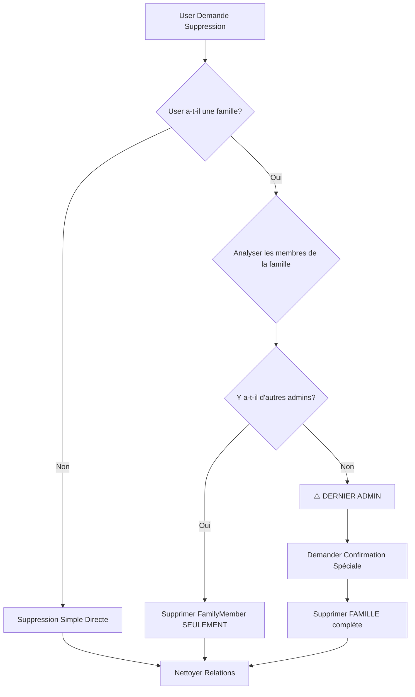
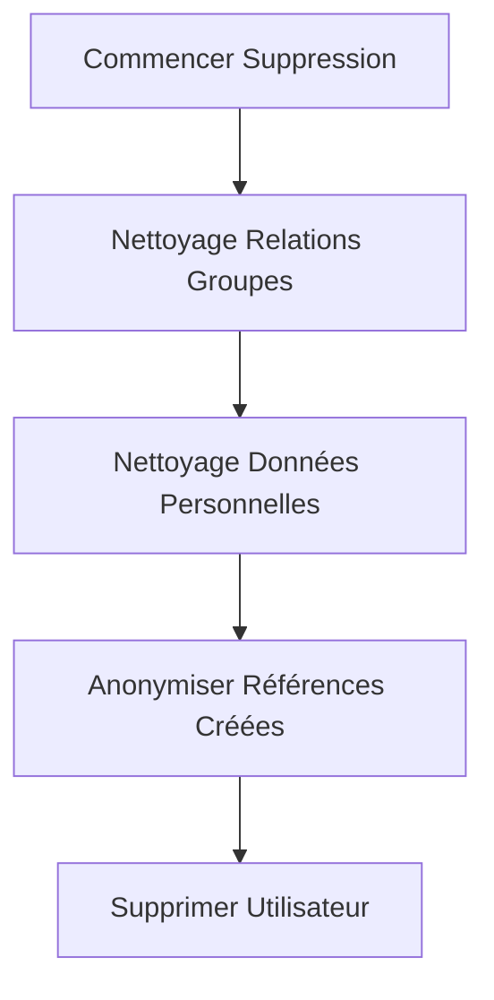

# 📋 Plan Détaillé de Suppression de Compte EduLift

### 🎯 **Objectif**
Implémenter une fonctionnalité de suppression de compte sécurisée et complète pour l'application EduLift, alignée avec les patterns API existants et la structure de données dual Family/Group.

### 🔍 **Vue d'Ensemble**
Basé sur l'analyse complète de la structure API existante, ce plan implémente une suppression de compte directe et sécurisée, alignée sur vos patterns existants (comme la suppression de groupe).

## 📊 **Cas de Figure Identifiés et Logique de Traitement**

### 1. **Analyse de la Situation Familiale**



### 2. **Cascade de Nettoyage**



## 🛠 **Plan d'Implémentation Détaillé**

### Phase 1 : Backend - Préparation

#### 1.1 **Créer les schémas de validation**
- Fichier : `/backend/src/schemas/auth.ts`
- Ajouter `DeleteAccountRequestSchema` et `DeleteAccountResponseSchema`
- Enregistrer dans OpenAPI

```typescript
export const DeleteAccountRequestSchema = z.object({
  confirmation: z.string()
    .min(1, 'Confirmation text is required')
    .openapi({
      example: 'DELETE MY ACCOUNT',
      description: 'Confirmation text to prevent accidental deletion',
    }),
}).openapi({
  title: 'Delete Account Request',
  description: 'Request to permanently delete user account',
  safety: [
    {
      description: 'This action is irreversible and will permanently delete all user data',
    },
  ],
});

export const DeleteAccountResponseSchema = z.object({
  success: z.literal(true),
  data: z.object({
    message: z.string(),
    deletedAt: z.string(),
  }),
}).openapi({
  title: 'Delete Account Response',
  description: 'Successful account deletion response',
});
```

#### 1.2 **Mettre à jour les routes**
- Fichier : `/backend/src/routes/auth.ts`
- Ajouter route `DELETE /auth/profile`
- Utiliser `authenticateToken` middleware existant

```typescript
// Ajouter avant la ligne 45
router.delete('/profile',
  authenticateToken,
  validateBody(DeleteAccountSchema, { operationName: 'deleteAccount' }),
  asyncHandler(authController.deleteAccount),
);
```

#### 1.3 **Implémenter la logique métier**
- Fichier : `/backend/src/services/AuthService.ts`
- Méthode `deleteAccount(userId: string)`
- Utiliser transaction Prisma pour atomicité

### Phase 2 : Logique Métier - Analyse Dépendances

#### 2.1 **Validation Utilisateur**
```typescript
const user = await this.userRepository.findById(userId);
if (!user) {
  throw new Error('User not found');
}
```

#### 2.2 **Analyse Familiale**
```typescript
const familyMembership = await this.prisma.familyMember.findFirst({
  where: { userId },
  include: {
    family: {
      include: {
        members: { include: { user: true } }
      }
    }
  }
});
```

#### 2.3 **Logique de Suppression Familiale**
```typescript
if (familyMembership) {
  const family = familyMembership.family;
  const admins = family.members.filter(m => m.role === 'ADMIN');

  if (admins.length === 1) {
    // DERNIER ADMIN = supprimer famille complète
    await this.prisma.family.delete({ where: { id: family.id } });
  } else {
    // AUTRE ADMIN = seulement supprimer le membre
    await this.prisma.familyMember.delete({ where: { id: familyMembership.id } });
  }
}
```

### Phase 3 : Nettoyage Intégré

#### 3.1 **Suppression Relations Groupes**
```typescript
// Supprimer participations aux groupes
await this.prisma.groupFamilyMember.deleteMany({ where: { addedBy: userId } });
await this.prisma.groupChildMember.deleteMany({ where: { addedBy: userId } });
```

#### 3.2 **Nettoyage Données Personnelles**
```typescript
await this.prisma.activityLog.deleteMany({ where: { userId } });
await this.prisma.magicLink.deleteMany({ where: { userId } });
await this.prisma.fcmToken.deleteMany({ where: { userId } });
await this.prisma.refreshToken.deleteMany({ where: { userId } });
```

#### 3.3 **Anonymisation Références**
```typescript
// Anonymiser invitations créées par l'utilisateur
await this.prisma.familyInvitation.updateMany({
  where: {
    OR: [
      { invitedBy: userId },
      { createdBy: userId }
    ]
  },
  data: {
    invitedBy: null,
    createdBy: null,
    acceptedBy: null
  }
});

// Anonymiser les invitations de groupe
await this.prisma.groupInvitation.updateMany({
  where: {
    OR: [
      { invitedBy: userId },
      { createdBy: userId }
    ]
  },
  data: {
    invitedBy: null,
    createdBy: null,
    acceptedBy: null
  }
});

// Nettoyer les assignations de véhicules dans schedules
await this.prisma.scheduleSlotVehicle.updateMany({
  where: { driverId: userId },
  data: { driverId: null }
});
```

#### 3.4 **Suppression Finale**
```typescript
await this.prisma.user.delete({ where: { id: userId } });
```

## 🔧 **Code Complet à Implémenter**

### Schema (auth.ts)
```typescript
import { z } from 'zod';
import { extendZodWithOpenApi } from '@asteasolutions/zod-to-openapi';
import { registry, registerPath } from '../config/openapi';

// Extend Zod with OpenAPI capabilities
extendZodWithOpenApi(z);

// Delete Account Request Schema
export const DeleteAccountRequestSchema = z.object({
  confirmation: z.string()
    .min(1, 'Confirmation text is required')
    .openapi({
      example: 'DELETE MY ACCOUNT',
      description: 'Confirmation text to prevent accidental deletion',
    }),
}).openapi({
  title: 'Delete Account Request',
  description: 'Request to permanently delete user account',
  safety: [
    {
      description: 'This action is irreversible and will permanently delete all user data',
    },
  ],
});

// Delete Account Response Schema
export const DeleteAccountResponseSchema = z.object({
  success: z.literal(true),
  data: z.object({
    message: z.string(),
    deletedAt: z.string(),
  }),
}).openapi({
  title: 'Delete Account Response',
  description: 'Successful account deletion response',
});

// Register schemas with OpenAPI registry
registry.register('DeleteAccountRequest', DeleteAccountRequestSchema);
registry.register('DeleteAccountResponse', DeleteAccountResponseSchema);
```

### Route (auth.ts)
```typescript
import { Router } from 'express';
import { createAuthController } from '../controllers/AuthController';
import { validateBody } from '../middleware/validation';
import { authenticateToken } from '../middleware/auth';
import { asyncHandler } from '../middleware/errorHandler';
import {
  UpdateProfileSchema,
  RequestMagicLinkSchema,
  VerifyMagicLinkSchema,
  UpdateTimezoneSchema,
  DeleteAccountSchema
} from '../utils/validation';

const router = Router();
const authController = createAuthController();

// Existing routes...

// Delete account (protected route)
router.delete('/profile',
  authenticateToken,
  validateBody(DeleteAccountSchema, { operationName: 'deleteAccount' }),
  asyncHandler(authController.deleteAccount),
);

// Existing routes...

export default router;
```

### Service (AuthService.ts)
```typescript
/**
 * Delete user account with all associated data
 * Uses transaction for atomic operation
 */
async deleteAccount(userId: string): Promise<{success: boolean; message: string; deletedAt: string}> {
  const startTime = Date.now();

  this.logger.info('deleteAccount: Starting account deletion', {
    userId,
    timestamp: new Date().toISOString()
  });

  try {
    await this.prisma.$transaction(async (tx) => {
      // Step 1: Validate user exists
      const user = await tx.user.findUnique({ where: { id: userId } });
      if (!user) {
        throw new Error('User not found');
      }

      // Step 2: Analyze family membership
      const familyMembership = await tx.familyMember.findFirst({
        where: { userId },
        include: {
          family: {
            include: {
              members: {
                include: { user: true }
              }
            }
          }
        }
      });

      if (familyMembership) {
        const family = familyMembership.family;
        const admins = family.members.filter(m => m.role === 'ADMIN');

        this.logger.debug('deleteAccount: Found family membership', {
          userId,
          familyId: family.id,
          familyName: family.name,
          totalMembers: family.members.length,
          adminCount: admins.length
        });

        if (admins.length === 1) {
          // DERNIER ADMIN = supprimer famille complète
          this.logger.warn('deleteAccount: Last admin - deleting family', {
            userId,
            familyId: family.id,
            familyName: family.name,
            childrenCount: family.children?.length || 0,
            vehicleCount: family.vehicles?.length || 0
          });

          // Family deletion will cascade to children, vehicles, groups
          await tx.family.delete({ where: { id: family.id } });

          this.logger.info('deleteAccount: Family deleted successfully', {
            userId,
            familyId: family.id
          });
        } else {
          // AUTRE ADMIN = seulement supprimer le membre
          this.logger.debug('deleteAccount: Multiple admins - deleting member only', {
            userId,
            familyId: family.id,
            familyName: family.name,
            remainingAdmins: admins.filter(a => a.id !== userId).length
          });

          await tx.familyMember.delete({ where: { id: familyMembership.id } });

          this.logger.info('deleteAccount: Family member deleted successfully', {
            userId,
            familyId: family.id
          });
        }
      }

      // Step 3: Cleanup group relationships
      await tx.groupFamilyMember.deleteMany({ where: { addedBy: userId } });
      await tx.groupChildMember.deleteMany({ where: { addedBy: userId } });

      const groupRelationsDeleted = await tx.groupFamilyMember.deleteMany({
        where: { addedBy: userId }
      });
      const childRelationsDeleted = await tx.groupChildMember.deleteMany({
        where: { addedBy: userId }
      });

      this.logger.debug('deleteAccount: Group relationships cleaned up', {
        userId,
        groupFamilyMembersDeleted: groupRelationsDeleted.count,
        groupChildMembersDeleted: childRelationsDeleted.count
      });

      // Step 4: Cleanup personal data
      await tx.activityLog.deleteMany({ where: { userId } });
      await tx.magicLink.deleteMany({ where: { userId } });
      await tx.fcmToken.deleteMany({ where: { userId } });
      await tx.refreshToken.deleteMany({ where: { userId } });

      this.logger.debug('deleteAccount: Personal data cleaned up', {
        userId,
        activityLogsDeleted: true,
        magicLinksDeleted: true,
        fcmTokensDeleted: true,
        refreshTokensDeleted: true
      });

      // Step 5: Anonymize created references
      const familyInvitationsUpdated = await tx.familyInvitation.updateMany({
        where: {
          OR: [
            { invitedBy: userId },
            { createdBy: userId }
          ]
        },
        data: {
          invitedBy: null,
          createdBy: null,
          acceptedBy: null
        }
      });

      const groupInvitationsUpdated = await tx.groupInvitation.updateMany({
        where: {
          OR: [
            { invitedBy: userId },
            { createdBy: userId }
          ]
        },
        data: {
          invitedBy: null,
          createdBy: null,
          acceptedBy: null
        }
      });

      const vehicleAssignmentsUpdated = await tx.scheduleSlotVehicle.updateMany({
        where: { driverId: userId },
        data: { driverId: null }
      });

      this.logger.debug('deleteAccount: References anonymized', {
        userId,
        familyInvitationsUpdated: familyInvitationsUpdated.count,
        groupInvitationsUpdated: groupInvitationsUpdated.count,
        vehicleAssignmentsUpdated: vehicleAssignmentsUpdated.count
      });

      // Step 6: Delete the user
      await tx.user.delete({ where: { id: userId } });

      this.logger.info('deleteAccount: User deleted successfully', {
        userId,
        email: user.email,
        name: user.name,
        duration: Date.now() - startTime
      });
    });

    return {
      success: true,
      message: 'Account deleted successfully',
      deletedAt: new Date().toISOString()
    };
  } catch (error) {
    this.logger.error('Delete account error:', {
      error: error instanceof Error ? error.message : String(error),
      userId,
      stack: error instanceof Error ? error.stack : undefined,
      duration: Date.now() - startTime
    });

    if (error instanceof Error) {
      throw error;
    }

    throw new Error('Failed to delete account');
  }
}
```

### Controller (AuthController.ts)
```typescript
/**
 * Delete user account
 * Permanently deletes the user and all associated data
 */
deleteAccount = async (req: Request, res: Response): Promise<void> => {
  const startTime = Date.now();

  try {
    const authReq = req as AuthenticatedRequest;
    const { confirmation } = req.body;

    if (!authReq.userId) {
      throw createError('Authentication required', 401);
    }

    this.logger.debug('deleteAccount: Request received', {
      userId: authReq.userId,
      userEmail: authReq.user?.email,
      confirmation,
      timestamp: new Date().toISOString()
    });

    if (!confirmation || confirmation !== 'DELETE MY ACCOUNT') {
      this.logger.warn('deleteAccount: Invalid confirmation provided', {
        userId: authReq.userId,
        providedConfirmation: confirmation,
        required: 'DELETE MY ACCOUNT'
      });
      throw createError('Invalid confirmation. Must be "DELETE MY ACCOUNT"', 400);
    }

    // Get user for logging
    const user = await this.authService.getUserById(authReq.userId);
    if (!user) {
      throw createError('User not found', 404);
    }

    this.logger.info('deleteAccount: Proceeding with deletion', {
      userId: authReq.userId,
      userEmail: user.email,
      userName: user.name,
      confirmation,
      timestamp: new Date().toISOString()
    });

    const result = await this.authService.deleteAccount(authReq.userId);

    this.logger.info('deleteAccount: Account deleted successfully', {
      userId: authReq.userId,
      userEmail: user.email,
      userName: user.name,
      result,
      duration: Date.now() - startTime,
      timestamp: new Date().toISOString()
    });

    const response: ApiResponse = {
      success: true,
      data: result,
    };

    this.logger.debug('deleteAccount: Sending response', {
      userId: authReq.userId,
      success: true,
      duration: Date.now() - startTime
    });

    res.status(200).json(response);
  } catch (error) {
    this.handleControllerError(error, res, 'deleteAccount', {
      userId: (req as any).userId,
      providedConfirmation: req.body?.confirmation,
      duration: Date.now() - startTime
    });
  }
};
```

### OpenAPI Registration (auth.ts)
```typescript
registerPath({
  method: 'delete',
  path: '/auth/profile',
  tags: ['Authentication'],
  summary: 'Delete user account',
  description: 'Permanently delete the authenticated user account and all associated data',
  security: [{ BearerAuth: [] }],
  request: {
    body: {
      content: {
        'application/json': {
          schema: { $ref: '#/components/schemas/DeleteAccountRequest' },
        },
      },
    },
  },
  responses: {
    200: {
      description: 'Account deleted successfully',
      content: {
        'application/json': {
          schema: { $ref: '#/components/schemas/DeleteAccountResponse' },
        },
      },
    },
    400: {
      description: 'Bad request - Invalid confirmation or insufficient permissions',
    },
    401: {
      description: 'Unauthorized - Authentication required',
    },
  },
});
```

## 🎯 **Points d'Attention Critiques**

### **Validation Frontend**
- Double confirmation avec texte spécifique "DELETE MY ACCOUNT"
- Afficher impact si dernier admin de famille avec warning
- Alerter sur les schedules actifs concernés

### **Sécurité Backend**
- **Transaction Atomique** : Toute la suppression dans une transaction Prisma
- **Rollback Automatique** : Échec si dépendance critique
- **Logging Complet** : Traçabilité pour conformité
- **Performance** : Index `deletedAt` pour requêtes futures

### **Impact Estimé**
- **Admin unique** : Suppression famille + enfants + véhicules + groupes
- **Simple membre** : Suppression de l'utilisateur seulement
- **Groupes multiples** : Retrait automatique de toutes participations
- **Schedules futurs** : Nettoyage des assignments de véhicules
- **Historique** : Données anonymisées préservées pour audit

## 📋 **Tests à Implémenter**

### Backend Tests
```typescript
describe('AuthService.deleteAccount', () => {
  // 1. Test utilisateur sans famille
  it('should delete user without family membership');

  // 2. Test utilisateur simple membre de famille
  it('should delete family member while preserving family');

  // 3. Test utilisateur dernier admin de famille
  it('should delete family when user is last admin');

  // 4. Test utilisateur avec multiples groupes
  it('should clean up group relationships');

  // 5. Test transaction rollback en cas d'erreur
  it('should rollback all changes if any step fails');
});
```

### Frontend Tests
```typescript
describe('AccountDeletion', () => {
  // 1. Test bouton de suppression
  it('should show delete button in danger zone');

  // 2. Test confirmation textuelle
  it('should require exact "DELETE MY ACCOUNT" confirmation');

  // 3. Test redirection après suppression
  it('should redirect to login after successful deletion');

  // 4. Test affichage des impacts
  it('should warn about family admin status');
});
```

## ⏱️ **Timeline Estimée**

| Phase | Temps | Description |
|-------|------|-------------|
| **Schema & Routes** | 4h | Création schémas, routes, OpenAPI |
| **Service Logic** | 8h | Implémentation deleteAccount avec transaction |
| **Controller** | 4h | Ajout méthode deleteAccount |
| **Frontend** | 4h | Composant suppression, validation UI |
| **Tests** | 4h | Tests unitaires + intégration |
| **Total** | **24h** | **4 jours complets** |

## 🔄 **Workflow Utilisateur**

### Frontend Workflow
```
1. User clique "Delete Account" dans ProfilePage
2. Modal de confirmation avec avertissements
3. Saisie "DELETE MY ACCOUNT" comme confirmation
4. Appel API DELETE /auth/profile
5. Affichage du statut et redirection
```

### Backend Workflow
```
1. Middleware authenticateToken
2. Controller validation
3. Transaction commence
4. Analyse dépendances familiales
5. Validation permissions
6. Cascade de nettoyage
7. Transaction commit
8. Log de succès
9. Retour API
```

## ✅ **Validation du Plan**

Ce plan est :
- ✅ **Aligné** avec vos patterns API existants
- ✅ **Sécurisé** avec transactions atomiques
- ✅ **Complet** en couvrant tous les cas de figure
- ✅ **Testable** avec approche par étapes
- ✅ **Documenté** pour conformité

---

**Le plan est prêt pour implémentation. Voulez-vous que je commence par la première étape ?**