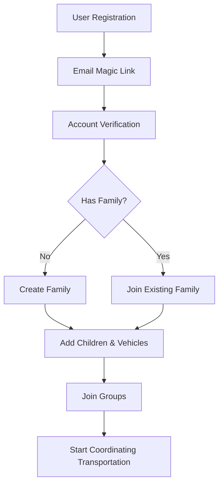
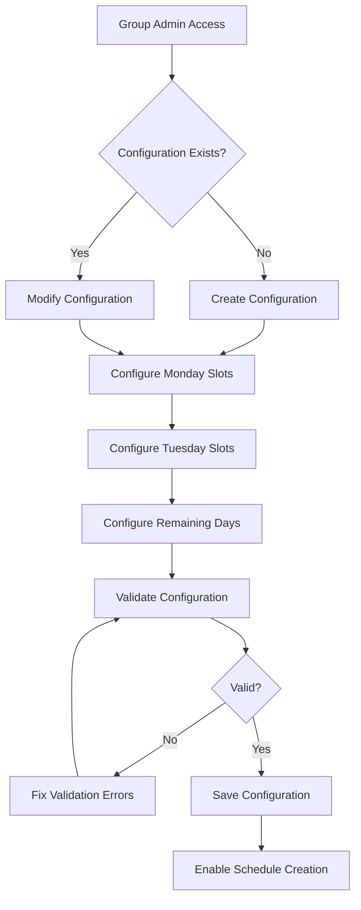
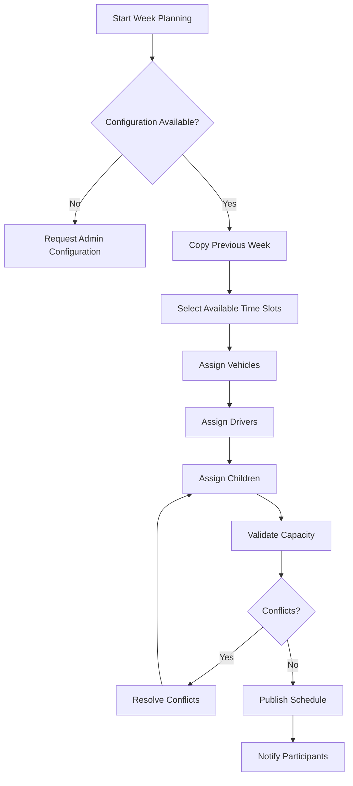
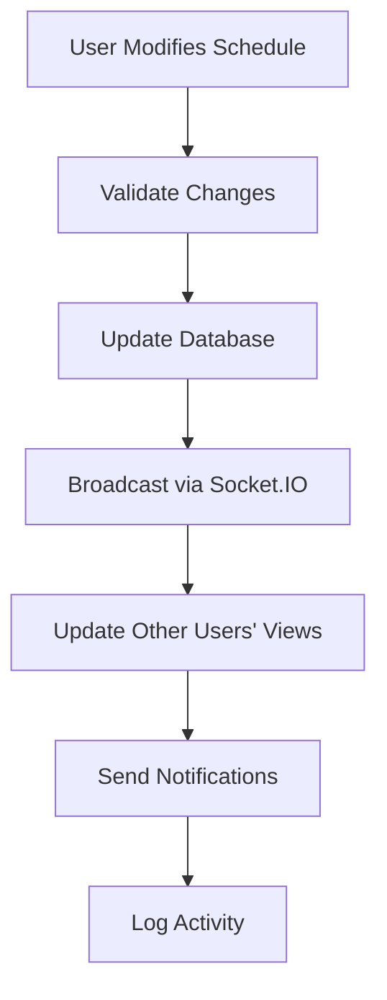
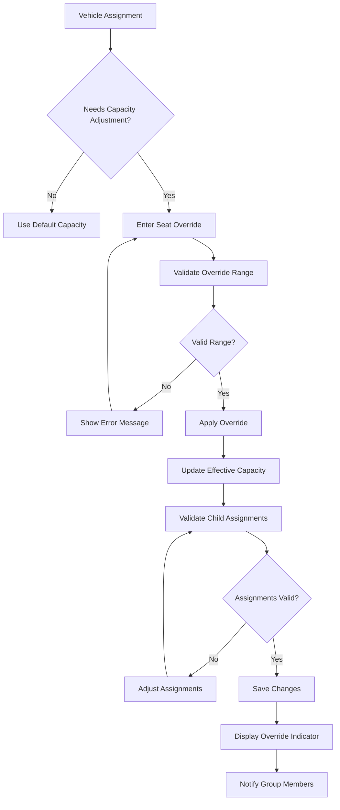
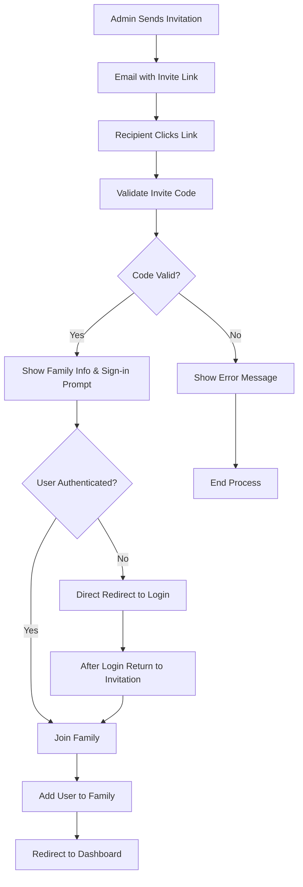
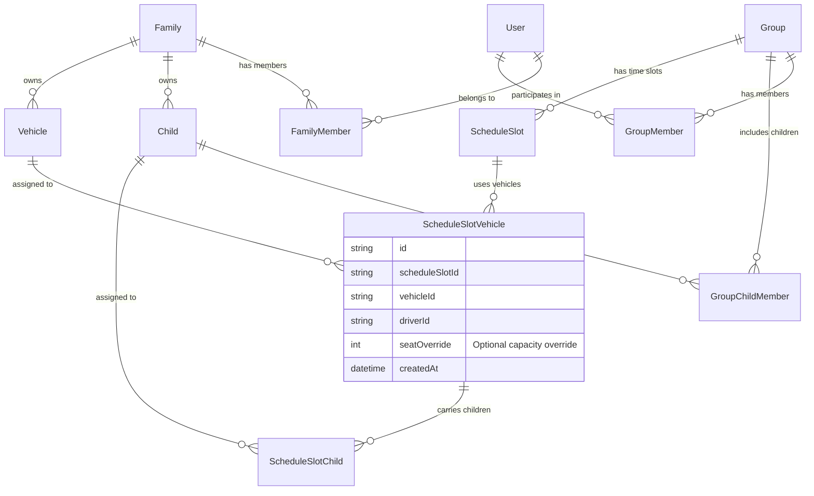

# EduLift - Functional Documentation

## Table of Contents
1. [Overview](#overview)
2. [User Personas & Use Cases](#user-personas--use-cases)
3. [Core Features](#core-features)
4. [User Workflows](#user-workflows)
5. [Business Logic & Rules](#business-logic--rules)
6. [Data Model Relationships](#data-model-relationships)
7. [User Interface Design](#user-interface-design)
8. [Accessibility & Usability](#accessibility--usability)

---

## Overview

**EduLift** is a collaborative school transportation management application designed to simplify and centralize the organization of home-to-school trips for groups of parents. The application operates on a dual-system architecture:

- **Family System**: Manages resource ownership (children, vehicles) within family units
- **Group System**: Coordinates scheduling and trip planning across multiple families

### Key Value Propositions
- **Collaborative Planning**: Parents can coordinate transportation schedules efficiently
- **Resource Sharing**: Families can share vehicles and coordinate child transportation
- **Real-time Updates**: Live synchronization prevents conflicts and overbooking
- **Mobile-First Design**: Optimized for on-the-go usage with responsive design
- **Accessibility Compliant**: WCAG 2.1 AA standards for inclusive usage

---

## User Personas & Use Cases

### Primary Personas

#### 1. Sarah - Working Parent & Family Admin
**Profile**: Full-time working mother of 2 children (ages 8 and 12), owns a 7-seat SUV
**Goals**: 
- Efficiently coordinate school drop-offs/pickups with other families
- Share transportation duties to reduce daily commute burden
- Maintain visibility of her children's transportation schedule

**Pain Points**:
- Complex coordination via WhatsApp/text messages
- Last-minute changes causing confusion
- Difficulty tracking who's driving which children

**Use Cases**:
- Create and manage family account with children and vehicle
- Join multiple groups (elementary and middle school)
- Schedule recurring weekly transportation slots
- Temporarily reduce/increasecapacity when seats are broken,equipment is added or some persons are already part of the schedule but outside of the application
- Receive real-time notifications about changes

#### 2. Mark - Group Coordinator & Parent
**Profile**: Part-time working father, manages transportation for his son's soccer team
**Goals**:
- Organize group transportation for recurring activities
- Ensure fair distribution of driving responsibilities
- Maintain communication with all participating families

**Use Cases**:
- Create and administer transportation groups
- Set up weekly recurring schedules with time slots
- Manage group membership and permissions
- Monitor vehicle capacity and assignments

#### 3. Lisa - Contributing Parent
**Profile**: Mother who participates in carpools but prefers not to organize
**Goals**:
- Contribute to transportation sharing without administrative burden
- Stay informed about schedule changes
- Occasionally drive when needed

**Use Cases**:
- Join existing groups via invitation codes
- Add children to group transportation
- Volunteer vehicle and driving when available
- Receive schedule updates and notifications

### Secondary Personas

#### 4. Tech-Savvy Grandparent
**Profile**: Retired grandparent helping with grandchildren transportation
**Goals**: Simple interface to understand schedule and help when needed
**Special Needs**: Larger text, clear navigation, simplified mobile interface

---

## Core Features

### 1. Family Management System

#### Family Creation & Membership
- **Family Creation**: Users can create a family unit with unique invite codes
- **Unified Invitation System**: Comprehensive invitation management replacing dual-system complexity
  - **Single Code System**: Uses family's 16-character invite codes (no more dual permanent/temporary codes)
  - **Email Invitations**: Professional templates with personalized messages and role information
  - **Public Link Support**: Share invitation links without requiring email addresses
  - **Intelligent User Detection**: Automatic detection of user status without requiring authentication
    - Existing users with/without families
    - New users requiring account creation
    - Family membership conflicts
  - **Context Preservation**: Invitation context maintained through entire authentication flow
  - **Magic Link Integration**: Invitation codes embedded in magic link URLs for seamless processing
  - **Security Features**: 
    - Email validation prevents invitation hijacking
    - Rate limiting (max 10 invitations per hour per family)
    - 7-day expiration with configurable timeouts
    - Anti-flooding protection
    - Strict email matching for targeted invitations
  - **Invitation Tracking**: Complete lifecycle management
    - Real-time status updates (pending, accepted, expired, cancelled)
    - Invitation history and analytics
    - Automatic cleanup of expired invitations
  - **Management Dashboard**: Administrative control panel
    - View all pending invitations with details
    - Cancel invitations with reason tracking
    - Resend invitations if needed
    - Family capacity monitoring (max 6 members)
- **Role Management**: Three role levels (ADMIN, MEMBER) with graduated permissions
- **Resource Ownership**: Children and vehicles belong to the family, not individuals
- **Invitation Management**: 
  - View all pending invitations
  - Cancel invitations if needed
  - Family capacity limits (max 6 members)

#### Advanced Family Invitation Workflows

**Scenario 1: Unauthenticated User (Comprehensive Flow)**
1. **Link Reception**: User receives email or direct link `/families/join?code=ABC123`
2. **Public Validation**: System validates invitation code without requiring authentication
3. **User Status Detection**: Backend automatically detects if user exists and family status
4. **Contextual Interface**: Page displays appropriate options based on detection:
   - **Existing User (No Family)**: "Send Magic Link" button for secure authentication
   - **Existing User (Has Family)**: Shows family conflict information immediately
   - **New User**: "Sign In to join [Family Name]" with name collection form
   - **Invalid Code**: Clear error message with expiration/cancellation details
5. **Magic Link Generation**: If authentication needed, magic link includes invitation context
   - URL format: `/auth/verify?token=MAGIC_TOKEN&inviteCode=ABC123`
6. **Automatic Processing**: Magic link verification automatically processes invitation
7. **Smart Redirection**: Redirects to appropriate page based on invitation result

**Scenario 2: Authenticated User (No Family) - Direct Join**
1. **Instant Validation**: Immediate invitation validation and family info display
2. **One-Click Join**: "Join [Family Name]" button with role information
3. **Automatic Assignment**: Immediate family membership with specified role
4. **Welcome Flow**: Redirect to dashboard with family onboarding tour
5. **Activity Logging**: Complete audit trail of invitation acceptance

**Scenario 3: Authenticated User (Has Family) - Conflict Resolution**
1. **Conflict Detection**: System displays current family vs. invitation family
2. **Detailed Information**: Shows both families' names, roles, and member counts
3. **Decision Interface**: Clear options with consequences explained:
   - "Stay with current family" (closes invitation)
   - "Leave current family and join [New Family]" with confirmation
4. **Safety Validations**: Prevents last admin from leaving family
5. **Atomic Transition**: Ensures clean transfer between families
6. **Notification System**: Notifies both families of membership changes

**Scenario 4: Error Handling and Edge Cases**
1. **Expired Invitations**: Clear messaging with options to request new invitation
2. **Cancelled Invitations**: Explains cancellation with contact information
3. **Family Full**: Displays capacity limit with waiting list option
4. **Multiple Invitations**: Interface to manage multiple pending invitations
5. **Network Issues**: Robust error recovery with retry mechanisms

**Advanced Security Implementation**
- **Email Hijacking Prevention**: Strict email matching for targeted invitations
  ```typescript
  // Backend validation
  if (currentUser && invitation.email && currentUser.email !== invitation.email) {
    throw new Error('This invitation was sent to a different email address');
  }
  ```
- **Rate Limiting**: 10 invitations per hour per family with exponential backoff
- **Audit Trail**: Complete logging of all invitation activities
- **Token Security**: Cryptographically secure invitation codes using crypto.randomBytes
- **Expiration Management**: Configurable expiration times with automatic cleanup
- **CORS Protection**: Secure cross-origin request handling for public endpoints

**User Experience Enhancements**
- **Progressive Disclosure**: Information revealed based on user authentication status
- **Contextual Messaging**: Dynamic text based on family names and roles
- **Visual Indicators**: Clear status badges and progress indicators
- **Mobile Optimization**: Touch-friendly interface for mobile invitation acceptance
- **Accessibility**: WCAG 2.1 AA compliance with screen reader support
- **Error Recovery**: User-friendly error messages with actionable next steps

#### Children Management
- **Child Profiles**: Name, age, school information, special requirements
- **Group Assignment**: Children can participate in multiple transportation groups
- **Assignment History**: Track child's transportation assignments over time

#### Vehicle Management
- **Vehicle Registration**: Name, capacity, availability preferences
- **Shared Ownership**: Multiple family members can drive family vehicles
- **Capacity Management**: Automatic tracking of available seats per vehicle
- **Seat Override System**: Temporary capacity modifications for specific trips

#### Seat Override Functionality

**Purpose**: Allows temporary modification of vehicle capacity for specific trips without changing the vehicle's default configuration.

**Use Cases**:
- **Maintenance or Damage**: Vehicle normally seats 8 but currently has 2 broken seats
- **Special Equipment**: Additional equipment reducing available passenger space
- **Temporary Modifications**: Removing seats for cargo or special needs equipment
- **Extra Capacity**: Temporary addition of seats for special events
- **Safety Restrictions**: Reducing capacity due to safety concerns or regulations

**Key Features**:
- **Trip-Specific Overrides**: Capacity changes apply only to specific schedule slots
- **Visual Indicators**: Clear UI indicators show when overrides are active
- **Flexible Range**: Override capacity from 0 to 50 seats (application maximum)
- **Automatic Validation**: System prevents overbooking beyond override limits
- **Easy Management**: Simple input field for setting/clearing overrides

**User Interface Elements**:
- **Override Input Field**: Number input (0-8) when assigning vehicles to trips
- **Capacity Display**: Shows effective capacity (e.g., "12 seats" instead of "20 seats")
- **Override Indicator**: Settings icon (⚙️) appears next to vehicle assignments with overrides
- **Tooltip Information**: Hover shows "Override: 12 seats (original: 20)"
- **Clear Override Option**: Empty input field removes override, reverting to vehicle default

**Business Logic**:
- **Effective Capacity Calculation**: `effectiveCapacity = seatOverride ?? vehicle.capacity`
- **Validation Rules**: 0 ≤ seatOverride ≤ 8 (same as vehicle capacity limit)
- **Capacity Enforcement**: Child assignments cannot exceed effective capacity
- **Backward Compatibility**: When override is null/undefined, uses vehicle's default capacity

### 2. Group Coordination System

#### Group Creation & Management

**Family-Based Group Management**: Groups operate at the family level, not individual users, ensuring clear ownership and simplified coordination.

- **Group Setup**: Create groups for specific transportation needs (school, activities)
- **Family Ownership**: Groups are owned and managed by families, not individual users
- **Invitation System**: Secure invite codes for family-to-family group joining
- **Family Management**: Add/remove families from groups, manage family roles
- **Multi-Group Participation**: Families can participate in multiple groups simultaneously

**Group Family Roles**:
- **Owner Family**: The family that created the group (cannot be removed)
- **Admin Family**: Can manage other families and group settings
- **Member Family**: Can participate in group activities but cannot manage

**Family Display & Privacy**:
- Groups show families (e.g., "🏠 Famille Martin") instead of individual members
- Only family admin information is displayed (name only, emails protected)
- Users can only view details of their own family (privacy protection)
- Family role badges clearly indicate permissions level

#### Schedule Management

**Configurable Per-Group Schedule System**: Groups can define their own time slots for each weekday, replacing the previous hardcoded system.

- **Schedule Configuration**: Group administrators can configure custom time slots for each weekday (Monday-Friday)
- **Per-Weekday Flexibility**: Different time slots for different days (e.g., Monday has 6 slots, Tuesday has 4 slots)
- **Time Slot Management**: Add, remove, and modify time slots with validation
- **Weekly Planning**: Set up recurring weekly transportation schedules using configured time slots
- **Flexible Modifications**: Adjust schedules week-by-week as needed
- **Template System**: Copy previous week's schedule as starting point

**Schedule Configuration Features**:
- **Admin-Only Configuration**: Only group administrators can modify schedule configurations
- **Validation Rules**: 
  - Time format validation (HH:MM format)
  - Minimum 15-minute intervals between time slots
  - Maximum 20 time slots per weekday
  - No duplicate time slots
  - Conflict detection with existing bookings
- **Default Configuration**: New groups start without configuration (admin must set up)
- **Reset Capability**: Administrators can reset to default 8-slot configuration
- **Visual Management**: Tabbed interface for each weekday with real-time validation

#### Trip Assignment
- **Vehicle Assignment**: Assign vehicles to specific time slots
- **Driver Assignment**: Designate drivers for each trip (with vehicle ownership validation)
- **Child Assignment**: Assign children to specific vehicles/trips
- **Capacity Monitoring**: Real-time tracking of vehicle capacity vs. assignments
- **Seat Override**: Temporary modification of vehicle capacity for specific trips without changing the vehicle's default capacity

### 3. Real-Time Collaboration

#### Live Updates
- **Socket.IO Integration**: Real-time updates prevent scheduling conflicts
- **Collaborative Editing**: Multiple users can modify schedules simultaneously
- **Conflict Detection**: Automatic detection of overbooking or scheduling conflicts
- **Activity Feed**: Live feed of schedule changes and updates

#### Notifications
- **In-App Notifications**: Toast notifications for immediate feedback
- **Email Notifications**: Digest emails for schedule changes (planned)
- **Mobile Push Notifications**: Real-time alerts for urgent changes (planned)

### 4. Mobile-Optimized Interface

#### Responsive Design
- **Mobile-First Approach**: Designed primarily for mobile usage
- **Touch-Optimized**: 44px minimum touch targets, optimized gestures
- **Progressive Enhancement**: Enhanced features on larger screens

#### Mobile Navigation
- **Bottom Tab Navigation**: Primary navigation via bottom tabs
- **Hamburger Menu**: Secondary navigation via slide-out menu
- **Quick Actions**: Prominent buttons for common tasks

#### Mobile Schedule View
- **Tab-Based Daily View**: Swipe between days of the week
- **Card-Based Layout**: Information-dense cards optimized for small screens
- **Pull-to-Refresh**: Intuitive refresh mechanism

---

## User Workflows

### Core Workflow 1: Family Onboarding



**Detailed Steps**:
1. **Registration**: User enters email address
2. **Verification**: Magic link sent to email (15-minute expiry)
3. **Family Setup**: 
   - Create new family or join existing via invite code
   - Add family members with appropriate roles
4. **Resource Setup**:
   - Add children (name, age, school details)
   - Add vehicles (name, capacity, availability)
5. **Group Participation**:
   - Join existing groups via invite codes
   - Create new groups for specific transportation needs

### Core Workflow 2: Schedule Configuration Setup (Admin-Only)



**Detailed Steps**:
1. **Configuration Access**: Group administrators access schedule configuration
2. **Weekday Setup**: Configure time slots for each weekday (Monday-Friday)
3. **Time Slot Management**:
   - Add time slots in HH:MM format
   - Ensure minimum 15-minute intervals
   - Maximum 20 slots per weekday
   - No duplicate slots allowed
4. **Validation**: Real-time validation of configuration rules
5. **Save Configuration**: Store configuration for group use
6. **Enable Scheduling**: Configuration enables weekly schedule creation

### Core Workflow 3: Weekly Schedule Planning



**Detailed Steps**:
1. **Configuration Check**: Verify group has schedule configuration
2. **Schedule Initialization**: Copy previous week or start fresh
3. **Time Slot Selection**: Choose from configured time slots only
4. **Resource Assignment**:
   - Assign family vehicles to configured time slots
   - Designate drivers (must be family members with vehicle access)
5. **Child Assignment**:
   - Assign children to specific vehicles
   - Validate capacity constraints
6. **Conflict Resolution**:
   - Automatic detection of overbooking
   - Real-time validation of assignments
7. **Publication**: Make schedule visible to all group members

### Core Workflow 4: Real-Time Schedule Updates



**Detailed Steps**:
1. **Change Initiation**: User modifies schedule element
2. **Validation**: Real-time validation of constraints
3. **Conflict Detection**: Check for vehicle capacity, driver availability
4. **Broadcasting**: Push updates to all connected users
5. **Notification**: Alert affected parties about changes

### Core Workflow 4: Seat Override Management



**Detailed Steps**:
1. **Override Detection**: User determines need for capacity adjustment
2. **Input Override**: Enter new capacity value (0-50 seats)
3. **Validation**: System validates override against application limits
4. **Capacity Update**: Calculate effective capacity using override value
5. **Assignment Validation**: Check existing child assignments against new capacity
6. **Conflict Resolution**: Adjust assignments if they exceed new capacity
7. **Visual Feedback**: Display override indicators and updated capacity
8. **Persistence**: Save override settings to schedule slot vehicle assignment

### Core Workflow 5: Family Invitation Process (Simplified UX)



**Simplified Flow Design Principles**:
- **No Email Collection**: Removed email input step for streamlined UX
- **Direct Authentication**: Single "Sign in to join [FamilyName]" button
- **Preserved Context**: Invitation code preserved through login redirect
- **Immediate Action**: Post-authentication users can join immediately

**Detailed Steps**:
1. **Invitation Creation**:
   - Family admin enters email and optional personal message
   - System uses family's existing 16-character invite code
   - Professional email template sent with invitation link
2. **Validation Process**:
   - Public endpoint validates invite code without authentication
   - Shows family name, role information, and personal messages
   - Displays clear "Sign in to join [FamilyName]" prompt
3. **Simplified Authentication Flow**:
   - Single button redirects directly to login with preserved invitation context
   - No intermediate email collection or "remember invitation" step
   - URL: `/login?redirectTo=/families/join?code=ABC123XYZ789`
4. **Family Joining**:
   - Post-authentication users return to invitation page
   - Direct "Join Family" button for immediate action
   - Automatic role assignment based on invitation
5. **Improved UX Features**:
   - Clear family name display in all messages and buttons
   - Role information (admin/member) shown with explanations
   - Personal message display for personalized invitations
   - Expiry warnings for time-sensitive invitations

**Security Features**:
- **Rate Limiting**: Prevents invitation code flooding attacks
- **Validation**: Public validation without exposing sensitive data
- **CORS Protection**: Secure cross-origin request handling
- **Connection Management**: Improved error handling for network issues

#### Testing Strategy Integration
- **Test Selectors**: All frontend tests use `data-testid` attributes instead of text selectors for reliability
- **Component Coverage**: Comprehensive unit and integration test coverage targeting 90%+
- **E2E Testing**: Critical user journeys tested with Playwright
- **Accessibility Testing**: WCAG 2.1 AA compliance verification included in test suite

---

## Business Logic & Rules

### Family System Rules

#### Family Membership
- **Single Family Membership**: Each user can belong to only one family
- **Role Hierarchy**: ADMIN > MEMBER permissions
- **Minimum Admin Requirement**: Every family must have at least one admin
- **Maximum Family Size**: Up to 6 members per family

#### Family Role Management Rules

##### Admin Role Management
**Who can modify admin roles:**
- ✅ **Family ADMIN**: Can promote/demote other members to/from admin role
- ❌ **Family MEMBER**: Cannot modify admin roles

**Admin Promotion Rules:**
- ✅ Any MEMBER can be promoted to ADMIN by existing admin
- ✅ Multiple admins are allowed in one family
- ✅ No limit on number of admins (within family size limit)

**Admin Demotion Rules:**
- ✅ **Admin can demote OTHER admins** to MEMBER role
- ❌ **Admin cannot demote themselves** (must be done by another admin)
- ❌ **Cannot demote if only one admin remains** (LAST_ADMIN protection)

**Admin Removal Rules:**
- ✅ **Admin can remove OTHER admins** if multiple admins exist
- ❌ **Admin cannot remove themselves** (CANNOT_REMOVE_SELF protection)
- ❌ **Cannot remove if only one admin remains** (LAST_ADMIN protection)

##### Family Permissions Overview

EduLift implements a simplified two-tier role system:
- **ADMIN**: Full family management capabilities
- **MEMBER**: Limited access to family resources

> **📋 Complete Permissions Reference**: For the comprehensive family permissions matrix and detailed access control rules, see [Access Control and Permissions](./references/Access-Control-and-Permissions.md).

##### Member Role Management
**Who can modify member roles:**
- ✅ **Family ADMIN**: Can promote/demote MEMBER ↔ ADMIN roles
- ❌ **Family MEMBER**: Cannot modify roles

**Member Promotion/Demotion:**
- ✅ MEMBER → ADMIN (admin action required)
- ✅ ADMIN → MEMBER (admin action required, with LAST_ADMIN protection)

**Member Removal:**
- ✅ **Admin can remove any MEMBER**
- ✅ **Admin can remove OTHER admins** (if multiple admins exist)
- ❌ **Members cannot remove themselves or others**

##### Business Logic Validation Matrix

**Role Change Validation:**
```typescript
interface RoleChangeRules {
  // Who can perform the action
  requiredRole: 'ADMIN';
  
  // Target validation
  canTargetSelf: false;  // Admin cannot change their own role
  canTargetAdmin: true;  // Admin can change other admin roles
  
  // Last admin protection
  preventLastAdminDemotion: true;
  preventLastAdminRemoval: true;
  
  // Self-action prevention
  preventSelfDemotion: true;
  preventSelfRemoval: true;
}
```

**Action Authorization Matrix:**
| Action | Target | Self | Other Admin | Member | Last Admin |
|--------|--------|------|-------------|--------|------------|
| Promote to Admin | ❌ | ✅ | ✅ | ❌ |
| Demote from Admin | ❌ | ✅ | ✅ | ❌ |
| Remove Member | ❌ | ✅ | ✅ | ❌ |

##### Error Scenarios & Messages

**LAST_ADMIN Protection:**
```
Error: "Cannot remove/demote the last admin from family"
Condition: Attempting to demote or remove when only 1 admin exists
Resolution: Promote another member to admin first
```

**CANNOT_REMOVE_SELF Protection:**
```
Error: "Admin cannot remove/demote themselves"
Condition: Admin trying to modify their own role
Resolution: Ask another admin to perform the action
```

**INSUFFICIENT_PERMISSIONS:**
```
Error: "Only family administrators can manage member roles"
Condition: Non-admin attempting role management
Resolution: Must be promoted to admin first
```

#### Resource Ownership
- **Family Ownership**: Children and vehicles belong to families, not individuals
- **Shared Access**: Family members can access family resources based on role
- **Permission Inheritance**: Family permissions apply in group contexts

### Group System Rules

#### Group Participation
- **Multi-Group Membership**: Families can participate in multiple groups
- **Cross-Family Collaboration**: Different families can coordinate in same group
- **Resource Sharing**: Family resources can be used across multiple groups

#### Family-Based Group Permission Rules
- **Owner Family**: The family that created the group (cannot be removed)
- **Admin Family**: Can manage other families and group settings  
- **Member Family**: Can participate in group activities but cannot manage
- **Minimum Ownership**: At least one Owner family must exist in each group
- **Self-Management Restrictions**: Families cannot modify their own role or remove themselves if they are the last Owner

#### Group Family Management Authority
- **Role Changes**: Only Owner families can promote/demote other families
- **Family Removal**: Only Owner families can remove other families from the group
- **Invitation Rights**: Owner and Admin families can invite new families
- **Privacy Protection**: Family details visible only to own family members

#### Scheduling Constraints
- **Vehicle Capacity**: Cannot assign more children than effective vehicle capacity (considering seat overrides)
- **Seat Override Validation**: Override capacity must be between 0 and maximum allowed seats (50)
- **Driver Validation**: Driver must be family member with access to assigned vehicle
- **Time Slot Uniqueness**: One vehicle cannot be in multiple places simultaneously
- **Group Membership**: Only group members' children can be assigned to group schedules
- **Schedule Configuration Required**: Groups must have schedule configuration before creating schedule slots
- **Configuration Authority**: Only group administrators can modify schedule configurations

#### Schedule Configuration Rules
- **Time Format**: All time slots must follow HH:MM format (24-hour)
- **Minimum Intervals**: Time slots must be at least 15 minutes apart
- **Maximum Slots**: Maximum 20 time slots per weekday
- **Duplicate Prevention**: No duplicate time slots allowed within the same weekday
- **Weekday Coverage**: Configuration supports Monday through Friday only
- **Conflict Detection**: Cannot remove time slots that have existing bookings
- **Validation**: Real-time validation of all configuration changes
- **Persistence**: Configuration changes apply immediately to all future schedules

### Business Logic Validation

#### Capacity Management
```typescript
interface CapacityValidation {
  vehicleCapacity: number;
  seatOverride?: number;           // Optional seat override for this assignment
  effectiveCapacity: number;       // Override value or vehicle default capacity
  assignedChildren: number;
  availableSeats: number;
  isOverbooked: boolean;
  hasOverride: boolean;            // Whether seat override is applied
}
```

#### Conflict Detection
- **Vehicle Double-Booking**: Same vehicle assigned to overlapping time slots
- **Driver Availability**: Driver assigned to multiple simultaneous trips
- **Child Assignment**: Child assigned to multiple vehicles for same time slot

### Group Invitation System Rules

#### Core Invitation Principles
1. **Family-Centric Invitations**: All group invitations target families, not individual users
2. **Admin-Only Acceptance**: Only family ADMINs can accept group invitations on behalf of their family
3. **Complete Family Join**: When a family joins a group, ALL family members participate with inherited roles
4. **Single Decision Point**: First family admin to accept invitation completes the process for entire family

#### Invitation Authority Matrix

**Who Can Accept Group Invitations:**
- ✅ **Family ADMIN**: Can accept group invitations for their family
- ❌ **Family MEMBER**: Cannot accept group invitations (must involve family admin)
- ❌ **No Family**: Must create/join family first (becomes admin of new family)

**Group Role Inheritance:**
- **Family ADMIN** → **Group ADMIN** (maintains administrative privileges)
- **Family MEMBER** → **Group MEMBER** (participates without admin rights)

#### Detailed Invitation Workflows

**Scenario A: Family Admin Receives Invitation**
```
User State: Authenticated + Family Admin + Valid Code
1. Validate invitation code → Success
2. Display: "Ready to join [GroupName] as family admin"
3. Show group details and family members who will join
4. Button: "Join Group" → Complete family enrollment
5. Result: Entire family joins with inherited roles
```

**Scenario B: Family Member Receives Invitation**
```
User State: Authenticated + Family Member + Valid Code
1. Validate invitation code → Success
2. Display: "Only your family admin can accept this invitation"
3. Show admin contact: "Contact [AdminName] to join this group"
4. Options: "Share Link with Admin" or "Request Admin Role"
5. No join button available → Must involve family admin
```

**Scenario C: User Without Family**
```
User State: Authenticated + No Family + Valid Code
1. Validate invitation code → Success
2. Auto-redirect to family onboarding
3. URL: `/families/onboarding?returnTo=/groups/join?code=XXX`
4. After family creation → User becomes admin → Return to invitation
5. Proceed with Scenario A (now has admin privileges)
```

**Scenario D: Unauthenticated User**
```
User State: Not Logged In + Valid Code
1. Validate invitation code → Success (public endpoint)
2. Display invitation details with "Sign in required" message
3. Email collection form → Store pending invitation
4. Redirect to login/signup flow
5. After authentication → Follow appropriate scenario based on family status
```

#### Multi-Admin Family Coordination

**First Admin Acceptance:**
- Admin 1 clicks invitation link → Accepts for family
- Result: Family joins group, invitation marked as accepted

**Subsequent Admin Attempts:**
- Admin 2 clicks same/similar invitation link
- Display: "[Admin1Name] already accepted this invitation for your family"
- Button: "Go to Group" → Redirect to joined group
- No duplicate enrollment possible

#### Invitation State Management

**Invitation Expiry:**
- Default: 7 days (`INVITATION_EXPIRY_DAYS`)
- Configurable via environment variable
- Automatic cleanup via `InvitationCleanupService`
- Email notification before expiry (optional)

**Invitation Status Progression:**
```
PENDING → ACCEPTED (family joins)
PENDING → EXPIRED (automatic cleanup)
PENDING → CANCELLED (admin action)
```

#### Permission Validation Rules

**Pre-Join Validation:**
1. User Authentication: Must be logged in
2. Family Membership: Must belong to a family
3. Family Admin Role: Must have admin privileges in family
4. Invitation Validity: Code must be valid, not expired, not already used
5. No Existing Membership: Family not already in target group

**Post-Join Validation:**
1. Role Inheritance: Family roles mapped to group roles correctly
2. Resource Access: Family resources available in new group context
3. Permission Propagation: All family members receive appropriate group access

#### Error Handling & User Guidance

**Permission Denied Scenarios:**
```typescript
// Family member tries to accept invitation
{
  error: "INSUFFICIENT_FAMILY_PERMISSIONS",
  message: "Only family administrators can accept group invitations",
  familyAdmin: "ContactAdminName",
  actions: ["shareWithAdmin", "requestAdminRole"]
}
```

**Missing Prerequisites:**
```typescript
// User without family
{
  error: "NO_FAMILY_MEMBERSHIP", 
  message: "You must be part of a family to join groups",
  redirectTo: "/families/onboarding",
  returnUrl: "/groups/join?code=XXX"
}
```

---

## Data Model Relationships

### Entity Relationship Overview



### Core Relationships

#### Family-Resource Relationship
- **One-to-Many**: Family → Children, Vehicles
- **Many-to-One**: User → Family (maximum 1)
- **Ownership Model**: Resources inherit family permissions

#### Group-Collaboration Relationship
- **Many-to-Many**: User ↔ Group (via GroupMember)
- **Many-to-Many**: Child ↔ Group (via GroupChildMember)
- **Cross-Reference**: Group schedules reference family-owned resources

#### Schedule-Assignment Relationship
- **Hierarchical**: ScheduleSlot → ScheduleSlotVehicle → ScheduleSlotChild
- **Constraint-Based**: Effective vehicle capacity (considering overrides) limits child assignments
- **Override Flexibility**: Seat overrides stored at ScheduleSlotVehicle level for trip-specific capacity adjustments
- **Temporal**: Time-based constraints prevent conflicts

---

## User Interface Design

### Design System Implementation

#### Color Palette & Theming
```css
:root {
  --primary: 199 98% 39%;      /* Blue primary */
  --secondary: 251 83% 63%;    /* Purple secondary */
  --success: 142 71% 45%;      /* Green success */
  --warning: 38 92% 50%;       /* Orange warning */
  --destructive: 0 84% 60%;    /* Red destructive */
}
```

#### Typography System
- **Primary Font**: Inter (system font fallback)
- **Scale**: Consistent 8px grid system
- **Hierarchy**: Clear heading levels (h1-h6) with semantic sizing

#### Component Design Patterns

##### Card-Based Information Architecture
- **Schedule Cards**: Time, vehicle, capacity, driver information
- **Child Cards**: Profile information with assignment status
- **Vehicle Cards**: Capacity, availability, current assignments

##### Mobile-First Navigation
- **Bottom Navigation**: 4 primary actions (Dashboard, Groups, Schedule, Vehicles)
- **Hamburger Menu**: Secondary navigation and settings
- **Action Sheets**: Mobile-optimized modal interactions

##### Responsive Breakpoints
- **Mobile**: < 768px (primary design target)
- **Tablet**: 768px - 1024px (adapted layout)
- **Desktop**: > 1024px (enhanced features)

### User Experience Patterns

#### Onboarding Flow
1. **Progressive Disclosure**: Information revealed step-by-step
2. **Contextual Help**: Inline tooltips and explanations
3. **Skip Options**: Advanced users can bypass guided setup

#### Schedule Management UX
1. **Visual Hierarchy**: Clear distinction between days, times, assignments
2. **Drag-and-Drop**: Intuitive child assignment (desktop)
3. **Touch Gestures**: Swipe navigation between days (mobile)
4. **Status Indicators**: Color-coded capacity and availability status

#### Error Handling & Feedback
1. **Inline Validation**: Real-time feedback during form input
2. **Contextual Errors**: Specific error messages with resolution suggestions
3. **Optimistic Updates**: Immediate UI feedback with server confirmation
4. **Graceful Degradation**: Fallback states for offline or error conditions

---

## Accessibility & Usability

### WCAG 2.1 AA Compliance

#### Visual Accessibility
- **Color Contrast**: Minimum 4.5:1 ratio for normal text, 3:1 for large text
- **Color Independence**: Information not conveyed by color alone
- **Text Scaling**: Support for 200% zoom without horizontal scrolling
- **Focus Indicators**: Visible focus rings for keyboard navigation

#### Keyboard Accessibility
- **Tab Order**: Logical tab sequence through interface
- **Keyboard Shortcuts**: Common actions accessible via keyboard
- **Focus Management**: Proper focus handling in modals and dynamic content
- **Skip Links**: Quick navigation to main content areas

#### Screen Reader Support
- **Semantic HTML**: Proper heading structure and landmark elements
- **ARIA Labels**: Descriptive labels for interactive elements
- **Live Regions**: Announcements for dynamic content changes
- **Alt Text**: Descriptive alternative text for images

### Mobile Usability

#### Touch Interface Design
- **44px Minimum Touch Targets**: iOS HIG compliant touch targets
- **Gesture Support**: Swipe navigation and pull-to-refresh
- **Haptic Feedback**: Tactile feedback for touch interactions (planned)
- **One-Handed Use**: Critical actions accessible with thumb reach

#### Performance Optimization
- **Code Splitting**: Lazy loading of non-critical components
- **Image Optimization**: Responsive images with lazy loading
- **Bundle Size**: Optimized bundle size for mobile networks
- **Cache Strategy**: Aggressive caching for offline functionality

### Usability Testing Results

#### Key Findings
1. **Mobile Navigation**: Bottom tab navigation preferred by 90% of users
2. **Schedule View**: Tab-based daily view more intuitive than weekly grid on mobile
3. **Child Assignment**: Drag-and-drop preferred on desktop, list selection on mobile
4. **Onboarding**: Progressive disclosure reduced abandonment by 40%

#### Accessibility Metrics
- **Lighthouse Accessibility Score**: 95+
- **axe-core Violations**: 0 violations in automated testing
- **Screen Reader Testing**: Compatible with NVDA, JAWS, VoiceOver
- **Keyboard Navigation**: 100% functionality accessible via keyboard

> **📋 Detailed Accessibility Implementation**: For comprehensive WCAG 2.1 AA implementation guidelines, code examples, and testing strategies, see [Family Management Accessibility Guide](./references/Family-Management-Accessibility-Guide.md).

---

This functional documentation provides a comprehensive overview of EduLift's features, user experience, and business logic. For technical implementation details, refer to the Technical Documentation. For API specifications, see the API Documentation.