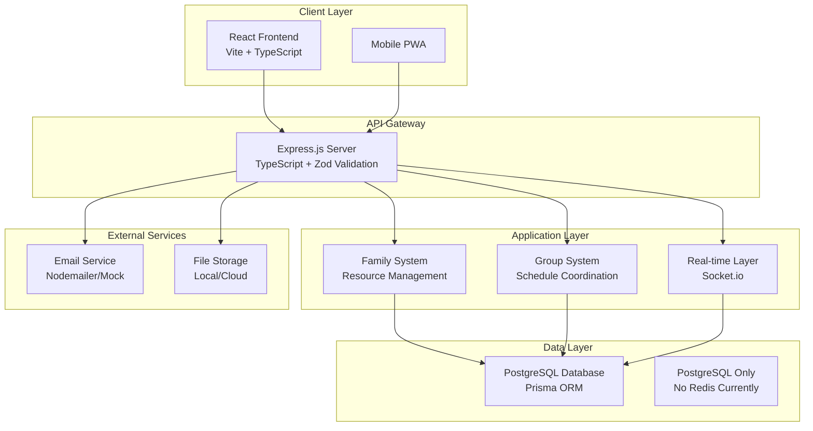
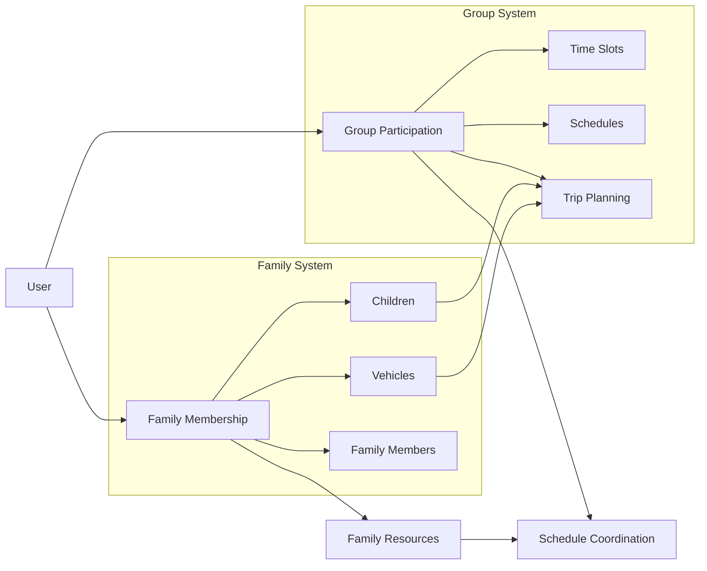
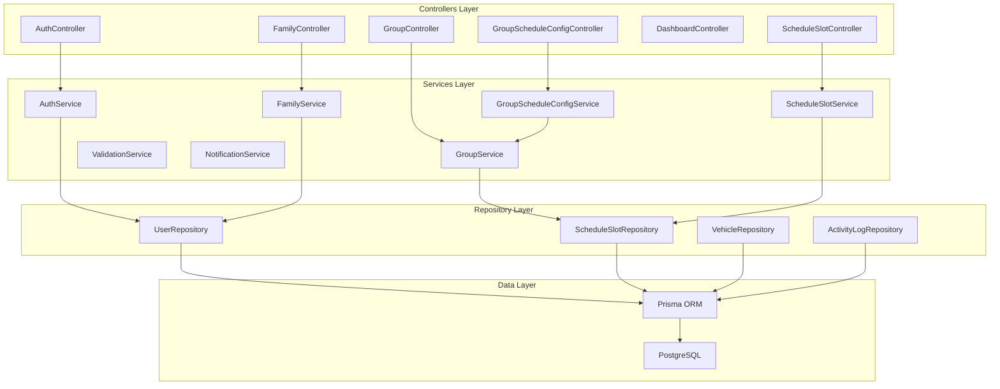
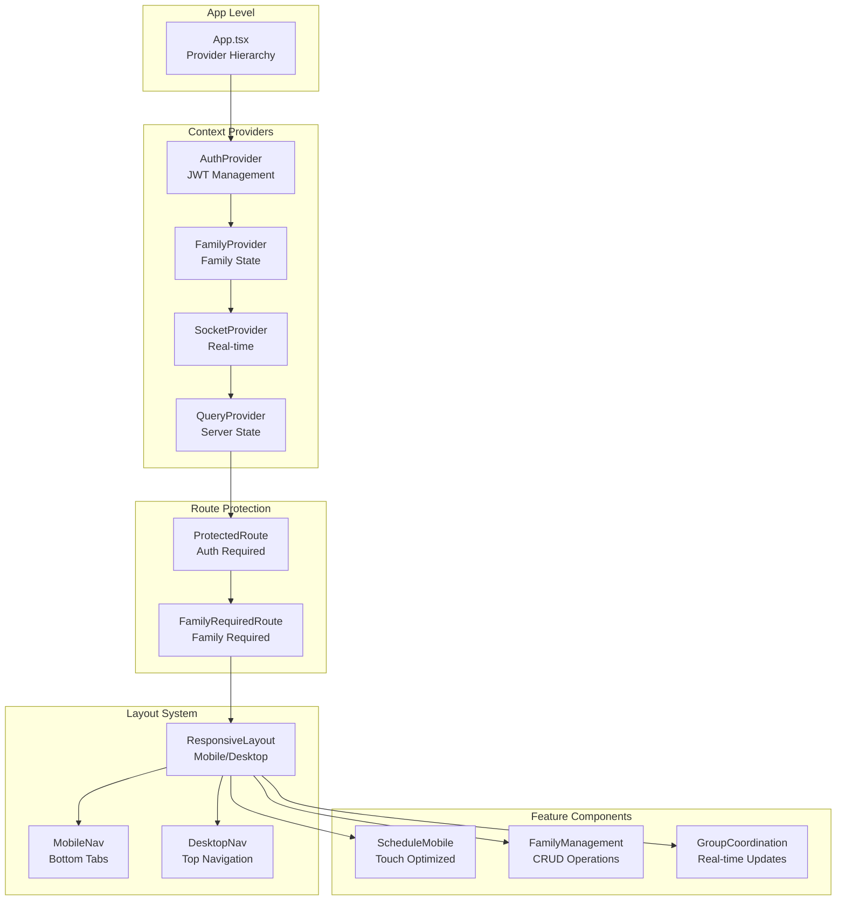
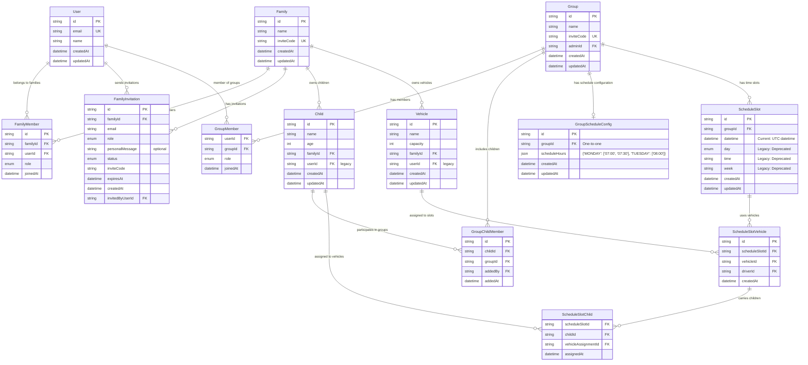
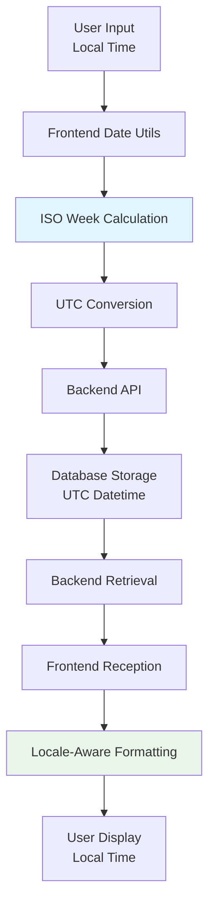
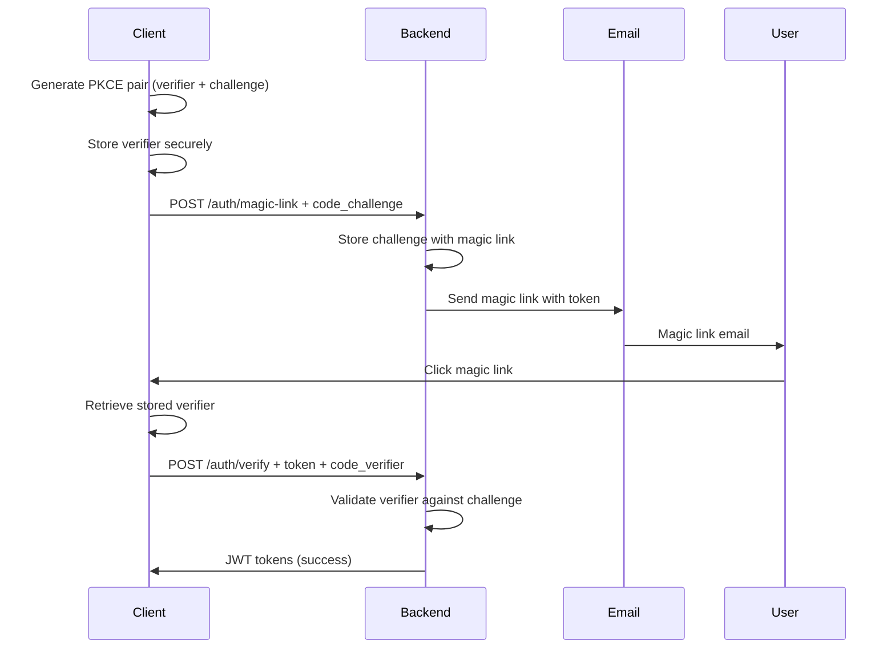
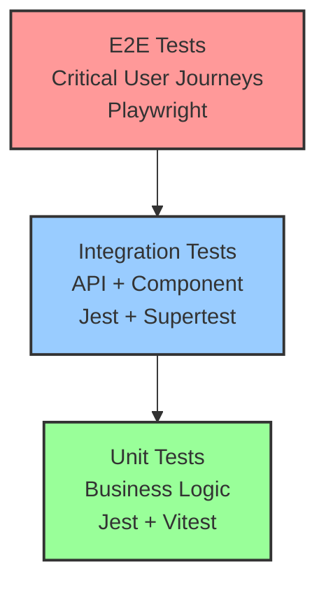

# EduLift - Technical Documentation

## Table of Contents
1. [Architecture Overview](#architecture-overview)
2. [Technology Stack](#technology-stack)
3. [Backend Architecture](#backend-architecture)
4. [Frontend Architecture](#frontend-architecture)
5. [Database Design](#database-design)
6. [API Design](#api-design)
7. [Date & Time Handling](#date--time-handling)
8. [Real-Time System](#real-time-system)
9. [Security Implementation](#security-implementation)
10. [Testing Strategy](#testing-strategy)
11. [Performance & Scalability](#performance--scalability)
12. [Development Workflow](#development-workflow)
13. [Monitoring & Observability](#monitoring--observability)

---

## Architecture Overview

EduLift implements a modern, scalable web application architecture with clear separation of concerns and dual-system design patterns.

### High-Level Architecture



### Architectural Principles

1. **Dual-System Architecture**: Separate systems for resource ownership (Family) and coordination (Group)
2. **Mobile-First Design**: Frontend optimized for mobile devices with progressive enhancement
3. **Real-Time Collaboration**: WebSocket-based updates for live scheduling coordination
4. **Type Safety**: End-to-end TypeScript with strict type checking
5. **Security by Design**: JWT authentication, role-based access control, input validation
6. **Scalable Foundation**: Docker containerization, cloud-ready deployment

### Dual-System Architecture Deep Dive

EduLift implements two complementary but distinct systems that work together:

#### Family System (Resource Ownership)
- **Purpose**: Manages shared resources (children, vehicles) within family units
- **Cardinality**: One user belongs to **ONE family** maximum
- **Role System**: Simplified ADMIN/MEMBER hierarchy
- **Resources**: Children and vehicles are family-owned, not individually owned
- **Authority**: Family admins can accept group invitations for entire family

#### Group System (Scheduling Coordination)
- **Purpose**: Coordinates transportation schedules and trip planning across families
- **Cardinality**: One family can participate in **MULTIPLE groups**
- **Resource Usage**: References family-owned resources for scheduling
- **Collaboration**: Different families coordinate in same group
- **Authority**: Group ownership and management operates at family level
- **Family-Based Management**: Groups display families (🏠 Famille Martin), not individual members
- **Role Hierarchy**: Owner Family > Admin Family > Member Family
- **Privacy Protection**: Only own family details visible, other families show name only

#### System Interaction Pattern


#### Architecture Benefits
- **Clear Ownership**: Family system handles "who owns what"
- **Flexible Coordination**: Group system handles "when and where"
- **Resource Sharing**: Family resources can be used across multiple groups
- **Permission Inheritance**: Family permissions apply in group contexts
- **Scalability**: Systems can evolve independently while maintaining integration

> **📋 Detailed Architecture Reference**: For comprehensive analysis of the dual-system architecture, database schema, and implementation details, see [Architecture Family vs Groups](./references/Architecture-Family-vs-Groups.md).

### Implementation Status Notes

#### Current Implementation vs Documentation
- **Database**: PostgreSQL as primary database with Redis infrastructure ready but not yet utilized by application code
- **Scheduling**: Uses "Schedule Slots" terminology, not "Trips" - API endpoints use `/schedule-slots` pattern  
- **Role System**: PARENT role has been **deprecated** - only ADMIN and MEMBER roles are active
- **Group Architecture**: ✅ **COMPLETE** - Successfully implemented family-based group management:
  - Frontend displays families (🏠 Famille Martin) instead of individual members
  - Backend API returns family-level data with privacy protection
  - Group roles operate at family level (Owner/Admin/Member families)
  - Only own family details visible to users (privacy compliance)

#### Data Storage Strategy
- **Primary Storage**: PostgreSQL handles all data persistence
- **Session Management**: Uses JWT tokens stored in localStorage
- **Caching**: Redis infrastructure configured and ready, but application-level caching not yet implemented
- **Real-time**: Socket.IO uses memory store for connection management

---

## Technology Stack

### Frontend Stack
```json
{
  "framework": "React 19.1.0",
  "language": "TypeScript 5.8.3",
  "build": "Vite 6.3.5",
  "routing": "React Router DOM 7.6.2",
  "ui": "Shadcn/ui + Radix UI",
  "styling": "Tailwind CSS 3.4.17",
  "state": "React Context + Zustand + TanStack Query",
  "forms": "React Hook Form + Zod",
  "realtime": "Socket.IO Client 4.8.1",
  "http": "Axios 1.9.0",
  "testing": "Vitest 3.2.3 + Testing Library"
}
```

### Backend Stack
```json
{
  "runtime": "Node.js 18+ with TypeScript",
  "framework": "Express.js",
  "database": "PostgreSQL with Prisma ORM",
  "cache": "Redis (infrastructure ready, not yet implemented)",
  "auth": "JWT + Magic Links",
  "validation": "Zod schemas",
  "realtime": "Socket.io",
  "email": "Nodemailer",
  "testing": "Jest + ts-jest",
  "containerization": "Docker + Docker Compose"
}
```

### Infrastructure Stack
```json
{
  "containerization": "Docker with multi-stage builds",
  "reverse_proxy": "Nginx",
  "ssl": "Certbot Let's Encrypt",
  "process_management": "PM2 with dumb-init",
  "monitoring": "Health checks + logs",
  "backup": "Automated PostgreSQL backups"
}
```

---

## Backend Architecture

### Service Layer Architecture



### Core Services Design

#### 1. Authentication Service
```typescript
class AuthService {
  // Magic link generation and validation
  async generateMagicLink(email: string): Promise<MagicLink>
  async validateMagicLink(token: string): Promise<User>
  
  // JWT token management
  async generateTokens(user: User): Promise<TokenPair>
  async refreshToken(refreshToken: string): Promise<TokenPair>
  async validateToken(token: string): Promise<User>
}
```

#### 2. Family Service
```typescript
class FamilyService {
  // Family lifecycle management
  async createFamily(data: CreateFamilyDto): Promise<Family>
  async joinFamily(inviteCode: string, userId: string): Promise<FamilyMember>
  
  // Member management with role validation
  async addMember(familyId: string, userData: AddMemberDto): Promise<FamilyMember>
  async updateMemberRole(memberId: string, role: FamilyRole): Promise<FamilyMember>
  
  // Simplified Invitation System
  async inviteMember(familyId: string, inviteData: InviteMemberDto, invitedBy: string): Promise<InvitationResult>
  async getPendingInvitations(familyId: string): Promise<FamilyInvitation[]>
  async cancelInvitation(familyId: string, invitationId: string, adminId: string): Promise<void>
  async validateInviteCode(inviteCode: string): Promise<{ id: string; name: string } | null>
  
  // Resource management
  async addChild(familyId: string, childData: CreateChildDto): Promise<Child>
  async addVehicle(familyId: string, vehicleData: CreateVehicleDto): Promise<Vehicle>
}

// New DTOs for invitation system
interface InviteMemberDto {
  email: string;
  role: FamilyRole;
  personalMessage?: string;
}

interface InvitationResult {
  inviteCode: string;
  email: string;
  invitationId: string;
}

interface FamilyInvitation {
  id: string;
  email: string;
  role: FamilyRole;
  personalMessage?: string;
  status: 'PENDING' | 'ACCEPTED' | 'EXPIRED' | 'CANCELLED';
  inviteCode: string;
  expiresAt: Date;
  createdAt: Date;
  invitedByUser: User;
}
```

#### Unified Family Invitation System (Advanced Implementation)

**Architecture Principles:**
- **Single System**: Eliminates dual permanent/temporary code complexity
- **Context Preservation**: Invitation context maintained through entire authentication flow
- **Intelligent Detection**: Automatic user and family status detection without authentication
- **Security First**: Multiple layers of protection against abuse and hijacking
- **Seamless UX**: Minimal friction for legitimate users across all scenarios

**Technical Implementation:**
```typescript
// Enhanced invitation validation with user detection
interface InvitationValidationResult {
  valid: boolean;
  familyId?: string;
  familyName?: string;
  role?: FamilyRole;
  personalMessage?: string;
  email?: string;
  
  // Advanced user detection (no auth required)
  existingUser?: boolean;
  userCurrentFamily?: {
    id: string;
    name: string;
    userRole: FamilyRole;
  };
  
  // Error handling
  error?: string;
  errorCode?: 'EXPIRED' | 'CANCELLED' | 'INVALID' | 'FAMILY_FULL' | 'EMAIL_MISMATCH';
}

// Magic link with embedded invitation context
interface MagicLinkWithInvitation {
  token: string;
  inviteCode?: string; // Embedded invitation code
  redirectUrl: string; // Post-auth destination
  expiresAt: Date;
}

// Comprehensive invitation processing
interface InvitationProcessingResult {
  success: boolean;
  action: 'JOINED' | 'FAMILY_CONFLICT' | 'REQUIRES_FAMILY_CHANGE' | 'ERROR';
  family?: Family;
  conflictDetails?: {
    currentFamily: Family;
    targetFamily: Family;
    canLeave: boolean;
    isLastAdmin: boolean;
  };
  redirectUrl?: string;
}
```

**Advanced Flow Implementation:**
```typescript
// 1. Public invitation validation (no auth required)
class UnifiedInvitationService {
  async validateFamilyInvitation(inviteCode: string, currentUserId?: string): Promise<InvitationValidationResult> {
    const invitation = await this.prisma.familyInvitation.findUnique({
      where: { inviteCode },
      include: { family: true }
    });
    
    if (!invitation || invitation.status !== 'PENDING' || invitation.expiresAt < new Date()) {
      return { valid: false, error: 'Invalid or expired invitation' };
    }
    
    // Advanced user detection without requiring authentication
    let existingUser = false;
    let userCurrentFamily = null;
    
    if (invitation.email) {
      const user = await this.prisma.user.findUnique({
        where: { email: invitation.email },
        include: { familyMember: { include: { family: true } } }
      });
      
      if (user) {
        existingUser = true;
        if (user.familyMember) {
          userCurrentFamily = {
            id: user.familyMember.family.id,
            name: user.familyMember.family.name,
            userRole: user.familyMember.role
          };
        }
        
        // Security: Prevent invitation hijacking
        if (currentUserId && user.id !== currentUserId) {
          return { 
            valid: false, 
            error: 'This invitation was sent to a different email address',
            errorCode: 'EMAIL_MISMATCH'
          };
        }
      }
    }
    
    return {
      valid: true,
      familyId: invitation.family.id,
      familyName: invitation.family.name,
      role: invitation.role,
      personalMessage: invitation.personalMessage,
      email: invitation.email,
      existingUser,
      userCurrentFamily
    };
  }
}

// 2. Magic link with invitation context
class AuthService {
  async generateMagicLink(email: string, inviteCode?: string): Promise<MagicLink> {
    const token = crypto.randomBytes(32).toString('hex');
    const redirectUrl = inviteCode ? `/families/join?code=${inviteCode}` : '/dashboard';
    
    return {
      token,
      email,
      inviteCode,
      redirectUrl,
      expiresAt: new Date(Date.now() + 15 * 60 * 1000) // 15 minutes
    };
  }
  
  async verifyMagicLink(token: string): Promise<AuthResult> {
    const magicLink = await this.validateMagicLinkToken(token);
    const user = await this.authenticateUser(magicLink.email);
    
    // Automatic invitation processing if inviteCode present
    if (magicLink.inviteCode) {
      const invitationResult = await this.invitationService.processInvitation(
        magicLink.inviteCode,
        user.id
      );
      
      return {
        user,
        tokens: this.generateTokens(user),
        invitationResult,
        redirectUrl: invitationResult.redirectUrl || magicLink.redirectUrl
      };
    }
    
    return { user, tokens: this.generateTokens(user), redirectUrl: magicLink.redirectUrl };
  }
}

// 3. Frontend intelligent interface
const UnifiedFamilyInvitationPage: React.FC = () => {
  const { inviteCode } = useSearchParams();
  const { user, isAuthenticated } = useAuth();
  const [validation, setValidation] = useState<InvitationValidationResult | null>(null);
  
  useEffect(() => {
    if (inviteCode) {
      // Validate invitation with current user context
      validateInvitation(inviteCode, user?.id).then(setValidation);
    }
  }, [inviteCode, user]);
  
  const renderInterface = () => {
    if (!validation?.valid) {
      return <ErrorDisplay error={validation?.error} />;
    }
    
    // Unauthenticated user scenarios
    if (!isAuthenticated) {
      if (validation.existingUser && validation.userCurrentFamily) {
        return (
          <FamilyConflictDisplay
            currentFamily={validation.userCurrentFamily}
            targetFamily={{ id: validation.familyId!, name: validation.familyName! }}
            showSignInButton
          />
        );
      }
      
      if (validation.existingUser) {
        return <MagicLinkForm email={validation.email} inviteCode={inviteCode} />;
      }
      
      return <NewUserSignUp familyName={validation.familyName} inviteCode={inviteCode} />;
    }
    
    // Authenticated user scenarios
    if (validation.userCurrentFamily) {
      return (
        <FamilyConflictResolution
          currentFamily={validation.userCurrentFamily}
          targetFamily={{ id: validation.familyId!, name: validation.familyName! }}
          onLeaveAndJoin={handleLeaveAndJoin}
        />
      );
    }
    
    return (
      <DirectJoinInterface
        familyName={validation.familyName!}
        role={validation.role!}
        onJoin={handleDirectJoin}
      />
    );
  };
  
  return (
    <Card className="max-w-md mx-auto">
      <CardHeader>
        <CardTitle>Family Invitation</CardTitle>
      </CardHeader>
      <CardContent>{renderInterface()}</CardContent>
    </Card>
  );
};
```
  
  // 4. Direct flow based on auth status
  flow: 'DIRECT_JOIN' | 'LOGIN_REDIRECT';
}

// Frontend component logic
const FamilyJoinPage: React.FC = () => {
  const { inviteCode } = useSearchParams();
  const { isAuthenticated } = useAuth();
  
  // Validate invitation on page load
  useEffect(() => {
    if (inviteCode) {
      validateInviteCode(inviteCode);
    }
  }, [inviteCode]);
  
  // Handle unauthenticated users
  const handleSignIn = () => {
    const currentUrl = window.location.pathname + window.location.search;
    navigate(`/login?redirectTo=${encodeURIComponent(currentUrl)}`);
  };
  
  // Direct join for authenticated users
  const handleJoinFamily = async () => {
    await joinFamily(inviteCode);
    navigate('/dashboard');
  };
};
```

#### 3. Schedule Slot Service
```typescript
class ScheduleSlotService {
  // Schedule management with conflict detection
  async createSlot(groupId: string, slotData: CreateSlotDto): Promise<ScheduleSlot>
  async assignVehicle(slotId: string, assignment: VehicleAssignmentDto): Promise<ScheduleSlotVehicle>
  async assignChild(vehicleAssignmentId: string, childId: string): Promise<ScheduleSlotChild>
  
  // Validation and constraint checking
  async validateCapacity(vehicleAssignmentId: string): Promise<CapacityValidation>
  async detectConflicts(assignment: VehicleAssignmentDto): Promise<ConflictReport>
}
```

#### 4. Group Schedule Configuration Service
```typescript
class GroupScheduleConfigService {
  // Schedule configuration management
  async getGroupScheduleConfig(groupId: string, userId: string): Promise<GroupScheduleConfig | null>
  async getGroupTimeSlots(groupId: string, weekday: string, userId: string): Promise<string[]>
  async updateGroupScheduleConfig(groupId: string, scheduleHours: ScheduleHours, userId: string): Promise<GroupScheduleConfig>
  async resetGroupScheduleConfig(groupId: string, userId: string): Promise<GroupScheduleConfig>
  
  // Validation and initialization
  async initializeDefaultConfigs(): Promise<void>
  static getDefaultScheduleHours(): ScheduleHours
  
  // Private validation methods
  private validateTimeFormat(time: string): boolean
  private validateScheduleHours(scheduleHours: ScheduleHours): void
  private async validateNoConflictsWithExistingSlots(groupId: string, proposedScheduleHours: ScheduleHours): Promise<void>
}

// Schedule configuration types
interface ScheduleHours {
  [key: string]: string[]; // { 'MONDAY': ['07:00', '07:30'], 'TUESDAY': ['08:00'] }
}

interface GroupScheduleConfigData {
  groupId: string;
  scheduleHours: ScheduleHours;
}

interface UpdateScheduleConfigData {
  scheduleHours: ScheduleHours;
}
```

### Data Access Pattern

#### Repository Pattern Implementation
```typescript
interface ScheduleSlotRepository {
  // Basic CRUD operations
  findById(id: string): Promise<ScheduleSlot | null>
  create(data: CreateScheduleSlotData): Promise<ScheduleSlot>
  update(id: string, data: UpdateScheduleSlotData): Promise<ScheduleSlot>
  delete(id: string): Promise<void>
  
  // Complex queries with joins
  findByGroupAndWeek(groupId: string, week: string): Promise<ScheduleSlot[]>
  findWithAssignments(id: string): Promise<ScheduleSlotWithAssignments>
  findConflictingSlots(vehicleId: string, timeRange: TimeRange): Promise<ScheduleSlot[]>
}
```

#### Transaction Management
```typescript
// Complex operations wrapped in transactions
async assignChildToVehicle(assignment: ChildVehicleAssignment): Promise<void> {
  return await prisma.$transaction(async (tx) => {
    // 1. Validate capacity
    const capacity = await validateVehicleCapacity(tx, assignment.vehicleId);
    
    // 2. Check for conflicts
    const conflicts = await detectScheduleConflicts(tx, assignment);
    
    // 3. Create assignment
    const result = await tx.scheduleSlotChild.create({ data: assignment });
    
    // 4. Log activity
    await logActivity(tx, 'CHILD_ASSIGNED', assignment);
    
    return result;
  });
}
```

### Error Handling Strategy

#### Custom Error Types
```typescript
class FamilyError extends Error {
  constructor(
    message: string,
    public code: FamilyErrorCode,
    public statusCode: number = 400
  ) {
    super(message);
    this.name = 'FamilyError';
  }
}

enum FamilyErrorCode {
  FAMILY_NOT_FOUND = 'FAMILY_NOT_FOUND',
  INSUFFICIENT_PERMISSIONS = 'INSUFFICIENT_PERMISSIONS',
  MEMBER_LIMIT_EXCEEDED = 'MEMBER_LIMIT_EXCEEDED',
  INVALID_INVITE_CODE = 'INVALID_INVITE_CODE'
}
```

#### Centralized Error Handler
```typescript
const errorHandler: ErrorRequestHandler = (err, req, res, next) => {
  logger.error('Request error:', {
    error: err.message,
    stack: err.stack,
    url: req.url,
    method: req.method,
    userId: req.user?.id
  });

  if (err instanceof FamilyError) {
    return res.status(err.statusCode).json({
      success: false,
      error: err.code,
      message: err.message
    });
  }

  // Generic error response
  res.status(500).json({
    success: false,
    error: 'INTERNAL_SERVER_ERROR',
    message: 'An unexpected error occurred'
  });
};
```

---

## Frontend Architecture

### Component Architecture



### State Management Architecture

#### Context Provider Hierarchy
```typescript
// App.tsx - Provider nesting order is critical
function App() {
  return (
    <QueryClientProvider client={queryClient}>
      <AuthProvider>
        <FamilyProvider>
          <SocketProvider>
            <Router>
              <Routes>
                <Route path="/*" element={<AppRoutes />} />
              </Routes>
            </Router>
          </SocketProvider>
        </FamilyProvider>
      </AuthProvider>
    </QueryClientProvider>
  );
}
```

#### State Management Patterns

##### 1. Authentication State
```typescript
interface AuthContextType {
  user: User | null;
  token: string | null;
  isLoading: boolean;
  login: (email: string) => Promise<void>;
  logout: () => void;
  refreshToken: () => Promise<void>;
}

const AuthProvider: React.FC<PropsWithChildren> = ({ children }) => {
  const [user, setUser] = useState<User | null>(null);
  const [token, setToken] = useState<string | null>(
    localStorage.getItem('authToken')
  );

  // Automatic token refresh
  useEffect(() => {
    if (token) {
      const refreshInterval = setInterval(refreshToken, 20 * 60 * 1000); // 20 minutes
      return () => clearInterval(refreshInterval);
    }
  }, [token]);

  return (
    <AuthContext.Provider value={{ user, token, login, logout, refreshToken }}>
      {children}
    </AuthContext.Provider>
  );
};
```

##### 2. Family State Management
```typescript
interface FamilyContextType {
  family: Family | null;
  children: Child[];
  vehicles: Vehicle[];
  isLoading: boolean;
  createFamily: (data: CreateFamilyData) => Promise<Family>;
  joinFamily: (inviteCode: string) => Promise<void>;
  addChild: (data: CreateChildData) => Promise<Child>;
  addVehicle: (data: CreateVehicleData) => Promise<Vehicle>;
}

const FamilyProvider: React.FC<PropsWithChildren> = ({ children }) => {
  const { user } = useAuth();
  
  // TanStack Query for server state
  const { data: family, isLoading } = useQuery({
    queryKey: ['family', user?.id],
    queryFn: () => familyApiService.getCurrentFamily(),
    enabled: !!user,
  });

  return (
    <FamilyContext.Provider value={{ family, children, vehicles, createFamily }}>
      {children}
    </FamilyContext.Provider>
  );
};
```

##### 3. Socket State with Zustand
```typescript
interface SocketStore {
  socket: Socket | null;
  isConnected: boolean;
  connectionError: string | null;
  connect: (token: string) => void;
  disconnect: () => void;
  subscribeToGroup: (groupId: string) => void;
}

const useSocketStore = create<SocketStore>((set, get) => ({
  socket: null,
  isConnected: false,
  connectionError: null,
  
  connect: (token: string) => {
    const socket = io(SOCKET_URL, {
      auth: { token },
      autoConnect: true,
      reconnection: true,
      reconnectionDelay: 3000,    // Start with 3 seconds
      reconnectionDelayMax: 30000, // Max 30 seconds
      reconnectionAttempts: 3,     // Reduced to 3 attempts
      timeout: 10000,              // 10 second connection timeout
      transports: ['websocket', 'polling']
    });
    
    socket.on('connect', () => {
      set({ isConnected: true, connectionError: null });
    });
    
    socket.on('disconnect', () => {
      set({ isConnected: false });
    });
    
    socket.on('connect_error', (error) => {
      set({ 
        isConnected: false, 
        connectionError: error.message 
      });
    });
    
    socket.on('reconnect_failed', () => {
      set({ 
        connectionError: 'Failed to reconnect after maximum attempts' 
      });
    });
    
    set({ socket });
  },
  
  disconnect: () => {
    const { socket } = get();
    socket?.disconnect();
    set({ socket: null, isConnected: false });
  }
}));
```

### Mobile-First Responsive Design

#### Responsive Layout System
```typescript
const ResponsiveLayout: React.FC<PropsWithChildren> = ({ children }) => {
  const isMobile = useMediaQuery("(max-width: 768px)");
  const [mobileMenuOpen, setMobileMenuOpen] = useState(false);

  return (
    <div className="min-h-screen bg-background">
      {/* Mobile Header */}
      {isMobile ? (
        <header className="sticky top-0 z-50 w-full border-b bg-background/95 backdrop-blur">
          <div className="container flex h-14 items-center">
            <Sheet open={mobileMenuOpen} onOpenChange={setMobileMenuOpen}>
              <SheetTrigger asChild>
                <Button variant="ghost" size="icon">
                  <Menu className="h-5 w-5" />
                </Button>
              </SheetTrigger>
              <SheetContent side="left" className="w-[280px]">
                <MobileNav onNavigate={() => setMobileMenuOpen(false)} />
              </SheetContent>
            </Sheet>
            <h1 className="ml-4 text-lg font-semibold">EduLift</h1>
          </div>
        </header>
      ) : (
        <DesktopNav />
      )}

      {/* Main Content */}
      <main className={cn(
        "container mx-auto",
        isMobile ? "px-4 py-4 pb-20" : "px-8 py-6"
      )}>
        {children}
      </main>

      {/* Mobile Bottom Navigation */}
      {isMobile && <BottomNav />}
    </div>
  );
};
```

#### Mobile-Optimized Components
```typescript
const ScheduleMobile: React.FC<ScheduleMobileProps> = ({ schedule, week }) => {
  const days = ["Mon", "Tue", "Wed", "Thu", "Fri"];

  return (
    <div className="space-y-4">
      {/* Week Navigation */}
      <Card>
        <CardHeader className="pb-3">
          <div className="flex items-center justify-between">
            <Button variant="ghost" size="sm">
              <ChevronLeft className="h-4 w-4" />
            </Button>
            <span className="font-medium">Week {week}</span>
            <Button variant="ghost" size="sm">
              <ChevronRight className="h-4 w-4" />
            </Button>
          </div>
        </CardHeader>
      </Card>

      {/* Tab-based Day Navigation */}
      <Tabs defaultValue="mon" className="w-full">
        <TabsList className="grid w-full grid-cols-5">
          {days.map((day) => (
            <TabsTrigger key={day} value={day.toLowerCase()}>
              <span className="sm:hidden">{day[0]}</span>
              <span className="hidden sm:inline">{day}</span>
            </TabsTrigger>
          ))}
        </TabsList>

        {days.map((day) => (
          <TabsContent key={day} value={day.toLowerCase()} className="space-y-3">
            {schedule[day]?.map((slot) => (
              <TimeSlotCard key={slot.id} slot={slot} />
            ))}
          </TabsContent>
        ))}
      </Tabs>
    </div>
  );
};
```

---

## Database Design

### Entity Relationship Model



### Prisma Schema Implementation

#### Core Models
```prisma
model User {
  id        String   @id @default(cuid())
  email     String   @unique
  name      String
  createdAt DateTime @default(now())
  updatedAt DateTime @updatedAt

  // Family system relationships
  familyMemberships FamilyMember[]
  groupMemberships  GroupMember[]
  
  // Legacy individual ownership (being migrated)
  children Child[] @relation("UserChildren")
  vehicles Vehicle[] @relation("UserVehicles")
  
  // Activity tracking
  activities ActivityLog[]
  magicLinks MagicLink[]

  @@map("users")
}

model Family {
  id         String   @id @default(cuid())
  name       String
  inviteCode String   @unique
  createdAt  DateTime @default(now())
  updatedAt  DateTime @updatedAt

  // Relationships
  members  FamilyMember[]
  children Child[]
  vehicles Vehicle[]

  @@map("families")
}

model FamilyMember {
  id       String     @id @default(cuid())
  familyId String
  userId   String
  role     FamilyRole @default(MEMBER)
  joinedAt DateTime   @default(now())

  // Relationships
  family Family @relation(fields: [familyId], references: [id], onDelete: Cascade)
  user   User   @relation(fields: [userId], references: [id], onDelete: Cascade)

  @@unique([familyId, userId])
  @@map("family_members")
}

model FamilyInvitation {
  id              String                  @id @default(cuid())
  familyId        String
  email           String
  role            FamilyRole              @default(MEMBER)
  personalMessage String?
  invitedBy       String
  status          FamilyInvitationStatus  @default(PENDING)
  inviteCode      String
  expiresAt       DateTime
  acceptedAt      DateTime?
  createdAt       DateTime                @default(now())
  updatedAt       DateTime                @updatedAt

  // Relationships
  family          Family @relation(fields: [familyId], references: [id], onDelete: Cascade)
  invitedByUser   User   @relation("FamilyInvitationsInvitedBy", fields: [invitedBy], references: [id], onDelete: Cascade)

  @@unique([familyId, email]) // One pending invitation per email per family
  @@map("family_invitations")
}

enum FamilyInvitationStatus {
  PENDING
  ACCEPTED
  EXPIRED
  CANCELLED
}

enum FamilyRole {
  ADMIN   // Can manage family, invite/remove members, manage children and vehicles
  MEMBER  // Read access, can participate in transportation
  // Note: PARENT role deprecated - consolidated into ADMIN for simplified permission model
}
```

#### Schedule System Models
```prisma
model ScheduleSlot {
  id      String @id @default(cuid())
  groupId String
  datetime DateTime  // UTC datetime in ISO 8601 format
  
  createdAt DateTime @default(now())
  updatedAt DateTime @updatedAt

  // Relations
  group            Group                  @relation(fields: [groupId], references: [id], onDelete: Cascade)
  vehicleAssignments ScheduleSlotVehicle[]
  childAssignments ScheduleSlotChild[]

  // Unique constraint: one schedule slot per group per datetime
  @@unique([groupId, datetime])
  @@map("schedule_slots")
}

model ScheduleSlotVehicle {
  id             String @id @default(cuid())
  scheduleSlotId String
  vehicleId      String
  driverId       String
  createdAt      DateTime @default(now())

  // Relations
  scheduleSlot    ScheduleSlot        @relation(fields: [scheduleSlotId], references: [id], onDelete: Cascade)
  vehicle         Vehicle             @relation(fields: [vehicleId], references: [id], onDelete: Cascade)
  driver          User                @relation("VehicleDriver", fields: [driverId], references: [id], onDelete: Cascade)
  childAssignments ScheduleSlotChild[]

  @@unique([scheduleSlotId, vehicleId])
  @@map("schedule_slot_vehicles")
}

model ScheduleSlotChild {
  scheduleSlotId       String
  childId              String
  vehicleAssignmentId  String
  assignedAt           DateTime @default(now())

  // Relations
  scheduleSlot      ScheduleSlot        @relation(fields: [scheduleSlotId], references: [id], onDelete: Cascade)
  child             Child               @relation(fields: [childId], references: [id], onDelete: Cascade)
  vehicleAssignment ScheduleSlotVehicle @relation(fields: [vehicleAssignmentId], references: [id], onDelete: Cascade)

  @@id([scheduleSlotId, childId])
  @@map("schedule_slot_children")
}
```

### Database Constraints & Validation

#### Capacity Constraints
```sql
-- Trigger to validate vehicle capacity
CREATE OR REPLACE FUNCTION validate_vehicle_capacity()
RETURNS TRIGGER AS $$
BEGIN
  IF (
    SELECT COUNT(*)
    FROM schedule_slot_children ssc
    WHERE ssc.vehicle_assignment_id = NEW.vehicle_assignment_id
  ) >= (
    SELECT v.capacity
    FROM vehicles v
    JOIN schedule_slot_vehicles ssv ON ssv.vehicle_id = v.id
    WHERE ssv.id = NEW.vehicle_assignment_id
  ) THEN
    RAISE EXCEPTION 'Vehicle capacity exceeded';
  END IF;
  RETURN NEW;
END;
$$ LANGUAGE plpgsql;

CREATE TRIGGER check_vehicle_capacity
  BEFORE INSERT ON schedule_slot_children
  FOR EACH ROW EXECUTE FUNCTION validate_vehicle_capacity();
```

#### Data Integrity Rules
```sql
-- Ensure family admin exists
CREATE OR REPLACE FUNCTION ensure_family_admin()
RETURNS TRIGGER AS $$
BEGIN
  IF NOT EXISTS (
    SELECT 1 FROM family_members
    WHERE family_id = OLD.family_id AND role = 'ADMIN'
  ) THEN
    RAISE EXCEPTION 'Family must have at least one admin';
  END IF;
  RETURN OLD;
END;
$$ LANGUAGE plpgsql;
```

---

## API Design

### Technical Implementation

EduLift's API layer implements several key technical patterns:

#### Request Validation & Type Safety
- **Zod Integration**: Runtime validation with TypeScript integration
- **Middleware Pattern**: Centralized validation middleware for all endpoints
- **Error Standardization**: Consistent error response format across all endpoints

```typescript
// Validation middleware implementation
const validateRequest = (schema: z.ZodSchema) => {
  return (req: Request, res: Response, next: NextFunction) => {
    try {
      req.body = schema.parse(req.body);
      next();
    } catch (error) {
      if (error instanceof z.ZodError) {
        return res.status(400).json({
          success: false,
          error: {
            code: 'VALIDATION_ERROR',
            message: 'Invalid request data',
            details: error.errors
          }
        });
      }
      next(error);
    }
  };
};
```

#### Authentication & Authorization
- **JWT Implementation**: Access and refresh token pattern
- **Magic Link Flow**: Passwordless authentication with 15-minute expiry
- **Role-Based Access**: Family and group permission validation

#### API Architecture Patterns
- **Resource-Based Routes**: RESTful structure with family-centric design
- **Dual-System Support**: Separate endpoints for family resources vs group coordination
- **Real-time Integration**: WebSocket events triggered by API changes

> **📋 Complete API Reference**: For detailed endpoint specifications, request/response schemas, and usage examples, see [API Documentation](./API-Documentation.md).


---

## Date & Time Handling

EduLift implements comprehensive date and time handling with ISO week support, timezone management, and locale-aware formatting.

### Architecture Overview



### Schedule Slot DateTime Migration (2025-06)

**Migration Status**: ✅ **COMPLETED**

The system has migrated from the legacy `{day, time, week}` format to proper `datetime` fields:

#### Before (Legacy)
```typescript
interface ScheduleSlot {
  day: 'MONDAY' | 'TUESDAY' | 'WEDNESDAY' | 'THURSDAY' | 'FRIDAY'
  time: string  // "08:00", "15:30", etc.
  week: string  // "2025-26" (ISO week format)
}
```

#### After (Current)
```typescript
interface ScheduleSlot {
  datetime: string  // ISO 8601 UTC datetime: "2025-06-30T06:00:00.000Z"
}
```

### ISO Week Calculation

The system uses **ISO 8601 week standards** for consistent week numbering:

```typescript
// Calculate ISO week number for any date
function getISOWeekNumber(date: Date): number {
  const target = new Date(date.valueOf());
  const dayNr = (date.getDay() + 6) % 7;
  target.setDate(target.getDate() - dayNr + 3);
  const jan4 = new Date(target.getFullYear(), 0, 4);
  const dayDiff = (target.getTime() - jan4.getTime()) / 86400000;
  return 1 + Math.ceil(dayDiff / 7);
}

// Calculate Monday of specific ISO week
function getWeekStartDate(weekString: string): Date {
  const [year, week] = weekString.split('-').map(Number);
  const jan4 = new Date(year, 0, 4);
  const jan4DayOfWeek = (jan4.getDay() + 6) % 7;
  const weekStart = new Date(jan4);
  weekStart.setDate(jan4.getDate() - jan4DayOfWeek + (week - 1) * 7);
  return weekStart;
}
```

#### Example Calculations
- **Week 27 of 2025**: Monday June 30 - Friday July 4, 2025
- **Monday 08:00 local time** → `2025-06-30T06:00:00.000Z` (UTC in CEST timezone)

### Frontend Date Formatting

#### Date Formatting Utilities
```typescript
// Location: frontend/src/utils/dateFormatting.ts

export function formatDate(
  isoDateTime: string,
  locale: string = 'en-US',
  context: DateContext = 'FULL'
): string {
  const date = new Date(isoDateTime);
  
  switch (context) {
    case 'FULL':    return new Intl.DateTimeFormat(locale, {
      weekday: 'long', year: 'numeric', month: 'long', day: 'numeric',
      hour: '2-digit', minute: '2-digit'
    }).format(date);
    
    case 'COMPACT': return new Intl.DateTimeFormat(locale, {
      weekday: 'short', month: 'short', day: 'numeric',
      hour: '2-digit', minute: '2-digit'
    }).format(date);
    
    case 'TIME_ONLY': return new Intl.DateTimeFormat(locale, {
      hour: '2-digit', minute: '2-digit'
    }).format(date);
    
    case 'ERROR': return new Intl.DateTimeFormat(locale, {
      dateStyle: 'medium', timeStyle: 'short'
    }).format(date);
  }
}

export function formatRelativeTime(isoDateTime: string, locale: string = 'en-US'): string {
  const date = new Date(isoDateTime);
  const now = new Date();
  const diffMs = date.getTime() - now.getTime();
  const diffMinutes = Math.round(diffMs / (1000 * 60));
  
  const rtf = new Intl.RelativeTimeFormat(locale, { numeric: 'auto' });
  
  if (Math.abs(diffMinutes) < 60) {
    return rtf.format(diffMinutes, 'minute');
  } else if (Math.abs(diffMinutes) < 1440) {
    return rtf.format(Math.round(diffMinutes / 60), 'hour');
  } else {
    return rtf.format(Math.round(diffMinutes / 1440), 'day');
  }
}
```

#### React Hook for Consistent Formatting
```typescript
// Location: frontend/src/hooks/useDateFormatting.ts

export function useDateFormatting() {
  const userLocale = useMemo(() => getUserLocale(), []);

  const format = useCallback((
    isoDateTime: string,
    context: DateContext = 'FULL'
  ): string => {
    return formatDate(isoDateTime, userLocale, context);
  }, [userLocale]);

  const formatRelative = useCallback((isoDateTime: string): string => {
    return formatRelativeTime(isoDateTime, userLocale);
  }, [userLocale]);

  const formatError = useCallback((isoDateTime: string): string => {
    return formatErrorDate(isoDateTime, userLocale);
  }, [userLocale]);

  return { format, formatRelative, formatError, locale: userLocale };
}
```

### Backend Date Validation

#### Past Date Prevention
```typescript
// Location: backend/src/services/ScheduleSlotService.ts

async createScheduleSlotWithVehicle(slotData: CreateScheduleSlotData, vehicleId: string) {
  // Validate that we're not creating a trip in the past
  if (isDateInPast(new Date(slotData.datetime))) {
    throw new Error('Cannot create trips in the past');
  }
  
  // ... rest of implementation
}
```

#### Date Utility Functions
```typescript
// Location: backend/src/utils/dateValidation.ts

export function isDateInPast(date: Date | string): boolean {
  const checkDate = typeof date === 'string' ? new Date(date) : date;
  const now = new Date();
  return checkDate.getTime() < now.getTime();
}

export function getDateValidationMessage(date: Date | string): string | null {
  if (isDateInPast(date)) {
    return 'Cannot schedule trips in the past';
  }
  return null;
}
```

### Timezone Handling Strategy

#### Client-Side
- **Input Interpretation**: Times entered by users are interpreted as **local time**
- **Storage Conversion**: Local times are converted to **UTC** before sending to backend
- **Display**: UTC times from backend are displayed in user's **local timezone**

#### Backend
- **Storage**: All datetimes stored as **UTC** in PostgreSQL
- **Validation**: Past date checks performed in **UTC**
- **API Responses**: Return **ISO 8601 UTC strings**

#### Example Flow
1. **User Input**: "Monday 08:00" in CEST timezone (GMT+2)
2. **Frontend Conversion**: `2025-06-30T06:00:00.000Z` (UTC)
3. **Backend Storage**: `datetime: 2025-06-30 06:00:00+00`
4. **Backend Response**: `"2025-06-30T06:00:00.000Z"`
5. **Frontend Display**: "Monday, June 30, 2025 at 08:00" (back to CEST)

### Testing & Quality Assurance

#### Unit Tests Coverage
- ✅ **Date Formatting**: 11 tests covering all contexts and locales
- ✅ **Date Validation**: 13 tests for past date checks and validation
- ✅ **Week Calculations**: 12 tests ensuring ISO week coherence
- ✅ **Round-trip Consistency**: Verification of week ↔ datetime conversions

#### Test Examples
```typescript
// Location: frontend/src/utils/__tests__/weekCalculations.test.ts

describe('Round-trip Coherence', () => {
  it('should maintain coherence between week calculation and datetime creation', () => {
    const originalWeek = '2025-27';
    const originalDay = 'WEDNESDAY';
    const originalTime = '14:30';
    
    const datetime1 = createScheduleSlotDateTime(originalWeek, originalDay, originalTime);
    const calculatedWeek = getISOWeekNumber(datetime1);
    const weekString = `2025-${calculatedWeek.toString().padStart(2, '0')}`;
    
    expect(weekString).toBe(originalWeek);
    
    const datetime2 = createScheduleSlotDateTime(weekString, originalDay, originalTime);
    expect(datetime1.getTime()).toBe(datetime2.getTime());
  });
});
```

---

## Real-Time System

### Socket.IO Architecture

#### Connection Management
```typescript
class SocketService {
  private io: Server;
  private connectedUsers: Map<string, UserConnection> = new Map();

  constructor(server: http.Server) {
    // Dynamic CORS configuration supporting devcontainer environments
    const corsOrigins = process.env.CORS_ORIGIN === "*"
      ? "*"
      : process.env.CORS_ORIGIN?.split(',').map(origin => origin.trim());
    
    this.io = new Server(server, {
      cors: {
        origin: corsOrigins,
        methods: ['GET', 'POST'],
        credentials: true
      },
      transports: ['websocket', 'polling']
    });

    this.setupMiddleware();
    this.setupEventHandlers();
  }

  private setupMiddleware() {
    // JWT authentication for socket connections
    this.io.use(async (socket, next) => {
      try {
        const token = socket.handshake.auth.token;
        const user = await AuthService.validateToken(token);
        socket.userId = user.id;
        socket.user = user;
        next();
      } catch (error) {
        next(new Error('Authentication failed'));
      }
    });

    // Rate limiting
    this.io.use(rateLimitMiddleware(10, 1000)); // 10 requests per second
  }

  private setupEventHandlers() {
    this.io.on('connection', (socket) => {
      this.handleConnection(socket);
    });
  }

  private handleConnection(socket: Socket) {
    const userId = socket.userId;
    
    // Store connection
    this.connectedUsers.set(userId, {
      socketId: socket.id,
      userId,
      connectedAt: new Date()
    });

    // Join user to their family room
    this.joinFamilyRoom(socket);

    // Join user to their group rooms
    this.joinGroupRooms(socket);

    // Handle disconnection
    socket.on('disconnect', () => {
      this.connectedUsers.delete(userId);
    });

    // Schedule-specific events
    this.setupScheduleEvents(socket);
  }

  private setupScheduleEvents(socket: Socket) {
    socket.on('join-schedule', (data: { groupId: string, week: string }) => {
      socket.join(`schedule:${data.groupId}:${data.week}`);
    });

    socket.on('update-vehicle-assignment', async (data: VehicleAssignmentUpdate) => {
      try {
        // Validate and process the update
        const result = await ScheduleSlotService.updateVehicleAssignment(data);
        
        // Broadcast to all users in the schedule room
        socket.to(`schedule:${data.groupId}:${data.week}`).emit('vehicle-assignment-updated', {
          slotId: data.slotId,
          assignment: result,
          updatedBy: socket.user.name
        });

        // Confirm to sender
        socket.emit('update-confirmed', { success: true, result });
      } catch (error) {
        socket.emit('update-error', {
          success: false,
          error: error.message
        });
      }
    });
  }
}
```

#### Real-Time Event Types
```typescript
// Client-to-Server Events
interface ClientToServerEvents {
  'join-schedule': (data: { groupId: string; week: string }) => void;
  'update-vehicle-assignment': (data: VehicleAssignmentUpdate) => void;
  'assign-child': (data: ChildAssignmentUpdate) => void;
  'typing-start': (data: { context: string }) => void;
  'typing-stop': (data: { context: string }) => void;
}

// Server-to-Client Events
interface ServerToClientEvents {
  'vehicle-assignment-updated': (data: VehicleAssignmentEvent) => void;
  'child-assignment-updated': (data: ChildAssignmentEvent) => void;
  'user-typing': (data: TypingEvent) => void;
  'capacity-warning': (data: CapacityWarningEvent) => void;
  'conflict-detected': (data: ConflictEvent) => void;
  'update-confirmed': (data: { success: boolean; result?: any }) => void;
  'update-error': (data: { success: false; error: string }) => void;
}
```

### Real-Time Conflict Resolution

#### Optimistic Updates with Rollback
```typescript
// Frontend optimistic update pattern
const useOptimisticScheduleUpdate = () => {
  const queryClient = useQueryClient();
  
  const updateVehicleAssignment = useMutation({
    mutationFn: (data: VehicleAssignmentUpdate) => {
      // Optimistically update cache immediately
      queryClient.setQueryData(['schedule', data.groupId, data.week], (old) => {
        return optimisticallyUpdateSchedule(old, data);
      });

      // Emit socket event
      socket.emit('update-vehicle-assignment', data);

      return apiService.updateVehicleAssignment(data);
    },
    
    onError: (error, variables) => {
      // Rollback optimistic update on error
      queryClient.invalidateQueries(['schedule', variables.groupId, variables.week]);
      
      toast.error('Update failed: ' + error.message);
    },
    
    onSuccess: (result, variables) => {
      // Confirm the update was successful
      queryClient.setQueryData(['schedule', variables.groupId, variables.week], result);
    }
  });

  return { updateVehicleAssignment };
};
```

#### Conflict Detection & Resolution
```typescript
class ConflictDetectionService {
  async detectScheduleConflicts(update: VehicleAssignmentUpdate): Promise<ConflictReport> {
    const conflicts: Conflict[] = [];

    // Check vehicle double-booking
    const vehicleConflicts = await this.checkVehicleConflicts(update);
    conflicts.push(...vehicleConflicts);

    // Check driver availability
    const driverConflicts = await this.checkDriverConflicts(update);
    conflicts.push(...driverConflicts);

    // Check capacity constraints
    const capacityConflicts = await this.checkCapacityConflicts(update);
    conflicts.push(...capacityConflicts);

    return {
      hasConflicts: conflicts.length > 0,
      conflicts,
      resolution: this.suggestResolution(conflicts)
    };
  }

  private async checkVehicleConflicts(update: VehicleAssignmentUpdate): Promise<Conflict[]> {
    const overlappingSlots = await ScheduleSlotRepository.findConflictingSlots(
      update.vehicleId,
      {
        start: update.startTime,
        end: update.endTime,
        week: update.week
      }
    );

    return overlappingSlots.map(slot => ({
      type: 'VEHICLE_DOUBLE_BOOKING',
      message: `Vehicle ${update.vehicleId} is already assigned to ${slot.time} on ${slot.day}`,
      conflictingSlot: slot
    }));
  }
}
```

---

## Security Implementation

### Authentication & Authorization

#### JWT Token Strategy
```typescript
interface TokenPayload {
  userId: string;
  email: string;
  iat: number;
  exp: number;
}

class JWTService {
  private readonly accessTokenSecret = process.env.JWT_ACCESS_SECRET!;
  private readonly refreshTokenSecret = process.env.JWT_REFRESH_SECRET!;
  
  generateAccessToken(user: User): string {
    return jwt.sign(
      { userId: user.id, email: user.email },
      this.accessTokenSecret,
      { expiresIn: '24h' }
    );
  }

  generateRefreshToken(user: User): string {
    return jwt.sign(
      { userId: user.id },
      this.refreshTokenSecret,
      { expiresIn: '7d' }
    );
  }

  verifyAccessToken(token: string): TokenPayload {
    return jwt.verify(token, this.accessTokenSecret) as TokenPayload;
  }

  verifyRefreshToken(token: string): { userId: string } {
    return jwt.verify(token, this.refreshTokenSecret) as { userId: string };
  }
}
```

#### PKCE (Proof Key for Code Exchange) Security Implementation

EduLift implements RFC 7636 compliant PKCE for magic link authentication, providing robust security against cross-user attacks and CSRF vulnerabilities.

##### Security Architecture

PKCE prevents cross-user magic link attacks by binding each magic link to a cryptographically secure code challenge:



##### Cross-Platform Implementation

**Backend (Node.js + TypeScript)**
- **Library**: `pkce-challenge@5.0.0` (5M+ weekly downloads)
- **RFC 7636 Compliance**: SHA256 challenge method with base64url encoding
- **Database Storage**: `codeChallenge` field in MagicLink model (VARCHAR, indexed)
- **Security Validation**: Timing-safe comparison, mandatory PKCE for new links

```typescript
// Backend PKCE utilities (/src/utils/pkce.ts)
import crypto from 'crypto';

export function generateCodeVerifier(): string {
  const buffer = crypto.randomBytes(32); // 256 bits entropy
  return buffer.toString('base64url'); // URL-safe, no padding
}

export function generateCodeChallenge(codeVerifier: string): string {
  const hash = crypto.createHash('sha256').update(codeVerifier).digest();
  return hash.toString('base64url'); // RFC 7636 compliant
}

// Database schema (Prisma)
model MagicLink {
  id            String   @id @default(cuid())
  token         String   @unique
  userId        String
  expiresAt     DateTime
  used          Boolean  @default(false)
  codeChallenge String  // PKCE: SHA256(verifier), base64url (43-128 chars)
  
  @@index([codeChallenge])
  @@index([token, codeChallenge])
}
```

**Frontend (React + TypeScript)**
- **Library**: `pkce-challenge@5.0.0` (same as backend for consistency)
- **Web Crypto API**: Secure random generation with browser standards
- **Storage**: localStorage with email validation and automatic cleanup
- **Integration**: Zero breaking changes to existing AuthService

```typescript
// Frontend PKCE utilities (/src/utils/pkceUtils.ts)
import pkceChallenge from 'pkce-challenge';

export async function generatePKCEPair(length: number = 43): Promise<PKCEPair> {
  const pair = await pkceChallenge(length); // RFC 7636 compliant
  return {
    code_verifier: pair.code_verifier,
    code_challenge: pair.code_challenge
  };
}

export function storePKCEPair(pair: PKCEPair, email: string): void {
  localStorage.setItem('pkce_code_verifier', pair.code_verifier);
  localStorage.setItem('pkce_code_challenge', pair.code_challenge);
  localStorage.setItem('pkce_email', email.trim().toLowerCase());
}
```

**Mobile (Flutter + Dart)**
- **Library**: Standard Dart `crypto` library (built-in, no external dependencies)
- **RFC 7636 Compliance**: Native SHA256 implementation with base64url encoding
- **Storage**: flutter_secure_storage integration for secure key storage
- **Deep Links**: Full support for mobile authentication flows

```dart
// Mobile PKCE utilities (/lib/core/utils/pkce_utils.dart)
import 'dart:convert';
import 'dart:math';
import 'package:crypto/crypto.dart';

class PKCEUtils {
  static String generateCodeVerifier() {
    final random = Random.secure();
    final chars = 'ABCDEFGHIJKLMNOPQRSTUVWXYZabcdefghijklmnopqrstuvwxyz0123456789-._~';
    return String.fromCharCodes(
      List.generate(128, (i) => chars.codeUnitAt(random.nextInt(chars.length)))
    );
  }
  
  static String generateCodeChallenge(String verifier) {
    final bytes = utf8.encode(verifier);
    final digest = sha256.convert(bytes);
    return base64.encode(digest.bytes)
        .replaceAll('+', '-')
        .replaceAll('/', '_')
        .replaceAll('=', ''); // Base64url encoding
  }
}
```

##### Security Benefits

**Cross-User Attack Prevention**
- **Problem Solved**: User A cannot use User B's magic link even if intercepted
- **Mechanism**: Each magic link bound to unique cryptographic challenge
- **Protection**: Code verifier stored locally, never transmitted in email

**CSRF Protection**
- **Random Verifiers**: Cryptographically secure 43-128 character strings
- **Challenge Binding**: Server validates verifier matches stored challenge
- **Timing Safety**: Constant-time comparison prevents timing attacks

**OAuth2 Standards Compliance**
- **RFC 7636**: Full compliance with IETF standard
- **Industry Best Practices**: Used by Google, Microsoft, GitHub for OAuth2
- **Future-Proof**: Compatible with OAuth2.1 security recommendations

##### Authentication Flow Security

```typescript
// Magic Link Request (with PKCE)
POST /api/v1/auth/magic-link
{
  "email": "user@example.com",
  "name": "John Doe",
  "code_challenge": "E9Melhoa2OwvFrEMTJguCHaoeK1t8URWbuGJSstw-cM", // Required
  "platform": "native"
}

// Magic Link Verification (with PKCE)
POST /api/v1/auth/verify
{
  "token": "magic-link-token-from-email",
  "code_verifier": "dBjftJeZ4CVP-mB92K27uhbUJU1p1r_wW1gFWFOEjXk" // Required
}

// Backend validation logic
async verifyMagicLink(token: string, codeVerifier: string) {
  const magicLink = await this.findValidMagicLink(token);
  
  // PKCE validation (timing-safe)
  const expectedChallenge = generateCodeChallenge(codeVerifier);
  const isValidPKCE = crypto.timingSafeEqual(
    Buffer.from(expectedChallenge, 'utf8'),
    Buffer.from(magicLink.codeChallenge, 'utf8')
  );
  
  if (!isValidPKCE) {
    throw new SecurityError('🚨 SECURITY: Invalid PKCE verifier');
  }
  
  // Proceed with authentication...
}
```

##### Testing Strategy & Coverage

**Backend Testing**
- **100% Test Coverage**: All PKCE utilities and validation logic
- **Security Test Cases**: Invalid challenges, timing attacks, edge cases
- **Integration Tests**: Complete authentication flow with PKCE validation

**Frontend Testing** 
- **55+ Test Cases**: PKCE generation, storage, validation, error handling
- **Browser Compatibility**: Web Crypto API feature detection
- **Security Scenarios**: Email mismatch, storage tampering, cleanup verification

**Mobile Testing**
- **Comprehensive Coverage**: Native crypto implementation validation
- **E2E Security Tests**: Deep link authentication with PKCE flow
- **Error Handling**: Network failures, storage issues, validation errors

**Security Review Results**
- **Backend Security Rating**: 9.1/10 (comprehensive implementation)
- **Mobile Security Rating**: 8.5/10 (native crypto compliance)
- **Production Ready**: All platforms tested and validated

##### Migration & Backwards Compatibility

**Deployment Strategy**
- **Zero Downtime**: PKCE added as optional, then enforced gradually
- **Legacy Support**: Temporary support for non-PKCE magic links during migration
- **Automatic Upgrade**: New magic links automatically use PKCE

**Breaking Changes**
- **API Requirements**: `code_challenge` now required for magic link requests
- **Client Updates**: All clients must send `code_verifier` during verification
- **Error Handling**: New PKCE validation errors added to API responses

##### Monitoring & Security Alerts

```typescript
// Security event logging
export function logSecurityEvent(event: string, details: any) {
  const logEntry = {
    timestamp: new Date().toISOString(),
    event,
    details: process.env.NODE_ENV === 'production' 
      ? { ...details, sensitive: '[REDACTED]' } 
      : details
  };
  
  console.warn('⚠️ SECURITY WARNING:', JSON.stringify(logEntry, null, 2));
}

// PKCE validation failure alerts
if (!isValidPKCE) {
  logSecurityEvent('PKCE_VALIDATION_FAILED', {
    userId: user.id,
    email: user.email,
    timestamp: Date.now(),
    userAgent: req.headers['user-agent']
  });
}
```

#### Role-Based Access Control
```typescript
// Middleware for role checking
const requireFamilyRole = (minimumRole: FamilyRole) => {
  return async (req: AuthenticatedRequest, res: Response, next: NextFunction) => {
    try {
      const { familyId } = req.params;
      const userId = req.user!.id;

      const membership = await FamilyService.getMembership(familyId, userId);
      
      if (!membership) {
        return res.status(403).json({
          success: false,
          error: { code: 'NOT_FAMILY_MEMBER', message: 'Not a member of this family' }
        });
      }

      const roleHierarchy = { MEMBER: 1, ADMIN: 2 };
      
      if (roleHierarchy[membership.role] < roleHierarchy[minimumRole]) {
        return res.status(403).json({
          success: false,
          error: { code: 'INSUFFICIENT_PERMISSIONS', message: 'Insufficient family permissions' }
        });
      }

      req.familyMembership = membership;
      next();
    } catch (error) {
      next(error);
    }
  };
};

// Usage in routes
router.post('/families/:familyId/children', 
  authenticateToken,
  requireFamilyRole('ADMIN'),
  validateRequest(AddChildSchema),
  FamilyController.addChild
);
```

#### Family Role Management Implementation

##### Backend Business Logic
```typescript
// FamilyService.updateMemberRole implementation
async updateMemberRole(adminId: string, memberId: string, newRole: FamilyRole): Promise<void> {
  return await this.prisma.$transaction(async (tx) => {
    // 1. Verify admin permissions
    const adminMember = await tx.familyMember.findFirst({
      where: { userId: adminId, role: FamilyRole.ADMIN }
    });
    
    if (!adminMember) {
      throw new FamilyError('UNAUTHORIZED', 'User is not a family admin');
    }

    // 2. Find target member in same family
    const targetMember = await tx.familyMember.findFirst({
      where: { id: memberId, familyId: adminMember.familyId }
    });
    
    if (!targetMember) {
      throw new FamilyError('MEMBER_NOT_FOUND', 'Member not found in family');
    }

    // 3. Prevent self-modification
    if (targetMember.userId === adminId) {
      throw new FamilyError('CANNOT_MODIFY_SELF', 'Admin cannot modify their own role');
    }

    // 4. Last admin protection
    if (targetMember.role === FamilyRole.ADMIN && newRole !== FamilyRole.ADMIN) {
      const adminCount = await tx.familyMember.count({
        where: { familyId: adminMember.familyId, role: FamilyRole.ADMIN }
      });
      
      if (adminCount <= 1) {
        throw new FamilyError('LAST_ADMIN', 'Cannot demote the last admin from family');
      }
    }

    // 5. Update role
    await tx.familyMember.update({
      where: { id: memberId },
      data: { role: newRole }
    });
  });
}

// FamilyService.removeMember implementation  
async removeMember(adminId: string, memberId: string): Promise<void> {
  return await this.prisma.$transaction(async (tx) => {
    // 1. Verify admin permissions
    const adminMember = await tx.familyMember.findFirst({
      where: { userId: adminId, role: FamilyRole.ADMIN }
    });
    
    if (!adminMember) {
      throw new FamilyError('UNAUTHORIZED', 'User is not a family admin');
    }

    // 2. Find target member
    const targetMember = await tx.familyMember.findFirst({
      where: { id: memberId, familyId: adminMember.familyId }
    });
    
    if (!targetMember) {
      throw new FamilyError('MEMBER_NOT_FOUND', 'Member not found in family');
    }

    // 3. Prevent self-removal
    if (targetMember.userId === adminId) {
      throw new FamilyError('CANNOT_REMOVE_SELF', 'Admin cannot remove themselves');
    }

    // 4. Last admin protection for admin removal
    if (targetMember.role === FamilyRole.ADMIN) {
      const adminCount = await tx.familyMember.count({
        where: { familyId: adminMember.familyId, role: FamilyRole.ADMIN }
      });
      
      if (adminCount <= 1) {
        throw new FamilyError('LAST_ADMIN', 'Cannot remove the last admin from family');
      }
    }

    // 5. Remove member
    await tx.familyMember.delete({
      where: { id: memberId }
    });
  });
}
```

##### Frontend Logic Implementation
```typescript
// ManageFamilyPage.tsx - Corrected admin menu logic
{isAdmin && (
  <DropdownMenu>
    <DropdownMenuTrigger asChild>
      <Button size="sm" variant="ghost" data-testid={`member-menu-${member.id}`}>
        <MoreVertical className="h-4 w-4" />
      </Button>
    </DropdownMenuTrigger>
    <DropdownMenuContent align="end">
      {/* Show role toggle for all members EXCEPT current user */}
      {member.userId !== currentUser.id && (
        <DropdownMenuItem
          onClick={() => setMemberToChangeRole({
            member,
            newRole: member.role === 'ADMIN' ? 'MEMBER' : 'ADMIN',
          })}
          data-testid={`role-toggle-${member.id}`}
        >
          <Shield className="h-4 w-4 mr-2" />
          {member.role === 'ADMIN' ? 'Make Member' : 'Make Admin'}
        </DropdownMenuItem>
      )}
      
      <DropdownMenuSeparator />
      
      {/* Show remove option for all members EXCEPT current user */}
      {member.userId !== currentUser.id && (
        <DropdownMenuItem
          onClick={() => setShowRemoveMemberDialog(member.id)}
          className="text-red-600 focus:text-red-600"
          data-testid={`remove-member-${member.id}`}
        >
          <Trash2 className="h-4 w-4 mr-2" />
          Remove Member
        </DropdownMenuItem>
      )}
    </DropdownMenuContent>
  </DropdownMenu>
)}
```

##### Error Handling & User Feedback
```typescript
// Frontend error handling for role management
const handleRoleChange = async (memberId: string, newRole: FamilyRole) => {
  try {
    await familyApiService.updateMemberRole(memberId, newRole);
    toast.success(`Member role updated successfully`);
    await refreshFamily();
  } catch (error: any) {
    const errorCode = error.response?.data?.error;
    
    switch (errorCode) {
      case 'LAST_ADMIN':
        toast.error('Cannot demote the last admin. Promote someone else first.');
        break;
      case 'CANNOT_MODIFY_SELF':
        toast.error('You cannot modify your own role. Ask another admin.');
        break;
      case 'INSUFFICIENT_PERMISSIONS':
        toast.error('Only family administrators can manage roles.');
        break;
      default:
        toast.error('Failed to update member role. Please try again.');
    }
  }
};

const handleRemoveMember = async (memberId: string) => {
  try {
    await familyApiService.removeMember(memberId);
    toast.success('Member removed successfully');
    await refreshFamily();
  } catch (error: any) {
    const errorCode = error.response?.data?.error;
    
    switch (errorCode) {
      case 'LAST_ADMIN':
        toast.error('Cannot remove the last admin. Promote someone else first.');
        break;
      case 'CANNOT_REMOVE_SELF':
        toast.error('You cannot remove yourself. Ask another admin.');
        break;
      case 'INSUFFICIENT_PERMISSIONS':
        toast.error('Only family administrators can remove members.');
        break;
      default:
        toast.error('Failed to remove member. Please try again.');
    }
  }
};
```

##### API Endpoint Security
```typescript
// PUT /api/v1/families/members/:memberId/role
router.put('/members/:memberId/role', 
  authenticateToken,                    // Require authentication
  validateRequest(UpdateRoleSchema),    // Validate request body
  asyncHandler(familyController.updateMemberRole)
);

// DELETE /api/v1/families/members/:memberId  
router.delete('/members/:memberId',
  authenticateToken,                    // Require authentication  
  asyncHandler(familyController.removeMember)
);

// Request validation schemas
const UpdateRoleSchema = z.object({
  role: z.enum(['ADMIN', 'MEMBER'])
});
```

### CORS and Rate Limiting Security

#### Dynamic CORS Configuration
```typescript
// Express CORS setup with environment-based configuration
app.use(
  cors({
    origin: process.env.CORS_ORIGIN === "*" 
      ? "*" 
      : process.env.CORS_ORIGIN?.split(',').map(origin => origin.trim()),
    credentials: true,
    methods: ["GET", "POST", "PUT", "PATCH", "DELETE", "OPTIONS"],
    allowedHeaders: ["Content-Type", "Authorization"],
  })
);
```

**CORS Strategy:**
- **Development**: Supports wildcard (`*`) or dynamic origins for devcontainer environments
- **Production**: Restricted to specific configured domains
- **WebSocket**: Same CORS policy applied to Socket.IO connections
- **Security**: Prevents unauthorized cross-origin requests while supporting development workflows

#### Rate Limiting Implementation
```typescript
// Global rate limiting per IP address
const rateLimitStore = new Map();
app.use((req: any, res: any, next: any) => {
  const ip = req.ip || req.socket?.remoteAddress || 'unknown';
  const now = Date.now();
  const windowMs = 60 * 1000; // 1 minute
  const maxRequests = 100; // max requests per window
  
  if (!rateLimitStore.has(ip)) {
    rateLimitStore.set(ip, { count: 1, resetTime: now + windowMs });
    return next();
  }
  
  const clientData = rateLimitStore.get(ip);
  
  if (now > clientData.resetTime) {
    clientData.count = 1;
    clientData.resetTime = now + windowMs;
    return next();
  }
  
  if (clientData.count >= maxRequests) {
    return res.status(429).json({
      success: false,
      error: 'Too many requests, please try again later'
    });
  }
  
  clientData.count++;
  next();
});
```

**Rate Limiting Features:**
- **Global Limits**: 100 requests per minute per IP address
- **Memory Store**: Lightweight in-memory tracking with automatic cleanup
- **Sliding Window**: 60-second windows with automatic reset
- **Error Response**: Standardized 429 responses with retry information
- **Flood Prevention**: Prevents connection flooding during CORS issues

#### Frontend Rate Limiting
```typescript
// API call rate limiting to prevent duplicate requests
const rateLimitMap = new Map<string, number>();
const RATE_LIMIT_WINDOW = 1000; // 1 second

const shouldAllowRequest = (key: string): boolean => {
  const now = Date.now();
  const lastCall = rateLimitMap.get(key);
  
  if (!lastCall || (now - lastCall) > RATE_LIMIT_WINDOW) {
    rateLimitMap.set(key, now);
    return true;
  }
  
  return false;
};

// Applied to sensitive operations like invite validation
async validateInviteCode(inviteCode: string) {
  const rateLimitKey = `validateInviteCode-${inviteCode}`;
  
  if (!shouldAllowRequest(rateLimitKey)) {
    return { valid: false, error: 'Too many validation attempts. Please wait a moment.' };
  }
  
  // ... validation logic
}
```

### Input Validation & Sanitization

#### Comprehensive Validation Pipeline
```typescript
class ValidationService {
  // Sanitize user input
  static sanitizeString(input: string): string {
    return input
      .trim()
      .replace(/[<>]/g, '') // Remove potential HTML tags
      .slice(0, 1000); // Limit length
  }

  // Validate email format
  static validateEmail(email: string): boolean {
    const emailRegex = /^[^\s@]+@[^\s@]+\.[^\s@]+$/;
    return emailRegex.test(email) && email.length <= 254;
  }

  // Validate CUID format
  static validateCUID(id: string): boolean {
    const cuidRegex = /^c[a-z0-9]{24}$/;
    return cuidRegex.test(id);
  }

  // Validate time format (HH:MM)
  static validateTimeFormat(time: string): boolean {
    const timeRegex = /^([01]?[0-9]|2[0-3]):[0-5][0-9]$/;
    return timeRegex.test(time);
  }
}

// Zod schemas with custom validation
const CreateChildSchema = z.object({
  name: z.string()
    .min(1, 'Name is required')
    .max(100, 'Name too long')
    .transform(ValidationService.sanitizeString),
  age: z.number()
    .int('Age must be an integer')
    .min(0, 'Age cannot be negative')
    .max(18, 'Age cannot exceed 18'),
  schoolInfo: z.string()
    .max(200, 'School info too long')
    .transform(ValidationService.sanitizeString)
    .optional()
});
```

### Data Protection & Privacy

#### Family Data Isolation
```typescript
// Middleware to ensure family data isolation
const ensureFamilyDataAccess = async (req: AuthenticatedRequest, res: Response, next: NextFunction) => {
  try {
    const { childId, vehicleId } = req.params;
    const userId = req.user!.id;

    // Check if user has access to the child/vehicle through family membership
    if (childId) {
      const hasAccess = await FamilyService.userHasAccessToChild(userId, childId);
      if (!hasAccess) {
        return res.status(403).json({
          success: false,
          error: { code: 'ACCESS_DENIED', message: 'No access to this child' }
        });
      }
    }

    if (vehicleId) {
      const hasAccess = await FamilyService.userHasAccessToVehicle(userId, vehicleId);
      if (!hasAccess) {
        return res.status(403).json({
          success: false,
          error: { code: 'ACCESS_DENIED', message: 'No access to this vehicle' }
        });
      }
    }

    next();
  } catch (error) {
    next(error);
  }
};
```

#### Audit Logging
```typescript
class ActivityLogService {
  static async logActivity(
    userId: string,
    action: ActivityAction,
    resourceType: ResourceType,
    resourceId: string,
    metadata?: any
  ): Promise<void> {
    await prisma.activityLog.create({
      data: {
        userId,
        action,
        resourceType,
        resourceId,
        metadata: metadata ? JSON.stringify(metadata) : null,
        timestamp: new Date(),
        ipAddress: this.getCurrentIP(),
        userAgent: this.getCurrentUserAgent()
      }
    });
  }

  // Example usage
  static async logChildAssignment(
    userId: string,
    childId: string,
    vehicleAssignmentId: string
  ): Promise<void> {
    await this.logActivity(
      userId,
      'CHILD_ASSIGNED',
      'SCHEDULE_SLOT',
      vehicleAssignmentId,
      { childId, action: 'assign' }
    );
  }
}
```

---

## Testing Strategy

### Current Testing Implementation Status
- **Backend Coverage**: 100% achieved with comprehensive unit and integration tests
- **Frontend Coverage**: 83%+ with ongoing `data-testid` selector conversion (62% complete)
- **E2E Testing**: Playwright with isolated test environment (ports 3002/4001)
- **Test Strategy**: TDD with Red-Green-Refactor cycle implementation
- **Test Isolation**: Complete Docker containerization for E2E with separate PostgreSQL (port 5433)

### Testing Architecture Pyramid

EduLift follows a comprehensive testing pyramid approach:



### TDD Implementation (Red-Green-Refactor)

All new features follow strict TDD methodology:

1. **RED**: Write failing test first
2. **GREEN**: Minimal implementation to pass
3. **REFACTOR**: Improve code quality while maintaining tests

```typescript
// Example TDD cycle for Family Service
describe('FamilyService.inviteMember', () => {
  // 1. RED: Failing test
  it('should send invitation email', async () => {
    const result = await familyService.inviteMember(validData);
    expect(result.success).toBe(true);
    expect(result.invitationId).toBeDefined();
  });
});

// 2. GREEN: Minimal implementation  
class FamilyService {
  async inviteMember(data) {
    return { success: true, invitationId: 'temp-id' };
  }
}

// 3. REFACTOR: Full implementation
class FamilyService {
  async inviteMember(data) {
    const invitation = await this.createInvitation(data);
    await this.emailService.sendInvitation(invitation);
    return { success: true, invitationId: invitation.id };
  }
}
```

### Backend Testing Architecture

#### Test Structure & Configuration
```typescript
// jest.config.js
module.exports = {
  preset: 'ts-jest',
  testEnvironment: 'node',
  collectCoverageFrom: [
    'src/**/*.ts',
    '!src/**/*.d.ts',
    '!src/types/**',
    '!src/**/*.test.ts'
  ],
  coverageThreshold: {
    global: {
      branches: 85,
      functions: 85,
      lines: 85,
      statements: 85
    }
  },
  setupFilesAfterEnv: ['<rootDir>/src/__tests__/setup.ts']
};
```

#### Test Selector Strategy
All frontend tests are being converted to use `data-testid` attributes instead of text selectors for:
- **Reliability**: Independent of UI text changes
- **Internationalization**: Works across language changes  
- **Maintenance**: Easier test maintenance and debugging
- **Consistency**: Standardized approach across all components

#### Unit Testing Patterns
```typescript
// Service unit test example
describe('FamilyService', () => {
  let familyService: FamilyService;
  let mockPrisma: jest.Mocked<PrismaClient>;

  beforeEach(() => {
    mockPrisma = {
      family: {
        create: jest.fn(),
        findUnique: jest.fn(),
        update: jest.fn(),
        delete: jest.fn()
      }
    } as any;

    familyService = new FamilyService(mockPrisma);
  });

  describe('createFamily', () => {
    it('should create a family with valid data', async () => {
      const familyData = { name: 'Test Family' };
      const mockFamily = { id: 'family1', ...familyData, inviteCode: 'ABC123' };

      mockPrisma.family.create.mockResolvedValue(mockFamily);

      const result = await familyService.createFamily('user1', familyData);

      expect(result).toEqual(mockFamily);
      expect(mockPrisma.family.create).toHaveBeenCalledWith({
        data: {
          name: familyData.name,
          inviteCode: expect.any(String),
          members: {
            create: {
              userId: 'user1',
              role: 'ADMIN'
            }
          }
        },
        include: { members: true }
      });
    });

    it('should throw error for invalid family name', async () => {
      const invalidData = { name: '' };

      await expect(familyService.createFamily('user1', invalidData))
        .rejects.toThrow('Family name is required');
    });
  });
});
```

#### Integration Testing
```typescript
// Integration test example
describe('Family Integration', () => {
  let app: Express;
  let prisma: PrismaClient;
  let testUser: User;

  beforeAll(async () => {
    app = createTestApp();
    prisma = new PrismaClient({ datasources: { db: { url: process.env.TEST_DATABASE_URL } } });
    await prisma.$connect();
  });

  beforeEach(async () => {
    await cleanDatabase(prisma);
    testUser = await createTestUser(prisma);
  });

  afterAll(async () => {
    await prisma.$disconnect();
  });

  describe('POST /api/v1/families', () => {
    it('should create family and add creator as admin', async () => {
      const token = generateTestToken(testUser);

      const response = await request(app)
        .post('/api/v1/families')
        .set('Authorization', `Bearer ${token}`)
        .send({ name: 'Test Family' })
        .expect(201);

      expect(response.body.success).toBe(true);
      expect(response.body.family.name).toBe('Test Family');
      expect(response.body.family.members).toHaveLength(1);
      expect(response.body.family.members[0].role).toBe('ADMIN');

      // Verify in database
      const family = await prisma.family.findUnique({
        where: { id: response.body.family.id },
        include: { members: true }
      });

      expect(family).toBeTruthy();
      expect(family!.members[0].userId).toBe(testUser.id);
    });
  });
});
```

### Frontend Testing Architecture

#### Component Testing Setup
```typescript
// test/setup.ts
import '@testing-library/jest-dom';
import { cleanup } from '@testing-library/react';
import { afterEach, beforeAll, vi } from 'vitest';

beforeAll(() => {
  // Mock IntersectionObserver
  global.IntersectionObserver = vi.fn().mockImplementation(() => ({
    observe: vi.fn(),
    unobserve: vi.fn(),
    disconnect: vi.fn(),
  }));

  // Mock ResizeObserver
  global.ResizeObserver = vi.fn().mockImplementation(() => ({
    observe: vi.fn(),
    unobserve: vi.fn(),
    disconnect: vi.fn(),
  }));

  // Mock matchMedia
  Object.defineProperty(window, 'matchMedia', {
    writable: true,
    value: vi.fn().mockImplementation(query => ({
      matches: false,
      media: query,
      onchange: null,
      addListener: vi.fn(),
      removeListener: vi.fn(),
      addEventListener: vi.fn(),
      removeEventListener: vi.fn(),
      dispatchEvent: vi.fn(),
    })),
  });
});

afterEach(() => {
  cleanup();
  vi.clearAllMocks();
});
```

#### Component Testing Patterns
```typescript
// Component test example
describe('ScheduleMobile', () => {
  const mockSchedule = {
    Mon: [
      {
        id: 'slot1',
        time: '08:00',
        direction: 'OUTBOUND',
        vehicle: { id: 'vehicle1', name: 'Honda CR-V', capacity: 7 },
        driver: { id: 'user1', name: 'John Doe' },
        assignments: [
          { id: 'assign1', child: { id: 'child1', name: 'Alice' } }
        ]
      }
    ],
    Tue: [],
    Wed: [],
    Thu: [],
    Fri: []
  };

  it('should render schedule with tabs for each day', () => {
    render(<ScheduleMobile schedule={mockSchedule} week="2024-W03" />);

    // Check that all day tabs are present
    expect(screen.getByRole('tab', { name: /mon/i })).toBeInTheDocument();
    expect(screen.getByRole('tab', { name: /tue/i })).toBeInTheDocument();
    expect(screen.getByRole('tab', { name: /wed/i })).toBeInTheDocument();
    expect(screen.getByRole('tab', { name: /thu/i })).toBeInTheDocument();
    expect(screen.getByRole('tab', { name: /fri/i })).toBeInTheDocument();
  });

  it('should show time slot details when tab is selected', () => {
    render(<ScheduleMobile schedule={mockSchedule} week="2024-W03" />);

    // Monday tab should be selected by default
    expect(screen.getByText('08:00')).toBeInTheDocument();
    expect(screen.getByText('Honda CR-V')).toBeInTheDocument();
    expect(screen.getByText('John Doe')).toBeInTheDocument();
    expect(screen.getByText('1/7')).toBeInTheDocument(); // Capacity indicator
  });

  it('should show empty state for days with no trips', async () => {
    render(<ScheduleMobile schedule={mockSchedule} week="2024-W03" />);

    // Click on Tuesday tab
    await userEvent.click(screen.getByRole('tab', { name: /tue/i }));

    expect(screen.getByText('No trips scheduled')).toBeInTheDocument();
  });
});
```

#### E2E Testing with Real User Workflows
```typescript
// E2E test example (using Playwright or similar)
describe('Family Onboarding E2E', () => {
  test('complete family onboarding flow', async ({ page }) => {
    // Navigate to login
    await page.goto('/login');

    // Enter email for magic link
    await page.fill('[data-testid="email-input"]', 'test@example.com');
    await page.click('[data-testid="send-magic-link"]');

    // Mock magic link verification
    await page.goto('/verify?token=test-token');

    // Should redirect to family onboarding
    await expect(page).toHaveURL('/onboarding');

    // Create family
    await page.fill('[data-testid="family-name"]', 'The Smith Family');
    await page.click('[data-testid="create-family"]');

    // Add first child
    await page.fill('[data-testid="child-name"]', 'Emma Smith');
    await page.fill('[data-testid="child-age"]', '8');
    await page.click('[data-testid="add-child"]');

    // Add vehicle
    await page.fill('[data-testid="vehicle-name"]', 'Honda CR-V');
    await page.fill('[data-testid="vehicle-capacity"]', '7');
    await page.click('[data-testid="add-vehicle"]');

    // Complete onboarding
    await page.click('[data-testid="complete-onboarding"]');

    // Should redirect to dashboard
    await expect(page).toHaveURL('/dashboard');
    await expect(page.locator('[data-testid="family-name"]')).toContainText('The Smith Family');
  });
});
```

### Performance Testing

#### Load Testing for Real-Time Features
```typescript
// Socket.io load test
describe('Socket.io Performance', () => {
  it('should handle 100 concurrent connections', async () => {
    const connections: Socket[] = [];
    const startTime = Date.now();

    // Create 100 concurrent connections
    for (let i = 0; i < 100; i++) {
      const socket = io('http://localhost:3001', {
        auth: { token: generateTestToken() }
      });
      connections.push(socket);
    }

    // Wait for all connections to establish
    await Promise.all(connections.map(socket => 
      new Promise(resolve => socket.on('connect', resolve))
    ));

    const connectionTime = Date.now() - startTime;
    expect(connectionTime).toBeLessThan(5000); // Should connect within 5 seconds

    // Test message broadcasting
    const messageStart = Date.now();
    const promises = connections.map((socket, index) => 
      new Promise(resolve => {
        socket.on('test-broadcast', resolve);
        if (index === 0) {
          socket.emit('broadcast-test', { message: 'Hello all!' });
        }
      })
    );

    await Promise.all(promises);
    const broadcastTime = Date.now() - messageStart;
    expect(broadcastTime).toBeLessThan(1000); // Should broadcast within 1 second

    // Cleanup
    connections.forEach(socket => socket.disconnect());
  });
});
```

> **📋 Comprehensive Testing Reference**: For detailed testing methodologies, E2E scenarios, performance testing, and practical recommendations, see [Testing Strategy](./references/Testing-Strategy.md).

---

## Performance & Scalability

### Database Performance Optimization

#### Indexing Strategy
```sql
-- Primary performance indexes
CREATE INDEX CONCURRENTLY idx_schedule_slots_group_week ON schedule_slots(group_id, week);
CREATE INDEX CONCURRENTLY idx_schedule_slot_vehicles_slot ON schedule_slot_vehicles(schedule_slot_id);
CREATE INDEX CONCURRENTLY idx_schedule_slot_children_vehicle ON schedule_slot_children(vehicle_assignment_id);
CREATE INDEX CONCURRENTLY idx_family_members_family ON family_members(family_id);
CREATE INDEX CONCURRENTLY idx_family_members_user ON family_members(user_id);
CREATE INDEX CONCURRENTLY idx_children_family ON children(family_id);
CREATE INDEX CONCURRENTLY idx_vehicles_family ON vehicles(family_id);

-- Composite indexes for complex queries
CREATE INDEX CONCURRENTLY idx_schedule_slots_complex ON schedule_slots(group_id, day, week, time);
CREATE INDEX CONCURRENTLY idx_activity_logs_user_time ON activity_logs(user_id, timestamp DESC);

-- Partial indexes for active data
CREATE INDEX CONCURRENTLY idx_magic_links_active ON magic_links(token) WHERE expires_at > NOW();
```

#### Query Optimization
```typescript
// Optimized repository queries with selective includes
class ScheduleSlotRepository {
  async findWithFullDetails(groupId: string, week: string): Promise<ScheduleSlot[]> {
    return prisma.scheduleSlot.findMany({
      where: { groupId, week },
      include: {
        vehicleAssignments: {
          include: {
            vehicle: {
              select: { id: true, name: true, capacity: true }
            },
            driver: {
              select: { id: true, name: true }
            },
            childAssignments: {
              include: {
                child: {
                  select: { id: true, name: true, age: true }
                }
              }
            }
          }
        }
      },
      orderBy: [
        { day: 'asc' },
        { time: 'asc' }
      ]
    });
  }

  // Use raw queries for complex aggregations
  async getCapacityStats(groupId: string, week: string): Promise<CapacityStats[]> {
    return prisma.$queryRaw`
      SELECT 
        ss.id as slot_id,
        ss.day,
        ss.time,
        v.capacity,
        COUNT(ssc.child_id) as assigned_children,
        (v.capacity - COUNT(ssc.child_id)) as available_seats
      FROM schedule_slots ss
      LEFT JOIN schedule_slot_vehicles ssv ON ss.id = ssv.schedule_slot_id
      LEFT JOIN vehicles v ON ssv.vehicle_id = v.id
      LEFT JOIN schedule_slot_children ssc ON ssv.id = ssc.vehicle_assignment_id
      WHERE ss.group_id = ${groupId} AND ss.week = ${week}
      GROUP BY ss.id, v.capacity
      ORDER BY ss.day, ss.time
    `;
  }
}
```

### Caching Strategy

#### Multi-Level Caching
```typescript
class CacheService {
  private redis: Redis;
  private memoryCache: NodeCache;

  constructor() {
    this.redis = new Redis(process.env.REDIS_URL);
    this.memoryCache = new NodeCache({ stdTTL: 300 }); // 5 minutes
  }

  // L1: Memory cache for frequently accessed data
  async getFromMemory<T>(key: string): Promise<T | null> {
    return this.memoryCache.get(key) || null;
  }

  async setInMemory<T>(key: string, value: T, ttl: number = 300): Promise<void> {
    this.memoryCache.set(key, value, ttl);
  }

  // L2: Redis cache for shared data
  async getFromRedis<T>(key: string): Promise<T | null> {
    const cached = await this.redis.get(key);
    return cached ? JSON.parse(cached) : null;
  }

  async setInRedis<T>(key: string, value: T, ttl: number = 3600): Promise<void> {
    await this.redis.setex(key, ttl, JSON.stringify(value));
  }

  // Unified cache interface with fallback
  async get<T>(key: string): Promise<T | null> {
    // Try memory cache first
    let value = await this.getFromMemory<T>(key);
    if (value) return value;

    // Fallback to Redis
    value = await this.getFromRedis<T>(key);
    if (value) {
      // Populate memory cache
      await this.setInMemory(key, value);
      return value;
    }

    return null;
  }

  async set<T>(key: string, value: T, memoryTTL: number = 300, redisTTL: number = 3600): Promise<void> {
    await Promise.all([
      this.setInMemory(key, value, memoryTTL),
      this.setInRedis(key, value, redisTTL)
    ]);
  }

  // Cache invalidation patterns
  async invalidatePattern(pattern: string): Promise<void> {
    const keys = await this.redis.keys(pattern);
    if (keys.length > 0) {
      await this.redis.del(...keys);
    }
  }

  async invalidateGroup(groupId: string): Promise<void> {
    await this.invalidatePattern(`group:${groupId}:*`);
  }

  async invalidateFamily(familyId: string): Promise<void> {
    await this.invalidatePattern(`family:${familyId}:*`);
  }
}
```

#### Cache-Aside Pattern Implementation
```typescript
class FamilyService {
  private cache: CacheService;

  async getFamily(familyId: string): Promise<Family | null> {
    const cacheKey = `family:${familyId}`;
    
    // Try cache first
    let family = await this.cache.get<Family>(cacheKey);
    if (family) {
      return family;
    }

    // Fetch from database
    family = await prisma.family.findUnique({
      where: { id: familyId },
      include: {
        members: { include: { user: true } },
        children: true,
        vehicles: true
      }
    });

    if (family) {
      // Cache for 1 hour
      await this.cache.set(cacheKey, family, 300, 3600);
    }

    return family;
  }

  async updateFamily(familyId: string, data: UpdateFamilyData): Promise<Family> {
    // Update database
    const family = await prisma.family.update({
      where: { id: familyId },
      data,
      include: {
        members: { include: { user: true } },
        children: true,
        vehicles: true
      }
    });

    // Update cache
    const cacheKey = `family:${familyId}`;
    await this.cache.set(cacheKey, family);

    // Invalidate related caches
    await this.cache.invalidateFamily(familyId);

    return family;
  }
}
```

### Frontend Performance Optimization

#### Code Splitting & Lazy Loading
```typescript
// Route-based code splitting
const DashboardPage = lazy(() => import('./pages/DashboardPage'));
const SchedulePage = lazy(() => import('./pages/SchedulePage'));
const GroupsPage = lazy(() => import('./pages/GroupsPage'));
const VehiclesPage = lazy(() => import('./pages/VehiclesPage'));

// Component-based code splitting
const ScheduleMobile = lazy(() => import('./components/features/ScheduleMobile'));
const ScheduleDesktop = lazy(() => import('./components/features/ScheduleDesktop'));

// Dynamic imports with loading states
const LazyScheduleView: React.FC<ScheduleViewProps> = (props) => {
  const isMobile = useMediaQuery("(max-width: 768px)");
  
  return (
    <Suspense fallback={<ScheduleSkeleton />}>
      {isMobile ? (
        <ScheduleMobile {...props} />
      ) : (
        <ScheduleDesktop {...props} />
      )}
    </Suspense>
  );
};
```

#### TanStack Query Optimization
```typescript
// Optimized query configuration
const queryClient = new QueryClient({
  defaultOptions: {
    queries: {
      staleTime: 5 * 60 * 1000, // 5 minutes
      cacheTime: 10 * 60 * 1000, // 10 minutes
      refetchOnWindowFocus: false,
      retry: (failureCount, error) => {
        // Don't retry on 4xx errors
        if (error.status >= 400 && error.status < 500) {
          return false;
        }
        return failureCount < 3;
      }
    }
  }
});

// Prefetching strategy
const usePrefetchRelatedData = () => {
  const queryClient = useQueryClient();
  const { family } = useFamily();

  useEffect(() => {
    if (family) {
      // Prefetch children data
      queryClient.prefetchQuery({
        queryKey: ['children', family.id],
        queryFn: () => familyApiService.getChildren(family.id)
      });

      // Prefetch vehicles data
      queryClient.prefetchQuery({
        queryKey: ['vehicles', family.id],
        queryFn: () => familyApiService.getVehicles(family.id)
      });
    }
  }, [family, queryClient]);
};

// Background sync with optimistic updates
const useOptimisticChildUpdate = () => {
  const queryClient = useQueryClient();

  return useMutation({
    mutationFn: updateChild,
    onMutate: async (variables) => {
      // Cancel outgoing refetches
      await queryClient.cancelQueries(['children', variables.familyId]);

      // Snapshot previous value
      const previousChildren = queryClient.getQueryData(['children', variables.familyId]);

      // Optimistically update cache
      queryClient.setQueryData(['children', variables.familyId], (old: Child[]) =>
        old?.map(child => 
          child.id === variables.childId 
            ? { ...child, ...variables.updates }
            : child
        )
      );

      return { previousChildren };
    },
    onError: (err, variables, context) => {
      // Rollback on error
      if (context?.previousChildren) {
        queryClient.setQueryData(['children', variables.familyId], context.previousChildren);
      }
    },
    onSettled: (data, error, variables) => {
      // Always refetch after mutation
      queryClient.invalidateQueries(['children', variables.familyId]);
    }
  });
};
```

### Scalability Considerations

#### Horizontal Scaling Strategy
```yaml
# docker-compose.prod.yml - Multi-instance setup
version: '3.8'
services:
  nginx:
    image: nginx:alpine
    ports:
      - "80:80"
      - "443:443"
    volumes:
      - ./nginx.conf:/etc/nginx/nginx.conf
    depends_on:
      - backend-1
      - backend-2

  backend-1:
    build: ./backend
    environment:
      - NODE_ENV=production
      - DATABASE_URL=${DATABASE_URL}
      - REDIS_URL=${REDIS_URL}
      - INSTANCE_ID=backend-1
    depends_on:
      - postgres
      - redis

  backend-2:
    build: ./backend
    environment:
      - NODE_ENV=production
      - DATABASE_URL=${DATABASE_URL}
      - REDIS_URL=${REDIS_URL}
      - INSTANCE_ID=backend-2
    depends_on:
      - postgres
      - redis

  postgres:
    image: postgres:15
    environment:
      POSTGRES_DB: edulift
      POSTGRES_USER: ${DB_USER}
      POSTGRES_PASSWORD: ${DB_PASSWORD}
    volumes:
      - postgres_data:/var/lib/postgresql/data

  redis:
    image: redis:7-alpine
    command: redis-server --appendonly yes
    volumes:
      - redis_data:/data
```

#### Database Scaling Preparation
```typescript
// Read replica support
class DatabaseService {
  private writeDB: PrismaClient;
  private readDB: PrismaClient;

  constructor() {
    this.writeDB = new PrismaClient({
      datasources: { db: { url: process.env.DATABASE_WRITE_URL } }
    });
    
    this.readDB = new PrismaClient({
      datasources: { db: { url: process.env.DATABASE_READ_URL } }
    });
  }

  // Write operations use write DB
  async create<T>(model: string, data: any): Promise<T> {
    return (this.writeDB as any)[model].create({ data });
  }

  async update<T>(model: string, where: any, data: any): Promise<T> {
    return (this.writeDB as any)[model].update({ where, data });
  }

  // Read operations use read replica
  async findMany<T>(model: string, params: any): Promise<T[]> {
    return (this.readDB as any)[model].findMany(params);
  }

  async findUnique<T>(model: string, params: any): Promise<T | null> {
    return (this.readDB as any)[model].findUnique(params);
  }

  // Force write DB for critical reads
  async findUniqueForUpdate<T>(model: string, params: any): Promise<T | null> {
    return (this.writeDB as any)[model].findUnique(params);
  }
}
```

This technical documentation provides a comprehensive overview of EduLift's architecture, implementation patterns, and scalability considerations. For API specifics, see the API Documentation, and for deployment procedures, refer to the Deployment Documentation.