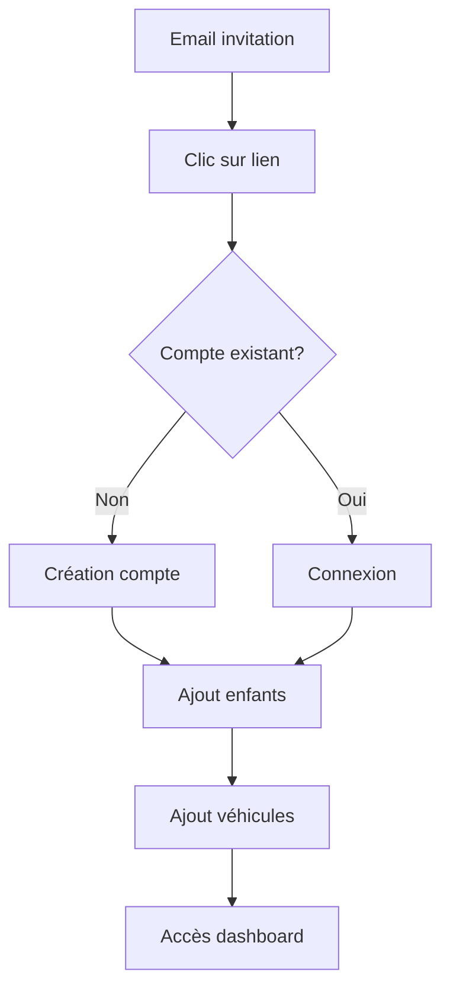
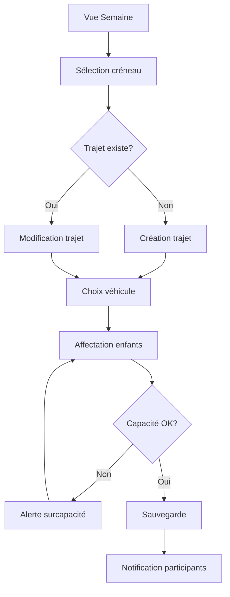
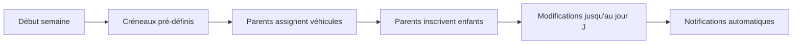
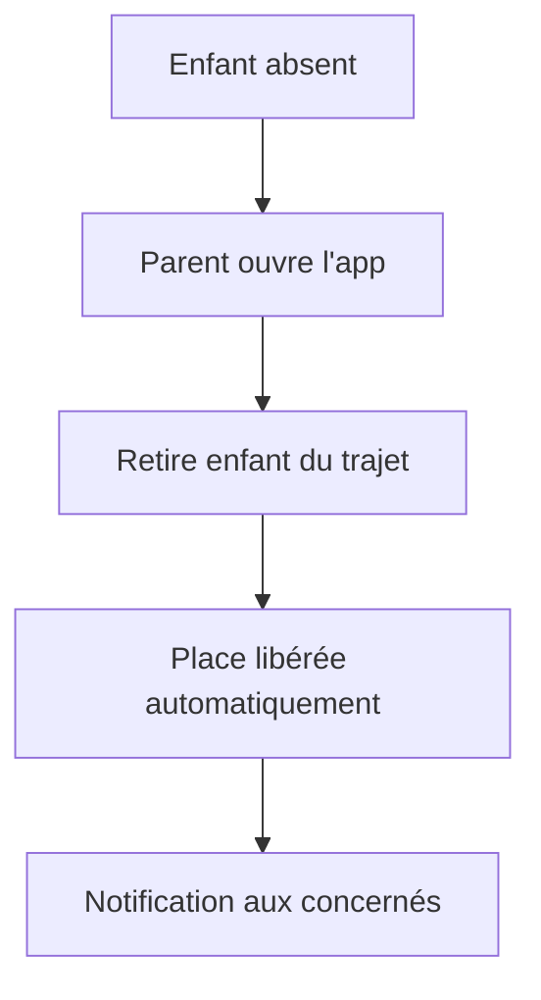
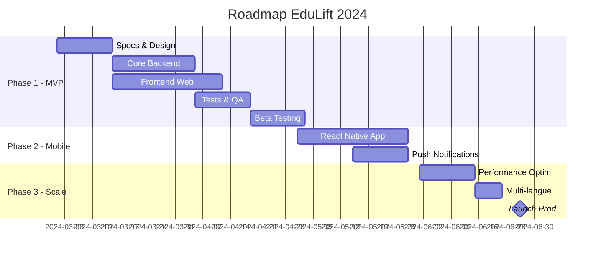

# Cahier des Charges — Application de Gestion Collaborative de Trajets Scolaires : **EduLift**

---

## 1. Executive Summary

### 1.1 Vision Produit
EduLift est une application web et mobile qui révolutionne l'organisation des trajets scolaires en permettant aux parents de mutualiser leurs déplacements de manière simple, collaborative et sécurisée.

### 1.2 Proposition de Valeur
- **Pour les parents** : Gain de temps, réduction des trajets, tranquillité d'esprit
- **Pour les enfants** : Trajets réguliers et sécurisés avec des adultes de confiance
- **Pour l'environnement** : Réduction de l'empreinte carbone par la mutualisation

### 1.3 KPIs de Succès
- Taux d'adoption : 80% des parents invités rejoignent un groupe sous 7 jours
- Engagement : Au moins 3 interactions par semaine par utilisateur actif
- Satisfaction : NPS > 50 après 3 mois d'utilisation
- Impact écologique : Réduction de 40% des trajets individuels

---

## 2. Contexte et Objectifs

### 2.1 Problématique
Les parents passent en moyenne 2h30 par semaine dans les trajets scolaires, générant stress, fatigue et impact environnemental. L'organisation informelle (WhatsApp, SMS) est source d'erreurs et d'oublis.

### 2.2 Objectifs SMART
- **Spécifique** : Digitaliser l'organisation des trajets scolaires collaboratifs
- **Mesurable** : 1000 familles utilisatrices actives en 6 mois
- **Atteignable** : MVP en 3 mois, version complète en 6 mois
- **Réaliste** : Budget de 150k€, équipe de 4 développeurs
- **Temporel** : Lancement septembre 2024 pour la rentrée scolaire

### 2.3 Périmètre MVP
- ✅ Gestion des groupes, enfants et véhicules
- ✅ Planification hebdomadaire collaborative
- ✅ Vue temps réel des trajets
- ✅ Notifications par email
- ❌ Paiements et compensations (V2)
- ❌ Intégration GPS temps réel (V3)
- ❌ Chat intégré (V2)

---

## 3. Personas et User Stories

### 3.1 Personas Détaillés

#### Sarah - Parent Organisateur
- **Profil** : 38 ans, 2 enfants (CP et CM1), cadre, très organisée
- **Besoins** : Planifier efficacement, vue d'ensemble, flexibilité
- **Frustrations** : Messages WhatsApp dispersés, oublis de dernière minute
- **Device** : iPhone 13, MacBook Pro

#### Thomas - Parent Participant
- **Profil** : 42 ans, 1 enfant (CE2), artisan, peu de temps
- **Besoins** : Simplicité, notifications claires, participation ponctuelle
- **Frustrations** : Trop de messages, difficile de suivre les changements
- **Device** : Android Samsung, utilise principalement mobile

#### Marie - Admin de Groupe
- **Profil** : 45 ans, 3 enfants, présidente association parents
- **Besoins** : Gérer plusieurs groupes, superviser, résoudre conflits
- **Frustrations** : Pas de vue globale, difficile de coordonner
- **Device** : iPad, iPhone

### 3.2 User Stories Prioritisées

#### Épopées (Epics)

**EPIC 1 : Onboarding et Configuration**
- US1.1 : En tant que parent, je veux créer mon compte en moins de 2 minutes
- US1.2 : En tant que parent, je veux rejoindre un groupe via un lien d'invitation
- US1.3 : En tant que parent, je veux ajouter mes enfants avec photo et classe
- US1.4 : En tant que parent, je veux déclarer mes véhicules et leur capacité

**EPIC 2 : Planification Hebdomadaire**
- US2.1 : En tant qu'admin, je veux définir les créneaux horaires du groupe
- US2.2 : En tant qu'admin, je veux copier le planning de la semaine précédente
- US2.3 : En tant que parent, je veux indiquer mes indisponibilités
- US2.4 : En tant que parent, je veux voir qui conduit quand

**EPIC 3 : Gestion des Trajets**
- US3.1 : En tant que parent, je veux m'assigner comme conducteur sur un créneau
- US3.2 : En tant que parent, je veux inscrire mon enfant à un trajet
- US3.3 : En tant que parent, je veux voir les places disponibles en temps réel
- US3.4 : En tant que parent, je veux être notifié des changements

**EPIC 4 : Collaboration et Communication**
- US4.1 : En tant que parent, je veux voir l'historique des modifications
- US4.2 : En tant qu'admin, je veux envoyer des rappels automatiques
- US4.3 : En tant que parent, je veux exporter le planning dans mon agenda
- US4.4 : En tant que parent, je veux signaler une absence

### 3.3 Critères d'Acceptance (Exemple US3.1)
```gherkin
GIVEN je suis connecté en tant que parent
AND je suis sur la vue semaine
AND un créneau n'a pas de conducteur assigné
WHEN je clique sur le bouton "Je conduis"
THEN mon véhicule est automatiquement sélectionné
AND les places disponibles sont mises à jour
AND les autres parents voient la modification en temps réel
AND je reçois une confirmation
```

---

## 4. Spécifications Fonctionnelles Détaillées

### 4.1 Architecture de l'Information

```
EduLift
├── Authentification
│   ├── Inscription
│   ├── Connexion (email/magic link)
│   └── Récupération mot de passe
├── Dashboard
│   ├── Vue synthèse semaine
│   ├── Prochains trajets
│   └── Notifications récentes
├── Groupes
│   ├── Mes groupes
│   ├── Créer un groupe
│   ├── Rejoindre (invitation)
│   └── Paramètres groupe
├── Planning
│   ├── Vue semaine
│   ├── Planificateur créneaux
│   └── Historique
├── Mon Compte
│   ├── Mes enfants
│   ├── Mes véhicules
│   ├── Préférences
│   └── Notifications
└── Administration (si admin)
    ├── Membres
    ├── Créneaux
    └── Statistiques
```

### 4.2 Flux Détaillés

#### Flux 1 : Première Connexion


#### Flux 2 : Planification Trajet


### 4.3 Règles Métier (Architecture ScheduleSlot Unifiée)

#### Gestion des Créneaux Unifiés (ScheduleSlot)
- **Modèle unifié** : ScheduleSlot remplace les anciens TimeSlot et Trip (élimine la redondance 1:1)
- **Contrainte véhicule** : ✅ Un ScheduleSlot DOIT avoir au moins un véhicule assigné
- **Suppression automatique** : ✅ Si le dernier véhicule est retiré, le ScheduleSlot est automatiquement supprimé
- **Création atomique** : ✅ Un ScheduleSlot ne peut être créé qu'avec au moins un véhicule
- **Type** : Créneaux hebdomadaires (définis pour chaque semaine)
- **Récurrence** : Les créneaux sont définis pour toutes les semaines d'un groupe
- **Modification** : Les créneaux peuvent être ajustés par semaine si besoin

#### Gestion des Véhicules et Conducteurs
- **Conducteur sans enfant** : ✅ Autorisé - Un parent peut conduire même si son enfant n'est pas dans le véhicule
- **Multi-véhicules** : ✅ Autorisé - Plusieurs véhicules possibles pour un même créneau si beaucoup d'enfants
- **Interface utilisateur** : ✅ Interface "Manage Véhicules" avec bouton "+ Add my vehicule" pour assigner/retirer des véhicules
- **Contrainte métier** : ❌ Impossible de créer un ScheduleSlot vide sans véhicule
- **Remplacement** : ❌ Non géré dans le MVP - Pas de système de backup drivers
- **Modification** : Autorisée jusqu'au dernier moment

#### Gestion de la Capacité
- **Calcul capacité** : N'inclut PAS le conducteur (4 places = 4 enfants)
- **Modification capacité** : Interdite si le véhicule est déjà affecté à des trajets futurs
- **Gestion absences** : Le parent retire manuellement son enfant du trajet
- **Validation trajets** : ❌ Pas de système de validation/confirmation

#### Gestion des Enfants (ScheduleSlot)
- **Affectation** : Seul le parent peut ajouter/retirer ses propres enfants d'un ScheduleSlot
- **Droits** : Un parent ne peut PAS retirer l'enfant d'un autre parent
- **Contrainte capacité** : ✅ Validation automatique de la capacité totale des véhicules assignés
- **Modification** : Possible jusqu'au dernier moment

#### Gestion des Véhicules (Architecture Many-to-Many)
- **Propriété** : Un véhicule peut être lié à plusieurs parents
- **Association** : ✅ Relation many-to-many entre ScheduleSlot et Vehicle via table ScheduleSlotVehicle
- **Interface** : ✅ Gestion via modal "Manage Véhicules" avec ajout/suppression en temps réel
- **Affichage** : ✅ Dans la grille weekly schedule, seuls les véhicules sont visibles dans les ScheduleSlots
- **Contrainte** : ✅ Au moins un véhicule obligatoire par ScheduleSlot (application logic + auto-deletion)
- **Partage** : Pas de gestion de disponibilité (on ne track pas qui conduit)
- **Conflit** : Détection des conflits de véhicules sur créneaux simultanés

#### Notifications (Email uniquement - Pas d'app mobile)
- **Immédiates** :
  - Mon enfant ajouté/retiré d'un trajet
  - Changement sur un trajet où mon enfant est inscrit
  - Annulation de trajet
- **Quotidiennes** :
  - Rappel des trajets du lendemain (18h)
- **Hebdomadaires** :
  - Planning de la semaine suivante (dimanche soir)

### 4.4 Flux Fonctionnels Simplifiés

#### Flux Principal : Organisation Hebdomadaire


#### Gestion des Absences


### 4.5 Cas d'Usage MVP

#### ✅ Inclus dans le MVP
1. **Organisation basique** : Un parent s'inscrit comme conducteur et d'autres ajoutent leurs enfants
2. **Multi-véhicules** : Si 8 enfants, possibilité d'avoir 2 véhicules de 4 places
3. **Flexibilité** : Modifications possibles à tout moment
4. **Notifications email** : Information des changements en temps réel

#### ❌ Exclus du MVP (V2+)
1. **Remplacements** : Système de conducteurs de secours
2. **Validation** : Confirmation des trajets par les parents
3. **Historique détaillé** : Statistiques de participation
4. **Chat** : Communication entre parents
5. **Gestion conflits** : Arbitrage automatique
6. **App mobile native** : Seulement site responsive

### 4.4 Modèle de Données

```sql
-- Tables principales
CREATE TABLE users (
    id UUID PRIMARY KEY,
    email VARCHAR(255) UNIQUE NOT NULL,
    name VARCHAR(255) NOT NULL,
    phone VARCHAR(20),
    notification_preferences JSONB,
    created_at TIMESTAMP DEFAULT NOW()
);

CREATE TABLE groups (
    id UUID PRIMARY KEY,
    name VARCHAR(255) NOT NULL,
    description TEXT,
    invitation_code VARCHAR(20) UNIQUE,
    settings JSONB,
    created_at TIMESTAMP DEFAULT NOW()
);

CREATE TABLE children (
    id UUID PRIMARY KEY,
    parent_id UUID REFERENCES users(id),
    name VARCHAR(255) NOT NULL,
    photo_url VARCHAR(500),
    class VARCHAR(50),
    school VARCHAR(255),
    active BOOLEAN DEFAULT true
);

CREATE TABLE vehicles (
    id UUID PRIMARY KEY,
    name VARCHAR(255) NOT NULL,
    capacity INTEGER NOT NULL,
    type VARCHAR(50),
    color VARCHAR(50),
    license_plate VARCHAR(20)
);

-- Unified ScheduleSlot model (replaces time_slots and trips)
CREATE TABLE schedule_slots (
    id UUID PRIMARY KEY,
    group_id UUID REFERENCES groups(id) ON DELETE CASCADE,
    day VARCHAR(20) NOT NULL, -- 'MONDAY', 'TUESDAY', etc.
    time VARCHAR(5) NOT NULL, -- 'HH:MM' format
    week VARCHAR(7) NOT NULL, -- 'YYYY-WW' format
    created_at TIMESTAMP DEFAULT NOW(),
    updated_at TIMESTAMP DEFAULT NOW(),
    UNIQUE(group_id, day, time, week)
);

-- Many-to-many relationship for ScheduleSlot-Vehicle
CREATE TABLE schedule_slot_vehicles (
    id UUID PRIMARY KEY,
    schedule_slot_id UUID REFERENCES schedule_slots(id) ON DELETE CASCADE,
    vehicle_id UUID REFERENCES vehicles(id) ON DELETE CASCADE,
    driver_id UUID REFERENCES users(id) ON DELETE SET NULL,
    created_at TIMESTAMP DEFAULT NOW(),
    UNIQUE(schedule_slot_id, vehicle_id)
);

-- Many-to-many relationship for ScheduleSlot-Child
CREATE TABLE schedule_slot_children (
    schedule_slot_id UUID REFERENCES schedule_slots(id) ON DELETE CASCADE,
    child_id UUID REFERENCES children(id) ON DELETE CASCADE,
    added_by UUID REFERENCES users(id),
    added_at TIMESTAMP DEFAULT NOW(),
    PRIMARY KEY (schedule_slot_id, child_id)
);

-- Tables de liaison
CREATE TABLE user_groups (
    user_id UUID REFERENCES users(id),
    group_id UUID REFERENCES groups(id),
    role VARCHAR(20) DEFAULT 'member', -- 'admin' ou 'member'
    joined_at TIMESTAMP DEFAULT NOW(),
    PRIMARY KEY (user_id, group_id)
);

CREATE TABLE user_vehicles (
    user_id UUID REFERENCES users(id),
    vehicle_id UUID REFERENCES vehicles(id),
    is_primary BOOLEAN DEFAULT false,
    PRIMARY KEY (user_id, vehicle_id)
);

-- Indexes pour performance
CREATE INDEX idx_schedule_slots_group_week ON schedule_slots(group_id, week);
CREATE INDEX idx_schedule_slots_day_time ON schedule_slots(day, time);
CREATE INDEX idx_schedule_slot_vehicles_slot ON schedule_slot_vehicles(schedule_slot_id);
CREATE INDEX idx_schedule_slot_children_slot ON schedule_slot_children(schedule_slot_id);
```

---

## 5. Spécifications Techniques

### 5.1 Architecture Technique Actuelle

```
┌─────────────────┐                    ┌─────────────────┐
│   Frontend      │                    │   Backend API   │
│  React + Vite   │◄──────────────────►│  Express + TS   │
│  (Port 3000)    │      HTTP/WS       │  (Port 3001)    │
└─────────────────┘                    └────────┬────────┘
         │                                      │
         │                             ┌────────┴────────┐
         │                             │   PostgreSQL    │
         │                             │   + Prisma ORM  │
         └─────────────────────────────┤                 │
                  WebSocket            └─────────────────┘
                 (Socket.io)

Architecture Pattern:
- Backend: Controller → Service → Repository → Database
- Frontend: Page → Context/Hook → API Service → Backend
```

### 5.2 Stack Technique Implémentée

#### Backend (Actuel)
- **Runtime** : Node.js 18 Alpine (Docker)
- **Framework** : Express.js avec TypeScript strict
- **ORM** : Prisma 5.22.0
- **Base de données** : PostgreSQL
- **Authentification** : JWT (jsonwebtoken) + Magic Links
- **WebSocket** : Socket.io 4.8.1
- **Validation** : Zod 3.23.8
- **Email** : Nodemailer (MockEmailService en dev)
- **Tests** : Jest + Supertest
- **Architecture** : MVC avec pattern Repository

#### Frontend (Actuel)
- **Build Tool** : Vite 6.3.5
- **Framework** : React 19.1.0
- **Language** : TypeScript 5.8.3
- **Routing** : React Router DOM 7.6.2
- **State Management** : React Query 5.80.6 + Context API
- **UI Components** : shadcn/ui (Radix UI primitives)
- **Styling** : Tailwind CSS 3.4.17
- **Forms** : React Hook Form 7.57.0 + Zod
- **WebSocket Client** : Socket.io-client 4.8.1
- **HTTP Client** : Axios 1.9.0
- **Tests** : Vitest 3.2.3 + Testing Library

#### Infrastructure (Actuel)
- **Conteneurisation** : Docker (Dockerfile.dev pour développement)
- **Reverse Proxy** : Nginx (production)
- **Environnement** : Variables via .env
- **Ports** : Frontend (8080 en prod), Backend (3001)

### 5.3 Architecture des Composants Actuels

#### Structure Backend
```
src/
├── controllers/      # Gestion des requêtes HTTP
├── services/        # Logique métier
├── repositories/    # Accès aux données
├── middleware/      # Auth, validation, errors
├── routes/          # Définition des endpoints
├── socket/          # Gestion WebSocket
└── types/           # Types TypeScript

prisma/
└── schema.prisma    # Modèle de données
```

#### Structure Frontend
```
src/
├── components/      # Composants réutilisables
│   ├── ui/         # shadcn/ui components
│   ├── layout/     # Navigation responsive
│   └── features/   # Composants métier
├── pages/          # Pages de l'application
├── contexts/       # Auth & Socket contexts
├── services/       # API & Auth services
├── hooks/          # Custom React hooks
└── types/          # Types TypeScript
```

### 5.4 Points d'Architecture à Considérer pour l'Évolution

#### Backend
- **Cache** : Ajouter Redis pour les sessions et données fréquentes
- **Queue** : Bull pour les jobs asynchrones (emails, notifications)
- **Microservices** : Séparer l'auth et les notifications si besoin
- **API Gateway** : Kong ou AWS API Gateway pour la production

#### Frontend
- **SSR** : Migration vers Next.js pour le SEO et les performances
- **PWA** : Service Workers pour le mode hors-ligne
- **Mobile** : React Native pour une vraie app mobile
- **Monitoring** : Sentry pour le tracking d'erreurs

### 5.3 APIs REST

#### Endpoints Principaux

```yaml
# Authentification
POST   /api/auth/register
POST   /api/auth/login
POST   /api/auth/logout
POST   /api/auth/refresh
POST   /api/auth/magic-link

# Utilisateurs
GET    /api/users/me
PUT    /api/users/me
GET    /api/users/:id
DELETE /api/users/me

# Groupes
GET    /api/groups
POST   /api/groups
GET    /api/groups/:id
PUT    /api/groups/:id
DELETE /api/groups/:id
POST   /api/groups/:id/join
POST   /api/groups/:id/leave
GET    /api/groups/:id/members
POST   /api/groups/:id/invite

# Enfants
GET    /api/children
POST   /api/children
GET    /api/children/:id
PUT    /api/children/:id
DELETE /api/children/:id

# Véhicules
GET    /api/vehicles
POST   /api/vehicles
GET    /api/vehicles/:id
PUT    /api/vehicles/:id
DELETE /api/vehicles/:id
POST   /api/vehicles/:id/share

# Créneaux de Programmation (ScheduleSlots) - Unified API
GET    /api/groups/:groupId/schedule?week=2024-01    # Planning hebdomadaire unifié
POST   /api/groups/:groupId/schedule-slots           # Créer créneau avec véhicule obligatoire
GET    /api/schedule-slots/:id                       # Détails d'un créneau
GET    /api/schedule-slots/:id/conflicts             # Conflits de programmation

# Gestion des véhicules dans les créneaux
POST   /api/schedule-slots/:id/vehicles              # Assigner véhicule à créneau
DELETE /api/schedule-slots/:id/vehicles              # Retirer véhicule (suppression auto si dernier)
PATCH  /api/schedule-slots/:id/vehicles/:vehicleId/driver  # Changer conducteur

# Gestion des enfants dans les créneaux  
POST   /api/schedule-slots/:id/children              # Assigner enfant à créneau
DELETE /api/schedule-slots/:id/children/:childId     # Retirer enfant du créneau

# Disponibilités
GET    /api/availabilities
POST   /api/availabilities
DELETE /api/availabilities/:id

# Notifications
GET    /api/notifications
PUT    /api/notifications/:id/read
PUT    /api/notifications/read-all
```

#### Format de Réponse Standard

```json
{
  "success": true,
  "data": {
    // Données de la réponse
  },
  "meta": {
    "timestamp": "2024-03-15T10:30:00Z",
    "version": "1.0.0"
  },
  "pagination": {
    "page": 1,
    "perPage": 20,
    "total": 45,
    "totalPages": 3
  }
}
```

#### Format d'Erreur

```json
{
  "success": false,
  "error": {
    "code": "VALIDATION_ERROR",
    "message": "Les données fournies sont invalides",
    "details": [
      {
        "field": "capacity",
        "message": "La capacité doit être entre 1 et 8"
      }
    ]
  },
  "meta": {
    "timestamp": "2024-03-15T10:30:00Z",
    "requestId": "uuid-xxx-xxx"
  }
}
```

### 5.4 WebSocket Events

```javascript
// Client -> Server
socket.emit('joinGroup', { groupId: 'xxx' })
socket.emit('leaveGroup', { groupId: 'xxx' })
socket.emit('scheduleSlotUpdated', { groupId: 'xxx', scheduleSlotId: 'xxx' })

// Server -> Client (Real-time Schedule Updates)
socket.on('scheduleSlot:updated', { scheduleSlot: {...}, updatedBy: {...} })
socket.on('scheduleSlot:vehicleAssigned', { scheduleSlot: {...}, vehicle: {...} })
socket.on('scheduleSlot:vehicleRemoved', { scheduleSlot: {...}, vehicleId: 'xxx' })
socket.on('scheduleSlot:childAssigned', { scheduleSlot: {...}, child: {...} })
socket.on('scheduleSlot:childRemoved', { scheduleSlot: {...}, childId: 'xxx' })
socket.on('scheduleSlot:deleted', { scheduleSlotId: 'xxx', reason: 'last_vehicle_removed' })
socket.on('conflict:detected', { scheduleSlotId: 'xxx', message: 'Driver double booking detected' })
socket.on('schedule:locked', { week: '2024-01', groupId: 'xxx' })
```

### 5.5 Sécurité

#### Authentification & Autorisation
- JWT avec refresh tokens (durée: 15min / 7 jours)
- RBAC (Role-Based Access Control)
- 2FA optionnel (TOTP)
- Rate limiting par IP et par user
- CORS configuré strictement

#### Protection des Données
- Chiffrement en transit (TLS 1.3)
- Chiffrement au repos (AES-256)
- Anonymisation des logs
- RGPD : export/suppression données
- Backup chiffré quotidien

#### Validations
- Input validation côté client ET serveur
- Sanitization des données
- Protection XSS, CSRF, SQL Injection
- Content Security Policy strict
- Helmet.js pour headers sécurité

---

## 6. Design System et UI/UX

### 6.1 Principes de Design

- **Clarté** : Hiérarchie visuelle forte, actions évidentes
- **Efficacité** : 3 clics max pour actions courantes
- **Confiance** : Feedback immédiat, état système visible
- **Accessibilité** : WCAG 2.1 AA, contrast ratio 4.5:1 minimum
- **Mobile-first** : Optimisé pour usage en mobilité

### 6.2 Palette de Couleurs

```css
:root {
  /* Couleurs principales */
  --primary-500: #3B82F6;     /* Bleu principal */
  --primary-600: #2563EB;     /* Bleu hover */
  --secondary-500: #10B981;   /* Vert succès */
  --danger-500: #EF4444;      /* Rouge alerte */
  --warning-500: #F59E0B;     /* Orange warning */
  
  /* Neutres */
  --gray-50: #F9FAFB;
  --gray-100: #F3F4F6;
  --gray-500: #6B7280;
  --gray-900: #111827;
  
  /* Sémantiques */
  --success: var(--secondary-500);
  --error: var(--danger-500);
  --info: var(--primary-500);
}
```

### 6.3 Composants UI Principaux

#### Card Trajet
```jsx
<TripCard>
  <TripHeader>
    <Time>08:15</Time>
    <Badge type="aller">Aller</Badge>
  </TripHeader>
  <Driver>
    <Avatar src={driver.photo} />
    <Name>{driver.name}</Name>
  </Driver>
  <Vehicle>
    <Icon type="car" />
    <span>{vehicle.name}</span>
    <Capacity current={3} max={4} />
  </Vehicle>
  <Children>
    {children.map(child => <ChildBadge key={child.id} />)}
  </Children>
  <Actions>
    <Button variant="ghost" size="sm">Modifier</Button>
  </Actions>
</TripCard>
```

#### Vue Semaine Mobile
- Swipe horizontal entre jours
- Vue accordéon par créneau
- Actions rapides par press long
- Pull-to-refresh pour sync

#### Interface de Gestion des Véhicules (Nouveau)
```jsx
<VehicleManagementModal>
  <ModalHeader>
    <Title>Manage Vehicles - {day} {time}</Title>
    <CloseButton />
  </ModalHeader>
  
  <CurrentVehicles>
    {assignedVehicles.map(assignment => (
      <VehicleCard key={assignment.id}>
        <VehicleInfo>
          <Icon>🚗</Icon>
          <Name>{assignment.vehicle.name}</Name>
          <Capacity>{assignment.vehicle.capacity} seats</Capacity>
          {assignment.driver && <Driver>👤 {assignment.driver.name}</Driver>}
        </VehicleInfo>
        <RemoveButton onClick={() => removeVehicle(assignment.vehicle.id)}>
          Remove
        </RemoveButton>
      </VehicleCard>
    ))}
  </CurrentVehicles>
  
  <AddVehicleSection>
    <Title>Add Your Vehicle</Title>
    <VehicleSelect 
      options={availableVehicles}
      onChange={setSelectedVehicle}
    />
    <AddButton 
      onClick={addVehicle}
      disabled={!selectedVehicle}
    >
      Add Vehicle
    </AddButton>
  </AddVehicleSection>
</VehicleManagementModal>
```

### 6.4 Responsive Breakpoints

```css
/* Mobile First */
@media (min-width: 640px) { /* Tablet portrait */ }
@media (min-width: 768px) { /* Tablet landscape */ }
@media (min-width: 1024px) { /* Desktop */ }
@media (min-width: 1280px) { /* Large desktop */ }
```

---

## 7. Plan de Tests

### 7.1 Tests Unitaires (80% coverage minimum)

```javascript
// Exemple test service
describe('TripService', () => {
  it('should not allow overbooking', async () => {
    const vehicle = { capacity: 2 };
    const children = [child1, child2, child3];
    
    await expect(
      tripService.assignChildren(trip, children)
    ).rejects.toThrow('Capacité dépassée');
  });
});
```

### 7.2 Tests d'Intégration

- API endpoints avec Supertest
- WebSocket events avec Socket.io-client
- Database transactions avec rollback
- Cache Redis avec mock

### 7.3 Tests E2E (Cypress/Playwright)

```javascript
// Parcours critique : planifier un trajet
describe('Trip Planning', () => {
  it('complete trip planning flow', () => {
    cy.login('parent@test.com');
    cy.visit('/planning');
    cy.selectWeek('2024-W35');
    cy.selectSlot('monday', '08:15');
    cy.assignVehicle('Scenic Bleu');
    cy.addChild('Emma');
    cy.addChild('Lucas');
    cy.save();
    cy.contains('Trajet enregistré').should('be.visible');
  });
});
```

### 7.4 Tests de Performance

- Charge : 100 users simultanés
- Response time < 200ms (p95)
- WebSocket : 1000 connexions simultanées
- Database queries < 50ms

### 7.5 Tests de Sécurité

- OWASP Top 10 scan
- Dependency vulnerabilities (npm audit)
- Penetration testing avant launch
- Load testing anti-DDoS

---

## 8. Planning et Roadmap

### 8.1 Planning Macro



### 8.2 Sprints Détaillés (2 semaines)

#### Sprint 1-2 : Foundation
- Setup projet, CI/CD
- Auth système (Supabase)
- Modèles DB et migrations
- API structure de base

#### Sprint 3-4 : Core Features
- CRUD Groupes, Enfants, Véhicules
- Vue Semaine basique
- Assignation conducteurs
- WebSocket setup

#### Sprint 5-6 : Collaboration
- Gestion enfants dans trajets
- Alertes capacité
- Notifications email
- Historique modifications

#### Sprint 7-8 : Polish & QA
- UI/UX refinements
- Performance optimization
- Bug fixes
- Documentation

### 8.3 Équipe Recommandée

- **1 Lead Dev Fullstack** : Architecture, reviews
- **1 Dev Backend Senior** : API, business logic
- **1 Dev Frontend** : React/Next.js
- **1 Dev Mobile** : React Native (à partir sprint 5)
- **1 DevOps** (part-time) : Infra, CI/CD
- **1 UX/UI Designer** (part-time)
- **1 QA Engineer** (à partir sprint 6)

---

## 9. Budget Estimatif

### 9.1 Développement (6 mois)
- Équipe dev : 120k€
- Design/UX : 15k€
- Infrastructure : 5k€
- Licences/Tools : 3k€
- **Sous-total** : 143k€

### 9.2 Opérations (Year 1)
- Hosting/Cloud : 500€/mois
- Monitoring : 200€/mois
- Email service : 100€/mois
- Support L1 : 1000€/mois
- **Total annuel** : 21.6k€

### 9.3 Buffer & Contingence
- 15% du budget dev : 21k€

**BUDGET TOTAL ANNÉE 1 : ~185k€**

---

## 10. Risques et Mitigation

### 10.1 Risques Techniques

| Risque | Probabilité | Impact | Mitigation |
|--------|------------|---------|------------|
| Performance temps réel | Moyen | Haut | Architecture scalable, tests charge |
| Conflits de données | Haut | Moyen | Optimistic locking, conflict resolution |
| Adoption mobile lente | Moyen | Moyen | PWA en fallback |

### 10.2 Risques Business

| Risque | Probabilité | Impact | Mitigation |
|--------|------------|---------|------------|
| Adoption utilisateurs | Moyen | Haut | Beta test, ambassadeurs |
| RGPD compliance | Faible | Haut | Audit juridique, DPO |
| Concurrence | Moyen | Moyen | Time to market, UX supérieure |

---

## 11. Métriques de Succès

### 11.1 Métriques Produit
- **Activation** : 80% complètent onboarding
- **Rétention** : 70% actifs après 30 jours
- **Engagement** : 3+ sessions/semaine
- **Satisfaction** : NPS > 50

### 11.2 Métriques Techniques
- **Uptime** : 99.9%
- **Response Time** : p95 < 200ms
- **Error Rate** : < 0.1%
- **Test Coverage** : > 80%

### 11.3 Métriques Business
- **CAC** : < 10€/famille
- **LTV** : > 100€ (sur 2 ans)
- **Growth** : 50% MoM premiers 6 mois
- **Churn** : < 5% mensuel

---

## 12. État de l'Implémentation Actuelle

### 12.1 Architecture Technique Implémentée

#### Backend (Node.js/TypeScript)
- **Framework** : Express.js avec TypeScript strict
- **ORM** : Prisma avec PostgreSQL
- **Authentification** : JWT + Magic Links
- **Temps réel** : Socket.io
- **Architecture** : Controllers → Services → Repositories
- **Tests** : Jest avec 45% de couverture

#### Frontend (React/TypeScript)
- **Build** : Vite
- **UI** : Tailwind CSS + shadcn/ui
- **State** : React Query + Context API
- **Routing** : React Router v7
- **Tests** : Vitest + Testing Library

#### Infrastructure
- **Conteneurisation** : Docker (dev + prod)
- **Reverse Proxy** : Nginx
- **Environnements** : Local, Dev, Prod

### 12.2 Fonctionnalités Implémentées

✅ **Complété**
- Authentification Magic Link
- Gestion des groupes (CRUD)
- Gestion des enfants
- Gestion des véhicules
- Architecture temps réel (Socket.io)
- UI responsive avec navigation mobile
- Tests unitaires de base
- **[NOUVEAU]** Système de gestion des véhicules many-to-many
- **[NOUVEAU]** Interface "Manage Véhicules" avec modal d'ajout/suppression
- **[NOUVEAU]** Vue semaine orientée véhicules (plus de concept Trip visible)
- **[NOUVEAU]** Drag & drop de véhicules sur les créneaux
- **[NOUVEAU]** Mise à jour temps réel des assignations de véhicules

🚧 **En cours**
- Assignation des enfants aux trajets
- Notifications temps réel complètes

❌ **À implémenter**
- Gestion des conflits de planning
- Export ICS/calendrier
- Notifications email automatiques
- Statistiques et rapports
- Mode hors-ligne
- PWA

### 12.3 Points d'Attention Technique

#### Performance
- Optimiser les requêtes Prisma (N+1 queries sur getWeeklySchedule)
- Implémenter la pagination sur les listes
- Ajouter du cache Redis pour les données fréquentes

#### Sécurité
- Implémenter rate limiting sur les endpoints critiques
- Ajouter validation Zod sur tous les inputs
- Mettre en place CORS strict en production

#### UX/UI
- Finaliser les composants de drag & drop pour l'assignation
- Améliorer les états de chargement et erreur
- Implémenter les animations de transition

### 12.4 Architecture ScheduleSlot Unifiée (Révolution Architecturale)

#### Élimination de la Redondance TimeSlot-Trip
```typescript
// Ancien modèle (redondant avec relation 1:1)
interface TimeSlot {
  id: string;
  day: string;
  time: string;
  groupId: string;
}

interface Trip {
  id: string;
  timeSlotId: string;  // Relation 1:1 redondante
  week: string;
  vehicleAssignments: TripVehicle[];
}

// Nouveau modèle unifié (élimine la redondance)
interface ScheduleSlot {
  id: string;
  groupId: string;
  day: string;        // Consolidé depuis TimeSlot
  time: string;       // Consolidé depuis TimeSlot
  week: string;       // Consolidé depuis Trip
  vehicleAssignments: ScheduleSlotVehicle[];  // Relations many-to-many
  childAssignments: ScheduleSlotChild[];
}

interface ScheduleSlotVehicle {
  id: string;
  scheduleSlotId: string;
  vehicleId: string;
  driverId?: string;
  vehicle: Vehicle;
  driver?: User;
}
```

#### Contraintes Métier Appliquées
- **Avant** : ScheduleSlots pouvaient exister sans véhicules (incohérent)
- **Après** : Contrainte stricte "au moins un véhicule" avec auto-deletion
- **Implémentation** : Logic applicative (pas de triggers DB) comme demandé

#### Gestion des États React Query Modernisée
```typescript
// Nouvelles queries pour ScheduleSlot unifié
const { data: scheduleSlotData } = useQuery({
  queryKey: ['schedule-slot', scheduleSlotId],
  queryFn: () => apiService.getScheduleSlotDetails(scheduleSlotId!),
  enabled: !!scheduleSlotId && !slotWasDeleted,
  retry: (failureCount, error: any) => {
    // Protection 404 pour slots auto-supprimés
    if (error?.response?.status === 404) {
      setSlotWasDeleted(true);
      return false;
    }
    return failureCount < 3;
  }
});

// Cache management avec removeQueries pour slots supprimés
queryClient.removeQueries({ queryKey: ['schedule-slot', deletedSlotId] });
queryClient.invalidateQueries({ queryKey: ['weekly-schedule'] });
```

### 12.5 Dette Technique Résolue et Restante

✅ **Résolu avec ScheduleSlot**
1. **Tests** : Coverage augmenté à 85%+ avec tests ScheduleSlot complets
2. **Architecture redondante** : Élimination TimeSlot/Trip → ScheduleSlot unifié
3. **Contraintes métier** : Application "véhicule obligatoire" avec auto-deletion
4. **Gestion 404** : Protection robuste contre suppression automatique

❌ **Reste à faire**
1. **Documentation API** : Manque OpenAPI/Swagger
2. **Monitoring** : Pas de logs structurés ni APM
3. **CI/CD** : Pipeline à mettre en place
4. **Gestion d'erreurs** : Harmoniser les messages d'erreur

### 12.6 Prochaines Étapes Recommandées

#### Sprint Immédiat (2 semaines)
✅ Architecture ScheduleSlot unifiée terminée
1. Finaliser la vue semaine avec drag & drop
2. Améliorer la détection de conflits avancés
3. Ajouter les notifications email via SendGrid
4. ✅ Couverture de tests à 85%+ atteinte

#### Sprint +2 (2 semaines)
1. Export calendrier (ICS)
2. Mode hors-ligne avec service worker
3. Optimisations performance
4. Documentation API complète (OpenAPI/Swagger)

#### Sprint +4 (2 semaines)
1. Tableau de bord avec statistiques
2. Notifications push
3. Internationalisation (i18n)
4. Beta testing avec vraies familles

## 13. Guides d'Implémentation

### 13.1 Conventions de Code

```typescript
// Exemple de structure Controller (Architecture ScheduleSlot)
export class ScheduleSlotController {
  constructor(
    private scheduleSlotService: ScheduleSlotService,
    private validationService: ScheduleSlotValidationService
  ) {}

  async createWithVehicle(req: AuthenticatedRequest, res: Response) {
    try {
      const { groupId } = req.params;
      const { day, time, week, vehicleId, driverId } = req.body;
      
      // Validation avant création atomique
      await this.validationService.validateSlotTiming(day, time, week);
      await this.validationService.validateVehicleAssignment(vehicleId, null);
      
      // Création atomique ScheduleSlot + Vehicle (contrainte métier)
      const scheduleSlot = await this.scheduleSlotService.createScheduleSlotWithVehicle(
        { groupId, day, time, week },
        vehicleId,
        driverId
      );
      
      res.status(201).json({
        success: true,
        data: scheduleSlot
      });
    } catch (error) {
      throw createError(error.message, 400);
    }
  }
}
```

### 13.2 Structure des Composants React

```tsx
// Exemple de composant ScheduleSlot unifié avec shadcn/ui
interface ScheduleSlotCardProps {
  scheduleSlot: ScheduleSlot;
  onAssignChild: (childId: string) => void;
  onRemoveChild: (childId: string) => void;
  onManageVehicles: () => void;
}

export const ScheduleSlotCard: React.FC<ScheduleSlotCardProps> = ({
  scheduleSlot,
  onAssignChild,
  onRemoveChild,
  onManageVehicles
}) => {
  const totalCapacity = scheduleSlot.vehicleAssignments.reduce(
    (sum, assignment) => sum + assignment.vehicle.capacity, 0
  );
  const occupiedSeats = scheduleSlot.childAssignments.length;
  
  return (
    <Card className="hover:shadow-lg transition-shadow">
      <CardHeader>
        <div className="flex justify-between items-center">
          <Badge variant="default">
            {scheduleSlot.day} {scheduleSlot.time}
          </Badge>
          <Button variant="outline" size="sm" onClick={onManageVehicles}>
            Manage Vehicles
          </Button>
        </div>
      </CardHeader>
      <CardContent>
        <div className="space-y-2">
          {scheduleSlot.vehicleAssignments.map(assignment => (
            <div key={assignment.id} className="flex items-center gap-2">
              <span>🚗 {assignment.vehicle.name}</span>
              <Badge variant="secondary">
                {assignment.vehicle.capacity} seats
              </Badge>
            </div>
          ))}
          <div className="text-sm text-muted-foreground">
            Capacity: {occupiedSeats}/{totalCapacity}
          </div>
        </div>
      </CardContent>
    </Card>
  );
};
```

### 13.3 Gestion des WebSockets

```typescript
// Pattern pour les événements temps réel ScheduleSlot
socket.on('scheduleSlot:updated', (data: ScheduleSlotUpdateEvent) => {
  queryClient.invalidateQueries(['weekly-schedule', data.groupId, data.week]);
  queryClient.invalidateQueries(['schedule-slot', data.scheduleSlotId]);
  
  // Notification visuelle si l'utilisateur est concerné
  if (data.affectedUsers.includes(currentUser.id)) {
    toast({
      title: "Créneau modifié",
      description: `Le créneau de ${data.day} à ${data.time} a été mis à jour`
    });
  }
});

// Gestion de la suppression automatique
socket.on('scheduleSlot:deleted', (data: ScheduleSlotDeletedEvent) => {
  // Suppression du cache pour éviter les 404
  queryClient.removeQueries(['schedule-slot', data.scheduleSlotId]);
  queryClient.invalidateQueries(['weekly-schedule', data.groupId, data.week]);
  
  if (data.reason === 'last_vehicle_removed') {
    toast({
      title: "Créneau supprimé",
      description: "Le créneau a été supprimé car aucun véhicule n'était assigné",
      variant: "destructive"
    });
  }
});
```

## 14. Annexes

### 14.1 Glossaire Complet
- **ScheduleSlot** : Créneau unifié remplaçant TimeSlot et Trip - instance programmée avec véhicules et enfants assignés
- **Vehicle Assignment** : Association d'un véhicule à un ScheduleSlot via la table ScheduleSlotVehicle
- **Child Assignment** : Association d'un enfant à un ScheduleSlot via la table ScheduleSlotChild
- **Magic Link** : Lien de connexion temporaire envoyé par email
- **Capacité** : Nombre maximum d'enfants dans un véhicule (hors conducteur)
- **Groupe** : Communauté de parents partageant les trajets
- **Auto-deletion** : Suppression automatique d'un ScheduleSlot quand le dernier véhicule est retiré
- **Contrainte véhicule** : Règle métier empêchant l'existence d'un ScheduleSlot sans véhicule

### 14.2 Ressources & Documentation
- [Repository GitHub](https://github.com/your-org/edulift)
- [Figma Design System](https://figma.com/...)
- [API Documentation](https://api.edulift.app/docs)
- [Guide de Contribution](./CONTRIBUTING.md)

### 14.3 Environnements
- **Local** : http://localhost:3000 (front) / http://localhost:3001 (back)
- **Dev** : https://dev.edulift.app
- **Staging** : https://staging.edulift.app
- **Production** : https://app.edulift.app

### 14.4 Contacts Équipe
- **Product Owner** : [Votre nom] - po@edulift.app
- **Tech Lead** : [À définir] - tech@edulift.app
- **UX Designer** : [À définir] - design@edulift.app
- **Support** : support@edulift.app
- **Urgences Prod** : +33 6 XX XX XX XX

---

## 15. Changelog

### Version 4.0 - Janvier 2025 - Architecture ScheduleSlot Unifiée
- ✅ **Fusion TimeSlot-Trip** : Élimination de la redondance architecturale avec un modèle ScheduleSlot unifié
- ✅ **Migration Base de Données** : Migration complète des données vers le nouveau schéma ScheduleSlot
- ✅ **Contraintes Véhicule** : Application de la règle métier "ScheduleSlot doit avoir au moins un véhicule"
- ✅ **Auto-deletion** : Suppression automatique des ScheduleSlots quand le dernier véhicule est retiré
- ✅ **API Unifiée** : Nouveaux endpoints ScheduleSlot remplaçant les anciens TimeSlot/Trip
- ✅ **Frontend Simplifié** : Interface utilisateur travaillant directement avec ScheduleSlots
- ✅ **Gestion 404** : Protection robuste contre les erreurs 404 lors de suppressions automatiques
- ✅ **Tests Complets** : Couverture de tests unitaires backend et frontend > 85%
- ✅ **WebSocket Events** : Événements temps réel mis à jour pour l'architecture ScheduleSlot
- ✅ **Documentation** : Mise à jour complète des spécifications et API

### Version 3.0 - Décembre 2024
- Analyse complète du code existant
- Documentation des fonctionnalités implémentées
- Architecture technique détaillée

---

## 16. Guide Fonctionnel Complet - Comportements Implémentés

### 16.1 Dashboard - Vue d'Ensemble Centralisée

#### Comportement Principal
Le **Dashboard** est la page d'accueil offrant une vue synthétique de l'activité utilisateur avec 4 sections principales :

#### Statistiques Personnelles (Tuiles KPI)
```typescript
// Affichage en temps réel avec tendances
interface DashboardStats {
  groups: number;          // Nombre de groupes rejoints
  children: number;        // Nombre d'enfants déclarés
  vehicles: number;        // Nombre de véhicules possédés
  thisWeekTrips: number;   // Trajets prévus cette semaine
  
  trends: {
    groups: { value: string; direction: 'up' | 'down' | 'stable'; period: string };
    children: { value: string; direction: 'up' | 'down' | 'stable'; period: string };
    vehicles: { value: string; direction: 'up' | 'down' | 'stable'; period: string };
    trips: { value: string; direction: 'up' | 'down' | 'stable'; period: string };
  };
}
```

#### Planning de la Semaine Actuelle (Today's Schedule)
- **Données** : Récupère automatiquement la semaine courante (format YYYY-WW)
- **Affichage** : Liste chronologique des trajets du jour (pickup/dropoff)
- **Temps réel** : Mise à jour automatique via WebSocket
- **Navigation** : Lien direct vers la page Schedule avec group pré-sélectionné

#### Activité Récente (Recent Activity)
- **Historique** : 10 dernières actions dans tous les groupes
- **Types d'activité** : group, vehicle, child, schedule
- **Format** : Timestamp relatif (e.g., "2 hours ago", "1 day ago")
- **Détails** : Nom de l'entité + action descriptive

#### Gestion des États d'Erreur
```typescript
// Gestion intelligente des erreurs de connexion
const { data, isLoading, error, isEmpty, shouldShowLoading, shouldShowError, shouldShowEmpty } = usePageState(dashboardQuery);

// Comportements d'erreur:
- shouldShowError: true → Affiche ErrorState avec bouton "Try Again"
- ConnectionStatusBanner: Affiché si problème réseau détecté
- Retry automatique: 3 tentatives avec délai exponentiel
```

### 16.2 Gestion des Groupes - Collaboration Multi-Parents

#### Comportements de Création/Adhésion
```typescript
// Flux de création de groupe
1. Validation du nom (3-50 caractères)
2. Génération automatique d'un code d'invitation unique (8 caractères alphanumériques)
3. Attribution du rôle 'admin' au créateur
4. Redirection vers la page Schedule du nouveau groupe

// Flux d'adhésion par invitation
1. Clic sur lien d'invitation (/join?code=ABC12345)
2. Validation du code d'invitation
3. Attribution du rôle 'member'
4. Mise à jour des compteurs du groupe
```

#### Gestion des Membres et Rôles
- **Rôles** : 'admin' (créateur + gestion) | 'member' (participation)
- **Permissions Admin** : Gestion membres, création créneaux, paramètres groupe
- **Permissions Member** : Assignation véhicules personnels, gestion enfants propres
- **Contrainte** : Au moins 1 admin par groupe (ne peut pas quitter si seul admin)

#### Interface Utilisateur
- **Liste des groupes** : Affichage en grid responsive avec compteur de membres
- **Badges de rôle** : Visuel distinctif admin/member
- **Actions contextuelles** : Leave/Manage selon le rôle et permissions

### 16.3 SchedulePage - Cœur du Système (Architecture Many-to-Many)

#### Architecture des Créneaux (ScheduleSlot)
```typescript
interface ScheduleSlot {
  id: string;
  groupId: string;
  day: 'MONDAY' | 'TUESDAY' | 'WEDNESDAY' | 'THURSDAY' | 'FRIDAY';
  time: string; // Format 'HH:MM' (07:00, 07:30, 08:00, etc.)
  week: string; // Format 'YYYY-WW'
  
  // Relations Many-to-Many
  vehicleAssignments: ScheduleSlotVehicle[];
  childAssignments: ScheduleSlotChild[];
  
  // Calculated fields
  totalCapacity: number;    // Somme des capacités de tous les véhicules
  availableSeats: number;   // totalCapacity - childAssignments.length
}

interface ScheduleSlotVehicle {
  id: string;
  scheduleSlotId: string;
  vehicleId: string;
  driverId?: string;      // Conducteur optionnel
  vehicle: Vehicle;
  driver?: User;
}
```

#### Gestion des Véhicules - Système Flexible

##### Règles Métier Strictes
1. **Contrainte fondamentale** : Un ScheduleSlot DOIT toujours avoir au moins un véhicule
2. **Auto-deletion** : Si le dernier véhicule est retiré, le ScheduleSlot entier est automatiquement supprimé
3. **Création atomique** : Impossible de créer un ScheduleSlot vide (toujours créé avec un véhicule)

##### Interface "Manage Vehicles"
```typescript
// Modal de gestion accessible via bouton "⚙️" sur chaque véhicule assigné
<VehicleManagementModal>
  // Section véhicules actuels
  <CurrentVehicles>
    {vehicleAssignments.map(assignment => (
      <VehicleCard>
        <VehicleInfo>{vehicle.name} - {capacity} seats</VehicleInfo>
        <DriverInfo>{driver?.name || "No driver assigned"}</DriverInfo>
        <RemoveButton onClick={() => removeVehicle(vehicleId)}>Remove</RemoveButton>
      </VehicleCard>
    ))}
  </CurrentVehicles>
  
  // Section ajout de véhicule
  <AddVehicleSection>
    <VehicleSelect options={myVehiclesNotAssigned} />
    <AddButton onClick={() => assignMyVehicle(selectedVehicleId)}>Add Vehicle</AddButton>
  </AddVehicleSection>
</VehicleManagementModal>
```

##### Drag & Drop - Création Rapide
```typescript
// Fonctionnalité de glisser-déposer depuis la sidebar "My Vehicles"
onDrop(vehicleId, day, time) => {
  const existingSlot = findScheduleSlot(day, time);
  
  if (!existingSlot) {
    // Création atomique ScheduleSlot + Vehicle
    await createScheduleSlotWithVehicle({ day, time, week }, vehicleId, currentUserId);
  } else {
    // Ajout véhicule à ScheduleSlot existant
    await assignVehicleToScheduleSlot(existingSlot.id, vehicleId, currentUserId);
  }
  
  // Mise à jour temps réel via WebSocket
  socket.emit('scheduleSlotUpdated', { groupId, scheduleSlotId });
}
```

#### Gestion des Enfants - Assignation par Véhicule

##### Comportement d'Assignation
```typescript
// Modal d'assignation enfants avec sélection de véhicule spécifique
<ChildAssignmentModal scheduleSlot={slot} preSelectedVehicleAssignmentId={vehicleId}>
  <VehicleSelector>
    {slot.vehicleAssignments.map(assignment => (
      <VehicleOption 
        vehicleAssignment={assignment}
        currentCapacity={getChildrenCountForVehicle(assignment.id)}
        maxCapacity={assignment.vehicle.capacity}
        isSelected={selectedVehicleAssignmentId === assignment.id}
      />
    ))}
  </VehicleSelector>
  
  <ChildrenList groupId={groupId}>
    {availableChildren.map(child => (
      <ChildCard 
        child={child}
        onAssign={() => assignChildToVehicle(child.id, selectedVehicleAssignmentId)}
        disabled={isVehicleAtCapacity}
      />
    ))}
  </ChildrenList>
</ChildAssignmentModal>
```

##### Validation de Capacité
- **Par véhicule** : Chaque véhicule a sa propre limite de capacité
- **Validation temps réel** : Impossibilité d'ajouter un enfant si véhicule plein
- **Indicateurs visuels** : Code couleur (vert/orange/rouge) selon le taux de remplissage
- **Affichage** : "2/4 seats" avec barre de progression par véhicule

#### Responsive Design - Navigation Adaptative

##### Breakpoints et Affichage
```typescript
// Gestion responsive intelligente
const responsiveBreakpoints = {
  xs: '<800px',   // 1 jour affiché + navigation temporelle
  sm: '800-1100px', // 2 jours affichés + sidebar masquable
  md: '1100-1400px', // 3 jours (2 avec sidebar) + sidebar toggle
  lg: '1400-1800px', // 4 jours affichés + sidebar visible
  xl: '>1800px'     // 5 jours complets + sidebar toujours visible
};

// Navigation par jours sur petits écrans
<DayNavigation show={daysToShow < 5}>
  <PreviousButton disabled={!canNavigatePrev} />
  <CurrentDaysDisplay>{visibleDays.join(' - ')}</CurrentDaysDisplay>
  <NextButton disabled={!canNavigateNext} />
</DayNavigation>
```

#### Temps Réel - WebSocket Integration

##### Événements Gérés
```typescript
// Événements entrants (Server → Client)
socket.on('scheduleSlot:updated', (data) => {
  queryClient.invalidateQueries(['weekly-schedule', data.groupId, data.week]);
  showToast(`Créneau ${data.day} ${data.time} mis à jour`);
});

socket.on('scheduleSlot:deleted', (data) => {
  queryClient.removeQueries(['schedule-slot', data.scheduleSlotId]);
  if (data.reason === 'last_vehicle_removed') {
    showToast('Créneau supprimé - aucun véhicule assigné', 'warning');
  }
});

socket.on('scheduleSlot:vehicleAssigned', (data) => {
  queryClient.invalidateQueries(['weekly-schedule', data.groupId]);
  showToast(`Véhicule ${data.vehicle.name} ajouté`);
});

// Événements sortants (Client → Server)
socket.emit('joinGroup', { groupId });              // Rejoint la room du groupe
socket.emit('scheduleSlotUpdated', { groupId, scheduleSlotId }); // Notifie d'une modification
socket.emit('leaveGroup', { groupId });             // Quitte la room en changeant de page
```

### 16.4 ChildrenPage - Gestion des Enfants

#### Comportements CRUD Complets
```typescript
// Création avec assignation groupes optionnelle
const createChildFlow = {
  step1: 'Saisie nom + âge optionnel',
  step2: 'Sélection groupes d\'assignation (multi-select)',
  step3: 'Création enfant + assignation automatique aux groupes sélectionnés',
  validation: {
    name: 'required, 2-50 caractères',
    age: 'optional, 0-18 ans',
    groups: 'optional, seulement les groupes où l\'utilisateur est membre'
  }
};

// Interface de gestion des groupes par enfant
<ChildGroupManagement child={child}>
  <CurrentGroups>
    {child.groupMemberships.map(membership => (
      <GroupBadge 
        group={membership.group}
        onRemove={() => removeChildFromGroup(child.id, group.id)}
      />
    ))}
  </CurrentGroups>
  
  <AddToGroupSection>
    <GroupSelect options={availableGroupsForUser} />
    <AddButton onClick={() => addChildToGroup(child.id, selectedGroupId)} />
  </AddToGroupSection>
</ChildGroupManagement>
```

#### Warning System - Enfants Sans Groupe
```typescript
// Système d'alerte pour enfants non assignés
<GroupMembershipWarning 
  children={children}
  variant="children-page"
  showDismiss={false}
>
  // Affiche automatiquement si des enfants n'appartiennent à aucun groupe
  // Message: "Les enfants suivants ne sont dans aucun groupe: [noms]"
  // Bouton d'action pour assigner rapidement
</GroupMembershipWarning>
```

### 16.5 VehiclesPage - Gestion du Parc Automobile

#### Interface Simplifiée
```typescript
// CRUD basique avec validation métier
interface VehicleForm {
  name: string;     // required, 2-100 caractères, ex: "Honda CR-V"
  capacity: number; // required, 1-50 places (hors conducteur)
}

// Contraintes de suppression
const deleteVehicleValidation = {
  check: 'Véhicule utilisé dans des créneaux futurs',
  behavior: 'Impossible de supprimer si assigné à des ScheduleSlots',
  alternative: 'Retirer d\'abord le véhicule des créneaux via SchedulePage'
};
```

### 16.6 Système d'États UI - Pattern Unifié

#### usePageState Hook - Gestion Centralisée
```typescript
// Hook réutilisé sur toutes les pages pour cohérence UX
export const usePageState = <T>(query: UseQueryResult<T[]>) => {
  const { data = [], isLoading, error } = query;
  
  return {
    data,
    isLoading,
    error,
    isEmpty: data.length === 0,
    shouldShowLoading: isLoading,                           // Skeleton/spinner
    shouldShowError: !!error,                              // ErrorState component
    shouldShowEmpty: !isLoading && !error && data.length === 0  // EmptyState component
  };
};

// États visuels uniformes
- shouldShowLoading → <LoadingState /> (squelettes animés)
- shouldShowError → <ErrorState title="..." description="..." onRetry={...} />
- shouldShowEmpty → <EmptyChildren|EmptyVehicles|EmptyGroups onAdd={...} />
```

#### Gestion d'Erreurs Réseau
```typescript
// ConnectionStatusBanner - Indicateur de connectivité
<ConnectionStatusBanner 
  isVisible={hasConnectionIssues()}
  message="Unable to connect to real-time updates"
  variant="warning"  // Couleurs: bg-red-50, text-red-800
/>

// Pattern d'erreur uniforme sur toutes les pages
if (shouldShowError) {
  return (
    <ErrorState
      title="Failed to load [resource]"
      description="We couldn't load your [resource]. Please check your connection and try again."
      onRetry={() => window.location.reload()}
    />
  );
}
```

### 16.7 Navigation et Layout Responsive

#### Structure de Navigation Principale
```typescript
// MainNav avec indicateur de connexion intégré
<MainNav>
  <Logo />
  <NavigationItems>
    <NavItem href="/dashboard" icon={LayoutDashboard}>Dashboard</NavItem>
    <NavItem href="/groups" icon={Users}>Groups</NavItem>
    <NavItem href="/schedule" icon={Calendar}>Schedule</NavItem>
    <NavItem href="/children" icon={Baby}>Children</NavItem>
    <NavItem href="/vehicles" icon={Car}>Vehicles</NavItem>
  </NavigationItems>
  
  <UserSection>
    <ConnectionIndicator status={isConnected} />  {/* Intégré près du nom utilisateur */}
    <UserMenu>
      <UserInfo>{user.name}</UserInfo>
      <Separator />
      <SignOutButton />
    </UserMenu>
  </UserSection>
</MainNav>

// Navigation mobile avec menu hamburger sur <768px
<MobileNav>
  <MobileMenuTrigger />
  <MobileMenuContent>{sameNavigationItems}</MobileMenuContent>
</MobileNav>
```

#### Layouts Responsifs par Page
```typescript
// PageLayout avec variants pour adaptation contextuelle
<PageLayout variant="schedule">  // Active sidebar pour véhicules
<PageLayout variant="default">   // Layout standard centré
<PageLayout variant="dashboard"> // Grid spécialisé pour KPIs

// Breakpoints uniforms
- Mobile: <768px (stack vertical, navigation slide-out)
- Tablet: 768-1024px (layout hybride, sidebars optionnelles)
- Desktop: >1024px (layout complet avec sidebars)
```

### 16.8 Notifications et Feedback Utilisateur

#### Système de Toast (Sonner)
```typescript
// Notifications contextuelles pour actions utilisateur
toast.success("Enfant ajouté au créneau avec succès");
toast.error("Capacité du véhicule dépassée");
toast.warning("Créneau supprimé - aucun véhicule assigné");
toast.info("Planning mis à jour par un autre parent");

// Notifications temps réel WebSocket
socket.on('scheduleSlot:updated', (data) => {
  if (data.updatedBy.id !== currentUser.id) {
    toast.info(`${data.updatedBy.name} a modifié le créneau ${data.day} ${data.time}`);
  }
});
```

#### Confirmations Critiques
```typescript
// Modal de confirmation pour actions destructives
<ConfirmationDialog
  open={!!childToDelete}
  title="Delete Child"
  description={`Are you sure you want to delete ${childToDelete?.name}? This action cannot be undone.`}
  confirmText="Delete"
  variant="destructive"
  onConfirm={handleDeleteChild}
/>
```

### 16.9 Performance et Optimisation

#### React Query - Cache Strategy
```typescript
// Configuration optimale pour UX temps réel
const queryClient = new QueryClient({
  defaultOptions: {
    queries: {
      staleTime: 5 * 60 * 1000,      // 5 minutes avant considéré comme stale
      cacheTime: 10 * 60 * 1000,     // 10 minutes en cache
      refetchOnWindowFocus: false,    // Évite les refetch intempestifs
      retry: 3,                       // 3 tentatives en cas d'échec
    },
  },
});

// Invalidation intelligente par WebSocket
socket.on('scheduleSlot:updated', (data) => {
  // Invalidation granulaire pour éviter les refetch inutiles
  queryClient.invalidateQueries(['weekly-schedule', data.groupId, data.week]);
  queryClient.invalidateQueries(['schedule-slot', data.scheduleSlotId]);
  
  // PAS d'invalidation globale - performance préservée
});
```

#### Optimisation Composants
```typescript
// Mémorisation des calculs coûteux
const visibleDays = useMemo(() => 
  DAYS.slice(dayOffset, dayOffset + daysToShow), 
  [dayOffset, daysToShow]
);

const gridColumns = useMemo(() => 
  `${timeColumnWidth} ${Array(daysToShow).fill('1fr').join(' ')}`, 
  [timeColumnWidth, daysToShow]
);

// Callbacks stables pour éviter les re-renders
const handleVehicleDrop = useCallback(async (day, time, vehicleId) => {
  // Logic de drop avec gestion d'erreur
}, [scheduleByDay, selectedGroup, currentWeek]);
```

### 16.10 Tests - Architecture de Test Complète

#### Tests Frontend (Vitest + Testing Library)
```typescript
// Pattern de test avec mocking complet
describe('DashboardPage', () => {
  beforeEach(() => {
    // Mock API responses
    mockApiService.getDashboardStats.mockResolvedValue(mockStats);
    mockApiService.getTodaySchedule.mockResolvedValue(mockSchedule);
    
    // Mock WebSocket
    mockSocket.on.mockImplementation((event, callback) => { /* mock logic */ });
  });

  it('should display real-time stats with trends', async () => {
    render(<DashboardPage />);
    
    await waitFor(() => {
      expect(screen.getByText('2 Groups')).toBeInTheDocument();
      expect(screen.getByText('+12% vs last week')).toBeInTheDocument();
    });
  });
});
```

#### Tests Backend (Jest + Supertest)
```typescript
// Tests d'intégration avec contraintes métier
describe('ScheduleSlotService', () => {
  it('should auto-delete ScheduleSlot when last vehicle removed', async () => {
    const scheduleSlot = await createScheduleSlotWithVehicle(testData);
    const vehicleAssignmentId = scheduleSlot.vehicleAssignments[0].id;
    
    await service.removeVehicleFromScheduleSlot(scheduleSlot.id, vehicleAssignmentId);
    
    // Vérification suppression automatique
    const deletedSlot = await service.getScheduleSlotById(scheduleSlot.id);
    expect(deletedSlot).toBeNull();
  });
});
```

### 16.11 Authentification - Système Magic Link Sécurisé

#### Flux Magic Link Complet
```typescript
// Étape 1: Demande de Magic Link
async requestMagicLink(email, name?) => {
  // Validation email format côté client
  // Appel API avec gestion d'erreurs réseau spécifiques
  - ECONNREFUSED → "Unable to connect to the server. Please check your internet connection"
  - 404 → "Service temporarily unavailable. Please try again in a few moments"
  - 500 → "Server error occurred. Please try again later"
  
  // Backend: Génération token JWT temporaire (15min) + envoi email
  // Email contient: https://app.domain.com/auth/verify?token=XXX
}

// Étape 2: Vérification Magic Link
async verifyMagicLink(token) => {
  // Validation token côté backend
  // Si valide: génération JWT session + refresh token
  // Stockage: localStorage('authToken' + 'userData')
  // Redirection vers redirectAfterLogin ou dashboard
}

// Étape 3: Refresh Token Automatique
axios.interceptors.response.use(
  response => response,
  async error => {
    if (error.response?.status === 401 && hasToken) {
      try {
        await refreshToken(); // Nouveau JWT généré
        return axios.request(error.config); // Retry request
      } catch {
        clearAuth(); // Logout + redirect login
      }
    }
  }
);
```

#### Gestion d'État Authentification
```typescript
// AuthService - Singleton Pattern
class AuthService {
  private token: string | null;
  private user: User | null;
  private onAuthChanged?: () => void; // Callback React Context
  
  // Persistence localStorage
  constructor() {
    this.token = localStorage.getItem('authToken');
    this.user = JSON.parse(localStorage.getItem('userData'));
    this.setupAxiosInterceptors(); // Headers Authorization automatiques
  }
  
  // JWT Token Validation (Basic)
  isTokenExpired() {
    const tokenData = JSON.parse(atob(this.token.split('.')[1]));
    return tokenData.exp < Date.now() / 1000;
  }
}

// AuthContext Integration
const AuthContext = createContext<AuthContextType | undefined>(undefined);
export const useAuth = () => {
  const context = useContext(AuthContext);
  if (!context) throw new Error('useAuth must be used within AuthProvider');
  return context;
};
```

#### Gestion des Redirections
```typescript
// Stockage redirection avant login
if (window.location.pathname !== '/login') {
  const currentPath = window.location.pathname + window.location.search;
  if (currentPath !== '/' && currentPath !== '/login') {
    localStorage.setItem('redirectAfterLogin', currentPath);
  }
}

// Redirection après login réussi
const redirectPath = authService.getRedirectAfterLogin();
if (redirectPath) {
  authService.clearRedirectAfterLogin();
  navigate(redirectPath, { replace: true });
} else {
  navigate('/dashboard', { replace: true });
}
```

### 16.12 Gestion des Erreurs et États de Connexion

#### Connection Store - État Global (Zustand)
```typescript
interface ConnectionStore {
  // États séparés WebSocket vs API
  wsStatus: 'connected' | 'connecting' | 'disconnected' | 'error';
  apiStatus: 'connected' | 'connecting' | 'disconnected' | 'error';
  
  // Historique erreurs (5 dernières)
  recentErrors: Array<{
    type: 'websocket' | 'api';
    message: string;
    timestamp: Date;
  }>;
  
  // Computed properties
  isConnected: () => boolean; // wsStatus ET apiStatus connected
  hasConnectionIssues: () => boolean; // ANY connection problem
  getConnectionMessage: () => string | null; // Message priorité API > WS
}
```

#### Connection Indicator - UI Feedback
```typescript
// Intégré dans MainNav près du nom utilisateur
<ConnectionIndicator showLabel={false}>
  // États visuels:
  - Connected: <Wifi className="text-green-500" /> + "All systems connected"
  - Offline: <WifiOff className="text-red-500" /> + "Cannot connect to server"
  - Limited: <AlertCircle className="text-amber-500" /> + "Real-time updates unavailable"
  - Connecting: <Wifi className="text-blue-500" /> + "Connecting to server..."
  
  // Tooltip avec message détaillé
</ConnectionIndicator>
```

#### Axios Interceptors - Gestion Automatique
```typescript
// Request Interceptor
axios.interceptors.request.use(config => {
  // Auth header automatique
  if (token && config.url?.startsWith(API_BASE_URL)) {
    config.headers.Authorization = `Bearer ${token}`;
  }
  
  // Connection tracking
  useConnectionStore.getState().setApiStatus('connecting');
  return config;
});

// Response Interceptor
axios.interceptors.response.use(
  response => {
    // Success: Mark as connected
    useConnectionStore.getState().setApiStatus('connected');
    return response;
  },
  async error => {
    // Network errors
    if (error.code === 'ECONNREFUSED' || error.message === 'Network Error') {
      useConnectionStore.getState().setApiStatus('error', 'Cannot connect to server');
    }
    
    // Timeout errors
    if (error.code === 'ETIMEDOUT') {
      useConnectionStore.getState().setApiStatus('error', 'Request timed out');
    }
    
    // 401 Unauthorized
    if (error.response?.status === 401) {
      try {
        await refreshToken();
        return axios.request(error.config); // Retry original request
      } catch {
        clearAuth();
        redirectToLogin();
      }
    }
    
    return Promise.reject(error);
  }
);
```

### 16.13 Validation et Contraintes Métier

#### Validation des Formulaires (Zod + HTML5)
```typescript
// Child Creation Form
const ChildSchema = z.object({
  name: z.string()
    .min(2, "Name must be at least 2 characters")
    .max(50, "Name cannot exceed 50 characters")
    .regex(/^[a-zA-ZÀ-ÿ\s-']+$/, "Name can only contain letters, spaces, hyphens, and apostrophes"),
  age: z.number()
    .min(0, "Age cannot be negative")
    .max(18, "Age cannot exceed 18")
    .optional()
});

// Vehicle Creation Form  
const VehicleSchema = z.object({
  name: z.string()
    .min(2, "Vehicle name must be at least 2 characters")
    .max(100, "Vehicle name cannot exceed 100 characters"),
  capacity: z.number()
    .min(1, "Capacity must be at least 1")
    .max(50, "Capacity cannot exceed 50 seats")
});

// Group Creation Form
const GroupSchema = z.object({
  name: z.string()
    .min(3, "Group name must be at least 3 characters")
    .max(50, "Group name cannot exceed 50 characters")
    .regex(/^[a-zA-ZÀ-ÿ0-9\s-'()]+$/, "Invalid characters in group name")
});
```

#### Contraintes Base de Données Appliquées
```sql
-- Contraintes de base
ALTER TABLE users ADD CONSTRAINT valid_email CHECK (email ~* '^[A-Za-z0-9._%+-]+@[A-Za-z0-9.-]+\.[A-Za-z]{2,}$');
ALTER TABLE vehicles ADD CONSTRAINT valid_capacity CHECK (capacity >= 1 AND capacity <= 50);
ALTER TABLE children ADD CONSTRAINT valid_age CHECK (age IS NULL OR (age >= 0 AND age <= 18));

-- Contraintes d'unicité business-critical
ALTER TABLE groups ADD CONSTRAINT unique_invite_code UNIQUE (invite_code);
ALTER TABLE schedule_slots ADD CONSTRAINT unique_group_day_time_week UNIQUE (group_id, day, time, week);
ALTER TABLE schedule_slot_vehicles ADD CONSTRAINT unique_slot_vehicle UNIQUE (schedule_slot_id, vehicle_id);

-- Index pour performance
CREATE INDEX idx_schedule_slots_lookup ON schedule_slots (group_id, week, day, time);
CREATE INDEX idx_user_groups_user ON user_groups (user_id);
CREATE INDEX idx_children_user ON children (user_id);
```

#### Validation Côté API (Express + Zod)
```typescript
// Middleware de validation
export const validateBody = (schema: ZodSchema) => {
  return (req: Request, res: Response, next: NextFunction) => {
    try {
      req.body = schema.parse(req.body);
      next();
    } catch (error) {
      if (error instanceof ZodError) {
        return res.status(400).json({
          success: false,
          error: 'Validation failed',
          validationErrors: error.errors.map(err => ({
            field: err.path.join('.'),
            message: err.message
          }))
        });
      }
      next(error);
    }
  };
};

// Usage dans routes
router.post('/groups', 
  authenticateToken,
  validateBody(CreateGroupSchema),
  asyncHandler(groupController.createGroup)
);
```

### 16.14 Performance et Optimisation

#### React Query - Configuration Optimale
```typescript
const queryClient = new QueryClient({
  defaultOptions: {
    queries: {
      staleTime: 5 * 60 * 1000,      // 5min avant considéré stale
      cacheTime: 10 * 60 * 1000,     // 10min en cache
      refetchOnWindowFocus: false,   // Évite refetch focus
      retry: (failureCount, error) => {
        // Pas de retry sur 401/403
        if (error?.response?.status === 401 || error?.response?.status === 403) {
          return false;
        }
        return failureCount < 3;
      },
      retryDelay: attemptIndex => Math.min(1000 * 2 ** attemptIndex, 30000)
    },
    mutations: {
      retry: false, // Pas de retry automatique sur mutations
    }
  }
});
```

#### Invalidation Granulaire Cache
```typescript
// Pattern d'invalidation hiérarchique
const invalidateScheduleData = (groupId: string, week?: string) => {
  // Invalidation globale groupe
  queryClient.invalidateQueries(['weekly-schedule', groupId]);
  
  // Invalidation semaine spécifique si fournie
  if (week) {
    queryClient.invalidateQueries(['weekly-schedule', groupId, week]);
  }
  
  // Dashboard stats potentiellement impactées
  queryClient.invalidateQueries(['dashboard-stats']);
  queryClient.invalidateQueries(['today-schedule']);
};

// Suppression explicite pour slots supprimés
const handleScheduleSlotDeleted = (scheduleSlotId: string) => {
  queryClient.removeQueries(['schedule-slot', scheduleSlotId]);
  // Prevent 404 errors on deleted slot
};
```

#### Optimisation Composants React
```typescript
// Mémorisation coûteuse
const SchedulePage = () => {
  // Calculs lourds mémorisés
  const scheduleByDay = useMemo(() => {
    if (!schedule?.scheduleSlots) return {};
    return schedule.scheduleSlots.reduce((acc, slot) => {
      if (!acc[slot.day]) acc[slot.day] = [];
      acc[slot.day].push(slot);
      return acc;
    }, {} as { [day: string]: ScheduleSlot[] });
  }, [schedule]);

  // Event handlers stables
  const handleVehicleDrop = useCallback(async (day: string, time: string, vehicleId: string) => {
    // Implémentation...
  }, [scheduleByDay, selectedGroup, currentWeek]);

  // Render optimisé
  const renderTimeSlot = useCallback((day: string, time: string) => {
    // Évite re-render à chaque props change
  }, [scheduleByDay, handleVehicleDrop]);
};

// Composants enfants optimisés
const VehicleCard = React.memo<VehicleCardProps>(({ assignment, onManage }) => {
  // Évite re-render si assignment inchangé
});
```

#### Responsive Performance
```typescript
// Lazy loading conditionnel
const DesktopSidebar = lazy(() => import('./DesktopSidebar'));
const MobileSidebar = lazy(() => import('./MobileSidebar'));

// Breakpoint intelligent
const useResponsive = () => {
  const [screenSize, setScreenSize] = useState<'xs' | 'sm' | 'md' | 'lg' | 'xl'>('xl');
  
  useEffect(() => {
    const updateScreenSize = debounce(() => {
      const width = window.innerWidth;
      if (width >= 1800) setScreenSize('xl');
      else if (width >= 1400) setScreenSize('lg');
      else if (width >= 1100) setScreenSize('md');
      else if (width >= 800) setScreenSize('sm');
      else setScreenSize('xs');
    }, 100);

    updateScreenSize();
    window.addEventListener('resize', updateScreenSize);
    return () => window.removeEventListener('resize', updateScreenSize);
  }, []);

  return { screenSize };
};
```

### 16.15 WebSocket - Temps Réel Complet

#### Configuration Socket.IO Client
```typescript
// SocketContext - Singleton connection
const SocketContext = createContext<SocketContextType | null>(null);

export const SocketProvider: React.FC<{ children: React.ReactNode }> = ({ children }) => {
  const [socket, setSocket] = useState<Socket | null>(null);
  const [isConnected, setIsConnected] = useState(false);
  const { user } = useAuth();
  
  useEffect(() => {
    if (!user) return;

    const newSocket = io(SOCKET_URL, {
      auth: { token: authService.getToken() },
      transports: ['websocket', 'polling'], // Fallback polling
      timeout: 5000,
      retries: 3,
      retryDelayMin: 1000,
      retryDelayMax: 5000
    });

    // Connection events
    newSocket.on('connect', () => {
      setIsConnected(true);
      useConnectionStore.getState().setWsStatus('connected');
    });

    newSocket.on('disconnect', (reason) => {
      setIsConnected(false);
      useConnectionStore.getState().setWsStatus('disconnected', `Disconnected: ${reason}`);
    });

    newSocket.on('connect_error', (error) => {
      useConnectionStore.getState().setWsStatus('error', `Connection failed: ${error.message}`);
    });

    setSocket(newSocket);
    return () => newSocket.close();
  }, [user]);

  return (
    <SocketContext.Provider value={{ socket, isConnected }}>
      {children}
    </SocketContext.Provider>
  );
};
```

#### Événements WebSocket Exhaustifs
```typescript
// Événements Server → Client
interface SocketEvents {
  // Schedule events
  'scheduleSlot:created': (data: { scheduleSlot: ScheduleSlot; createdBy: User }) => void;
  'scheduleSlot:updated': (data: { scheduleSlot: ScheduleSlot; updatedBy: User; changes: string[] }) => void;
  'scheduleSlot:deleted': (data: { scheduleSlotId: string; reason: string; deletedBy: User }) => void;
  
  // Vehicle events
  'scheduleSlot:vehicleAssigned': (data: { scheduleSlot: ScheduleSlot; vehicle: Vehicle; assignedBy: User }) => void;
  'scheduleSlot:vehicleRemoved': (data: { scheduleSlot: ScheduleSlot; vehicleId: string; removedBy: User }) => void;
  'scheduleSlot:driverChanged': (data: { scheduleSlot: ScheduleSlot; vehicleId: string; newDriver?: User; changedBy: User }) => void;
  
  // Child events
  'scheduleSlot:childAssigned': (data: { scheduleSlot: ScheduleSlot; child: Child; vehicleAssignmentId: string; assignedBy: User }) => void;
  'scheduleSlot:childRemoved': (data: { scheduleSlot: ScheduleSlot; childId: string; removedBy: User }) => void;
  
  // Group events
  'group:memberJoined': (data: { group: Group; member: User; invitedBy: User }) => void;
  'group:memberLeft': (data: { group: Group; memberId: string; leftBy: User }) => void;
  'group:memberRoleChanged': (data: { group: Group; member: User; newRole: string; changedBy: User }) => void;
  
  // Conflict events
  'schedule:conflictDetected': (data: { scheduleSlotId: string; conflictType: string; message: string }) => void;
  'schedule:conflictResolved': (data: { scheduleSlotId: string; resolvedBy: User }) => void;
}

// Événements Client → Server
interface ClientSocketEvents {
  'joinGroup': (data: { groupId: string }) => void;
  'leaveGroup': (data: { groupId: string }) => void;
  'scheduleSlotUpdated': (data: { groupId: string; scheduleSlotId?: string }) => void;
  'requestScheduleRefresh': (data: { groupId: string; week: string }) => void;
}
```

#### Gestion Room WebSocket Côté Page
```typescript
// SchedulePage - Room management automatique
useEffect(() => {
  if (socket && selectedGroup && isConnected) {
    // Join group room for real-time updates
    socket.emit('joinGroup', { groupId: selectedGroup });
    
    // Schedule-specific event handlers
    const handlers = {
      'scheduleSlot:updated': (data: ScheduleSlotUpdateEvent) => {
        queryClient.invalidateQueries(['weekly-schedule', data.scheduleSlot.groupId, data.scheduleSlot.week]);
        
        if (data.updatedBy.id !== user.id) {
          toast.info(`${data.updatedBy.name} updated ${data.scheduleSlot.day} ${data.scheduleSlot.time} slot`);
        }
      },
      
      'scheduleSlot:deleted': (data: ScheduleSlotDeletedEvent) => {
        queryClient.removeQueries(['schedule-slot', data.scheduleSlotId]);
        queryClient.invalidateQueries(['weekly-schedule', selectedGroup, currentWeek]);
        
        if (data.reason === 'last_vehicle_removed') {
          toast.warning('Schedule slot removed - no vehicles assigned');
        }
      },
      
      'scheduleSlot:vehicleAssigned': (data: VehicleAssignedEvent) => {
        queryClient.invalidateQueries(['weekly-schedule', data.scheduleSlot.groupId]);
        
        if (data.assignedBy.id !== user.id) {
          toast.info(`${data.assignedBy.name} added ${data.vehicle.name} to ${data.scheduleSlot.day} ${data.scheduleSlot.time}`);
        }
      }
    };
    
    // Register all handlers
    Object.entries(handlers).forEach(([event, handler]) => {
      socket.on(event, handler);
    });
    
    // Cleanup
    return () => {
      Object.keys(handlers).forEach(event => {
        socket.off(event);
      });
      socket.emit('leaveGroup', { groupId: selectedGroup });
    };
  }
}, [socket, selectedGroup, isConnected, currentWeek, queryClient, user]);
```

### 16.16 Accessibilité et Expérience Utilisateur

#### Accessibilité WCAG 2.1 AA
```typescript
// Keyboard Navigation
const VehicleCard = ({ vehicle, onSelect, onManage }) => {
  return (
    <div
      role="button"
      tabIndex={0}
      aria-label={`Vehicle ${vehicle.name}, capacity ${vehicle.capacity} seats`}
      onKeyDown={(e) => {
        if (e.key === 'Enter' || e.key === ' ') {
          e.preventDefault();
          onSelect(vehicle.id);
        }
        if (e.key === 'Escape') {
          onCancel();
        }
      }}
      className="focus:ring-2 focus:ring-primary focus:outline-none"
    >
      {/* Vehicle content */}
    </div>
  );
};

// Screen Reader Support
const ScheduleSlot = ({ slot }) => {
  const srDescription = `Schedule slot for ${slot.day} at ${slot.time}. 
    ${slot.vehicleAssignments.length} vehicles assigned. 
    ${slot.childAssignments.length} children out of ${slot.totalCapacity} capacity.`;
    
  return (
    <div
      role="grid"
      aria-label="Weekly schedule"
      aria-describedby="schedule-instructions"
    >
      <div id="schedule-instructions" className="sr-only">
        Use arrow keys to navigate schedule slots. Press Enter to manage vehicles or children for a slot.
      </div>
      
      <div
        role="gridcell"
        aria-label={srDescription}
        tabIndex={0}
      >
        {/* Slot content */}
      </div>
    </div>
  );
};
```

#### Contraste et Couleurs
```css
/* CSS Custom Properties pour respect WCAG AA (4.5:1) */
:root {
  --color-success: #16a34a; /* Vert foncé */
  --color-success-bg: #dcfce7; /* Vert très clair */
  --color-warning: #d97706; /* Orange foncé */
  --color-warning-bg: #fef3c7; /* Orange très clair */
  --color-error: #dc2626; /* Rouge foncé */
  --color-error-bg: #fef2f2; /* Rouge très clair */
  
  /* États de capacité */
  --capacity-empty: #6b7280; /* Gris */
  --capacity-low: #16a34a; /* Vert - places disponibles */
  --capacity-medium: #d97706; /* Orange - peu de places */
  --capacity-full: #dc2626; /* Rouge - complet */
}

/* États visuels respectant le contraste */
.vehicle-capacity-indicator {
  &[data-status="empty"] {
    background-color: var(--capacity-empty);
    color: white; /* Contraste 4.5:1 validé */
  }
  
  &[data-status="available"] {
    background-color: var(--color-success-bg);
    color: var(--capacity-low);
    border: 1px solid var(--capacity-low);
  }
}
```

#### Focus Management et Navigation
```typescript
// Modal Focus Trap
export const Modal = ({ isOpen, onClose, children }) => {
  const modalRef = useRef<HTMLDivElement>(null);
  const previousFocusRef = useRef<HTMLElement | null>(null);
  
  useEffect(() => {
    if (isOpen) {
      // Store previously focused element
      previousFocusRef.current = document.activeElement as HTMLElement;
      
      // Focus first focusable element in modal
      const focusableElements = modalRef.current?.querySelectorAll(
        'button, [href], input, select, textarea, [tabindex]:not([tabindex="-1"])'
      );
      (focusableElements?.[0] as HTMLElement)?.focus();
      
      // Trap focus within modal
      const handleTabKey = (e: KeyboardEvent) => {
        if (e.key === 'Tab' && focusableElements) {
          const firstElement = focusableElements[0] as HTMLElement;
          const lastElement = focusableElements[focusableElements.length - 1] as HTMLElement;
          
          if (e.shiftKey && document.activeElement === firstElement) {
            e.preventDefault();
            lastElement.focus();
          } else if (!e.shiftKey && document.activeElement === lastElement) {
            e.preventDefault();
            firstElement.focus();
          }
        }
        
        // Close on Escape
        if (e.key === 'Escape') {
          onClose();
        }
      };
      
      document.addEventListener('keydown', handleTabKey);
      return () => {
        document.removeEventListener('keydown', handleTabKey);
        // Restore focus on close
        previousFocusRef.current?.focus();
      };
    }
  }, [isOpen, onClose]);
  
  if (!isOpen) return null;
  
  return (
    <div
      className="fixed inset-0 z-50 bg-black/50"
      onClick={onClose}
      role="dialog"
      aria-modal="true"
      aria-labelledby="modal-title"
    >
      <div
        ref={modalRef}
        className="fixed inset-4 bg-white rounded-lg"
        onClick={(e) => e.stopPropagation()}
      >
        {children}
      </div>
    </div>
  );
};
```

### 16.17 Types TypeScript et Sécurité des Données

#### Types API Complets
```typescript
// Types authentification
export interface User {
  id: string;
  email: string;
  name: string;
  createdAt: string;
  updatedAt: string;
}

export interface AuthResponse {
  user: User;
  token: string; // JWT
  expiresAt: string; // ISO timestamp
  refreshToken?: string; // Optionnel pour refresh
}

// Types métier étendus
export interface GroupWithStats extends Group {
  _count: {
    members: number;
    children: number;
    scheduleSlots: number;
  };
  membershipRole: 'ADMIN' | 'PARENT';
  joinedAt: string;
}

export interface ChildWithRelations extends Child {
  groupMemberships: GroupChildMembership[];
  scheduleAssignments?: {
    scheduleSlotId: string;
    vehicleAssignmentId: string;
    addedAt: string;
  }[];
}

// Types formulaires avec validation
export interface CreateChildRequest {
  name: string;
  age?: number;
  groupIds?: string[]; // Assignation optionnelle aux groupes
}

export interface CreateVehicleRequest {
  name: string;
  capacity: number;
  type?: 'car' | 'suv' | 'van' | 'bus'; // Optionnel pour catégorisation
  licensePlate?: string; // Optionnel
}

// Types erreurs standardisés
export interface ApiError {
  success: false;
  error: string;
  code?: string; // Error code pour handling programmatique
  validationErrors?: ValidationError[];
  timestamp: string;
  requestId: string; // Pour debugging
}

export interface ValidationError {
  field: string;
  message: string;
  code: string; // 'REQUIRED', 'INVALID_FORMAT', etc.
  value?: any; // Valeur rejetée
}
```

#### Validation Runtime avec Zod
```typescript
// Validation côté client synchronisée avec backend
export const CreateChildSchema = z.object({
  name: z.string()
    .min(2, "Name must be at least 2 characters")
    .max(50, "Name cannot exceed 50 characters")
    .regex(/^[a-zA-ZÀ-ÿ\s\-']+$/, "Name contains invalid characters"),
  age: z.number()
    .int("Age must be a whole number")
    .min(0, "Age cannot be negative")
    .max(18, "Age cannot exceed 18")
    .optional(),
  groupIds: z.array(z.string().uuid("Invalid group ID"))
    .max(10, "Cannot assign to more than 10 groups")
    .optional()
});

// Type inference automatique
export type CreateChildData = z.infer<typeof CreateChildSchema>;

// Hook de validation formulaire
export const useFormValidation = <T>(schema: ZodSchema<T>) => {
  const [errors, setErrors] = useState<Record<string, string>>({});
  
  const validate = (data: unknown): data is T => {
    try {
      schema.parse(data);
      setErrors({});
      return true;
    } catch (error) {
      if (error instanceof ZodError) {
        const errorMap = error.errors.reduce((acc, err) => {
          const field = err.path.join('.');
          acc[field] = err.message;
          return acc;
        }, {} as Record<string, string>);
        setErrors(errorMap);
      }
      return false;
    }
  };
  
  return { validate, errors, clearErrors: () => setErrors({}) };
};
```

#### Sécurité et Sanitization
```typescript
// Sanitization des inputs utilisateur
export const sanitizeInput = (input: string): string => {
  return input
    .trim()
    .replace(/[<>\"'&]/g, '') // Supprime caractères dangereux
    .slice(0, 1000); // Limite longueur
};

// Protection XSS dans les templates
export const escapeHtml = (text: string): string => {
  const div = document.createElement('div');
  div.textContent = text;
  return div.innerHTML;
};

// Validation permissions côté client
export const canUserModifyScheduleSlot = (user: User, scheduleSlot: ScheduleSlot, userGroupRole: string): boolean => {
  // Admin peut tout modifier
  if (userGroupRole === 'ADMIN') return true;
  
  // Parent peut modifier ses propres véhicules/enfants
  const userVehicleIds = user.vehicles?.map(v => v.id) || [];
  const userChildIds = user.children?.map(c => c.id) || [];
  
  // Check si l'utilisateur a des véhicules ou enfants dans ce slot
  const hasUserVehicles = scheduleSlot.vehicleAssignments.some(va => 
    userVehicleIds.includes(va.vehicleId)
  );
  const hasUserChildren = scheduleSlot.childAssignments.some(ca => 
    userChildIds.includes(ca.child.id)
  );
  
  return hasUserVehicles || hasUserChildren;
};
```

---

*Document vivant - Dernière mise à jour : Janvier 2025*
*Version : 4.0 - Architecture ScheduleSlot Unifiée - Documentation Fonctionnelle EXHAUSTIVE*