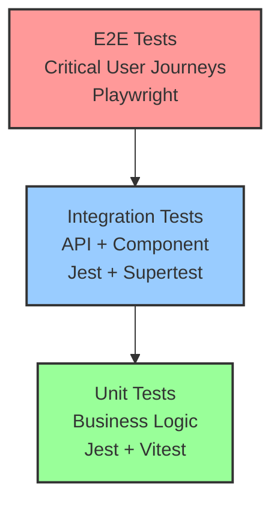

# EduLift Testing Strategy

## Overview

This document outlines the comprehensive testing strategy for EduLift, including unit tests, integration tests, and end-to-end (E2E) tests. The strategy is designed to ensure reliability, prevent regressions, and support continuous development in a multi-developer environment.

## Testing Architecture

### 1. Testing Pyramid



### 2. Test Environment Isolation

#### Development Environment
- **Ports**: Backend (3000), Frontend (5173)
- **Database**: Local PostgreSQL
- **Purpose**: Active development and debugging

#### E2E Test Environment
- **Ports**: Backend (3002), Frontend (4001)
- **Database**: Isolated test PostgreSQL (port 5433)
- **Purpose**: Automated E2E testing
- **Isolation**: Complete Docker containerization

#### CI/CD Environment
- **Ephemeral containers**
- **Parallel test execution**
- **Artifact collection**

## Testing Framework Selection

### Backend Testing: Jest + Supertest
```typescript
// Unit Test Example
describe('FamilyService', () => {
  it('should create family with valid data', async () => {
    // RED → GREEN → REFACTOR cycle
    const result = await familyService.createFamily(validData);
    expect(result).toMatchObject({ name: 'Test Family' });
  });
});

// Integration Test Example
describe('POST /api/v1/families', () => {
  it('should create family and return 201', async () => {
    const response = await request(app)
      .post('/api/v1/families')
      .send({ name: 'Test Family' })
      .expect(201);
  });
});
```

### Frontend Testing: Vitest + Testing Library
```typescript
// Component Test Example
describe('FamilyOnboardingWizard', () => {
  it('should complete onboarding flow', async () => {
    render(<FamilyOnboardingWizard />);
    
    await userEvent.fill(screen.getByTestId('family-name'), 'Test Family');
    await userEvent.click(screen.getByTestId('create-family'));
    
    expect(screen.getByText('Family created successfully')).toBeInTheDocument();
  });
});
```

### E2E Testing: Playwright
```typescript
// E2E Test Example
test('should complete full family onboarding', async ({ page }) => {
  await page.goto('/onboarding');
  await page.fill('[data-testid="family-name"]', 'Smith Family');
  await page.click('[data-testid="create-family"]');
  
  await expect(page).toHaveURL('/dashboard');
  await expect(page.locator('[data-testid="family-name"]')).toContainText('Smith Family');
});
```

## Test Coverage Strategy

### Current Coverage Status
- **Backend**: 100% achieved with comprehensive unit and integration tests
- **Frontend**: 83%+ with ongoing `data-testid` selector conversion (62% complete)

### Coverage Requirements
- **Minimum**: 90% line coverage
- **Critical paths**: 100% coverage
- **Error handling**: 95% coverage

### Testing Best Practices & Current Challenges

#### Backend (100% Coverage Achieved)
✅ **Completed**: All services, controllers, and repositories have comprehensive test coverage
- Family system: Full unit and integration test coverage
- Group coordination: Complete business logic testing
- Authentication: Magic link and JWT token testing
- Real-time features: Socket.IO event testing

#### Frontend (Ongoing Improvements)
🔄 **Current Focus**: Improving test reliability and maintainability
- **Test Selector Migration**: Converting from text-based to `data-testid` selectors (62% complete)
- **Reducing Test Complexity**: Simplifying over-complex unit tests with excessive mocking
- **Test Stability**: Addressing brittle tests that break with implementation changes

#### Known Testing Challenges
⚠️ **Issues Being Addressed**:
- Over-complex unit tests with excessive mocking
- Brittle tests that break when implementation details change
- Hard to maintain tests due to complex mock setups
- Slow test execution from complex DOM interactions

## E2E Test Scenarios

### 1. Critical User Journeys

#### Authentication Flow
```typescript
✅ Magic link login
✅ Token refresh
✅ Session management
✅ Multi-device handling
```

#### Family Onboarding
```typescript
✅ Family creation
✅ Child addition
✅ Vehicle registration
✅ Validation handling
✅ Progress persistence
```

#### Group Coordination
```typescript
✅ Group creation and invitations
✅ Member management
✅ Schedule coordination
✅ Real-time updates
✅ Conflict resolution
```

#### Real-Time Assignments
```typescript
✅ Vehicle assignments
✅ Child assignments
✅ Capacity management
✅ Concurrent user handling
✅ Offline/online sync
```

### 2. Cross-Browser Testing
- **Primary**: Chromium, Firefox, WebKit
- **Mobile**: iOS Safari, Android Chrome
- **Responsive**: Mobile-first design validation

### 3. Performance Testing
- **Load**: 100+ concurrent users
- **Real-time**: Socket connection handling
- **Mobile**: Touch interactions and gestures

## Test Data Management

### Test Data Strategy
```typescript
// Consistent test data across all test types
export const TEST_FAMILIES = {
  SMITH: { name: 'The Smith Family' },
  JOHNSON: { name: 'Johnson Family' }
};

export const TEST_CHILDREN = {
  EMMA: { name: 'Emma Smith', age: 8 },
  NOAH: { name: 'Noah Smith', age: 10 }
};

export const TEST_VEHICLES = {
  HONDA_CRV: { name: 'Honda CR-V', capacity: 7 },
  TOYOTA_SIENNA: { name: 'Toyota Sienna', capacity: 8 }
};
```

### Database Seeding
- **Unit/Integration**: In-memory or isolated DB
- **E2E**: Containerized PostgreSQL with seed data
- **Cleanup**: Automatic between test runs

## Test Execution Workflows

### Local Development
```bash
# Unit Tests
npm run test:unit:backend    # Backend Jest tests
npm run test:unit:frontend   # Frontend Vitest tests

# E2E Tests
npm run e2e:setup           # Start isolated environment
npm run e2e:test           # Run Playwright tests
npm run e2e:teardown       # Cleanup environment

# Coverage Reports
npm run test:coverage      # Generate coverage reports
```

### CI/CD Pipeline
```yaml
name: Test Suite
on: [push, pull_request]

jobs:
  unit-tests:
    runs-on: ubuntu-latest
    steps:
      - name: Backend Tests
        run: npm run test:unit:backend
      - name: Frontend Tests  
        run: npm run test:unit:frontend
      
  e2e-tests:
    runs-on: ubuntu-latest
    steps:
      - name: Setup E2E Environment
        run: npm run e2e:setup
      - name: Run E2E Tests
        run: npm run e2e:test
      - name: Upload Test Results
        uses: actions/upload-artifact@v3
        with:
          name: playwright-report
          path: playwright-report/
```

### Parallel Execution
- **Unit Tests**: Parallel by default (Jest/Vitest)
- **E2E Tests**: Parallel across browsers
- **CI**: Matrix strategy for multiple environments

## TDD Implementation

### Red-Green-Refactor Cycle
Following strict TDD methodology for all new features:

```typescript
// 1. RED: Write failing test
describe('FamilyService.inviteMember', () => {
  it('should send invitation email', async () => {
    // Test that will fail initially
    const result = await familyService.inviteMember(data);
    expect(result.success).toBe(true);
  });
});

// 2. GREEN: Minimal implementation
class FamilyService {
  async inviteMember(data) {
    // Minimal code to pass test
    return { success: true };
  }
}

// 3. REFACTOR: Improve implementation
class FamilyService {
  async inviteMember(data) {
    // Full implementation with error handling
    const invitation = await this.createInvitation(data);
    await this.emailService.sendInvitation(invitation);
    return { success: true, invitationId: invitation.id };
  }
}
```

## Real-Time Testing Strategy

### Socket.IO Testing
```typescript
// Backend: Real-time event testing
describe('SocketService', () => {
  it('should broadcast schedule updates', async () => {
    const mockSocket = createMockSocket();
    await socketService.handleScheduleUpdate(data);
    
    expect(mockSocket.broadcast.emit).toHaveBeenCalledWith(
      'schedule-updated', 
      expect.objectContaining({ slotId: data.slotId })
    );
  });
});

// Frontend: Real-time state testing
describe('useSocket', () => {
  it('should update state on schedule events', async () => {
    const { result } = renderHook(() => useSocket());
    
    act(() => {
      mockSocket.emit('schedule-updated', mockData);
    });
    
    expect(result.current.lastUpdate).toEqual(mockData);
  });
});
```

### E2E Real-Time Testing
```typescript
test('should handle concurrent user interactions', async ({ page, context }) => {
  // Two users modify same schedule simultaneously
  const user1Page = page;
  const user2Page = await context.newPage();
  
  // Test real-time updates, conflict resolution, etc.
});
```

## Mobile Testing

### Mobile-First Approach
- **Responsive Design**: All tests verify mobile layouts
- **Touch Interactions**: Gesture-based navigation
- **Performance**: Mobile device emulation

### Device Testing Matrix
```typescript
// Playwright mobile configuration
projects: [
  { name: 'Mobile Chrome', use: { ...devices['Pixel 5'] } },
  { name: 'Mobile Safari', use: { ...devices['iPhone 12'] } },
  { name: 'Tablet', use: { ...devices['iPad Pro'] } }
]
```

## Error Handling & Edge Cases

### Network Conditions
```typescript
test('should handle offline/online transitions', async ({ page, context }) => {
  // Test offline functionality
  await context.setOffline(true);
  
  // User actions while offline
  await page.click('[data-testid="assign-child"]');
  
  // Verify offline indicators and queued changes
  await expect(page.locator('[data-testid="offline-indicator"]')).toBeVisible();
  
  // Reconnect and verify sync
  await context.setOffline(false);
  await expect(page.locator('[data-testid="sync-success"]')).toBeVisible();
});
```

### Validation & Error States
- **Form validation**: Client and server-side
- **API errors**: 4xx/5xx response handling
- **Capacity limits**: Vehicle and schedule constraints
- **Conflict resolution**: Concurrent modification handling

## Performance Testing

### Load Testing Scenarios
1. **100+ concurrent users** accessing schedules
2. **Real-time updates** across multiple groups
3. **Database performance** under load
4. **Socket connection limits**

### Performance Metrics
- **Response times**: < 200ms for API calls
- **Real-time latency**: < 100ms for updates
- **Mobile performance**: < 3s initial load
- **Memory usage**: Stable over time

## Accessibility Testing

### WCAG Compliance
- **Automated**: axe-core integration
- **Manual**: Screen reader testing
- **Mobile**: Voice control and gestures

```typescript
// Accessibility testing in E2E
test('should be accessible to screen readers', async ({ page }) => {
  await page.goto('/dashboard');
  
  const accessibilityScanResults = await new AxeBuilder({ page })
    .withTags(['wcag2a', 'wcag2aa'])
    .analyze();
    
  expect(accessibilityScanResults.violations).toEqual([]);
});
```

## Documentation & Reporting

### Test Documentation
- **Test plans**: User story coverage
- **Test cases**: Detailed scenario descriptions
- **Results**: Automated reporting and artifacts

### Coverage Reporting
```bash
# Generate comprehensive coverage reports
npm run test:coverage:all

# Outputs:
# - backend/coverage/lcov-report/index.html
# - frontend/coverage/index.html  
# - e2e-tests/playwright-report/index.html
```

### Failure Analysis
- **Screenshot capture**: On E2E failures
- **Video recordings**: For complex failure scenarios
- **Trace files**: Detailed execution analysis
- **Log aggregation**: Centralized error tracking

## Maintenance & Evolution

### Test Maintenance
- **Regular review**: Monthly test effectiveness analysis
- **Flaky test management**: Identification and resolution
- **Performance monitoring**: Test execution time tracking
- **Coverage goals**: Continuous improvement targets

### Future Enhancements
1. **Visual regression testing**: UI consistency
2. **API contract testing**: Service integration
3. **Security testing**: Vulnerability scanning
4. **Chaos engineering**: Resilience testing

## Team Guidelines

### Test Writing Standards
- **Descriptive names**: Clear test intentions
- **AAA pattern**: Arrange-Act-Assert structure
- **Single responsibility**: One concept per test
- **Data isolation**: Independent test data

### Code Review Process
- **Test coverage**: Required for new features
- **TDD compliance**: Red-Green-Refactor evidence
- **E2E scenarios**: Critical path coverage
- **Performance impact**: Test execution time

### CI/CD Integration
- **Failing tests**: Block deployment
- **Coverage gates**: Minimum thresholds
- **Parallel execution**: Optimize build time
- **Result artifacts**: Preserve test evidence

---

## Quick Reference Commands

```bash
# Setup
npm install                    # Install all dependencies
npm run e2e:install           # Install Playwright browsers

# Development
npm run test:unit:backend     # Backend unit tests
npm run test:unit:frontend    # Frontend unit tests
npm run test:watch           # Watch mode for development

# E2E Testing  
npm run e2e:setup            # Start isolated test environment
npm run e2e:test             # Run all E2E tests
npm run e2e:test:headed      # Run with browser UI
npm run e2e:test:debug       # Debug mode
npm run e2e:teardown         # Cleanup test environment

# Coverage & Reports
npm run test:coverage        # Generate coverage reports
npm run e2e:report          # View Playwright HTML report

# Complete Test Suite
npm run test:all            # Run all tests (unit + E2E)
```

## 🔧 **Practical Testing Recommendations**

### Current Testing Issues & Solutions

#### Issues Identified:
- **Over-complex unit tests** with excessive mocking
- **Brittle tests** that break when implementation details change  
- **Hard to maintain** due to complex mock setups
- **Slow test execution** due to complex DOM interactions

#### Recommended Solutions:

**1. Simplify Unit Tests**
```typescript
// ✅ GOOD: Simple hook test
describe('usePageState', () => {
  it('returns correct loading state', () => {
    const result = usePageState({ data: undefined, isLoading: true, error: null });
    expect(result.shouldShowLoading).toBe(true);
  });
});

// ✅ GOOD: Simple component test  
describe('ConnectionIndicator', () => {
  it('shows connected status', () => {
    render(<ConnectionIndicator />, { 
      wrapper: ({ children }) => (
        <MockConnectionProvider status="connected">
          {children}
        </MockConnectionProvider>
      )
    });
    expect(screen.getByText('Connected')).toBeInTheDocument();
  });
});
```

**2. Minimize Integration Test Complexity**
```typescript
// ✅ GOOD: Simple integration test
describe('VehiclesPage Integration', () => {
  it('shows loading then vehicles', async () => {
    mockApiService.getVehicles.mockResolvedValue([mockVehicle]);
    
    render(<VehiclesPage />);
    
    expect(screen.getByText('Loading')).toBeInTheDocument();
    await waitFor(() => {
      expect(screen.getByText('Test Vehicle')).toBeInTheDocument();
    });
  });
});
```

**3. Move Complex Flows to E2E**
```typescript
// ✅ GOOD: E2E test for complex flows
test('user can create child and assign to groups', async ({ page }) => {
  await page.goto('/children');
  await page.click('[data-testid="add-child"]');
  await page.fill('[data-testid="child-name"]', 'Test Child');
  await page.click('[data-testid="add-to-group"]');
  await page.selectOption('[data-testid="group-select"]', 'School Group');
  await page.click('[data-testid="confirm-add"]');
  
  await expect(page.locator('[data-testid="child-list"]')).toContainText('Test Child');
});
```

### Testing Anti-Patterns to Avoid
- ❌ Tests that mock more than they test
- ❌ Tests that break when CSS classes change  
- ❌ Tests that require complex DOM polyfills
- ❌ Tests that take >5 seconds to run
- ❌ Tests that test implementation details

### Team Collaboration Guidelines
1. **Always pull latest before test changes**
2. **Run tests locally before committing** 
3. **Keep test changes focused and small**
4. **Communicate test strategy changes with team**
5. **Use shared conventions in test-utils**
6. **Prefer `data-testid` selectors over text-based selectors**

---

This testing strategy ensures comprehensive coverage while maintaining development velocity and code quality for the EduLift application.